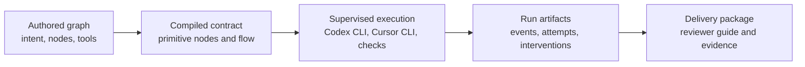

# Agentflow

Agentflow is a supervised execution runtime for long-running coding work.

Teams author a readable graph, hand meaningful work to external agent harnesses such as Codex CLI or Cursor CLI, and get back a durable run record with supervisor interventions, validation evidence, and a review-ready delivery package.

Agentflow is built for local repositories and local control. The authored DAG remains the human-facing source of intent; the runtime compiles it into primitive executable nodes; the supervisor keeps execution bounded and inspectable; the delivery package makes the final change understandable.

## Core Promise

- Humans define the goal, scope, constraints, acceptance criteria, and approval boundaries.
- Agent nodes own substantial engineering outcomes rather than tiny prompt handoffs.
- Deterministic and semantic checks feed the supervisor with structured evidence.
- Supervisor interventions are policy-bounded, durable, and visible in `interventions.jsonl`.
- Terminal runs write a `delivery/` package that helps humans review the work quickly.

## Runtime Model



The graph is not a free-form planner. It is an accountable execution contract. The supervisor can retry, repair missing artifacts, rebuild context, refresh workspaces, run diagnostics, request semantic evaluation, and escalate. It cannot silently change the task, widen authority, bypass checks, or hide its interventions.

## Where To Start

- Humans evaluating Agentflow should read this README, then `docs/SCOPE.md` for the product boundary and `docs/ARCHITECTURE.md` for the runtime model.
- Graph authors should use the minimal graph below, `docs/examples/graphs/`, and `docs/OPERATIONS.md` for validation and launch.
- Plugin authors should use `docs/PLUGINS.md` for local or Git plugin packages, workflow exports, tool exports, and secure auth.
- Operators reviewing a terminal run should start with `delivery/manifest.json` and the human entrypoints it lists.
- Agents authoring or debugging Agentflow should use the packaged `agentflow` and `agentflow-plugins` skills under `skills/`.

## Install And Build

```bash
npm install
npm run typecheck
npm test
npm run build
```

Run from source:

```bash
npm run graph-help
npm run validate -- --graph agentflow.graph.json
npm run run -- --graph agentflow.graph.json
```

After `npm run build`, the packaged CLI entry is `dist/cli/index.js`. The npm binary name is `agentflow`.

## Minimal Graph

```json
{
  "version": "1",
  "graph_id": "ship-reviewable-change",
  "intent": {
    "goal": "Implement a focused change and leave it ready for review.",
    "scope": {
      "paths": ["src/**", "tests/**"],
      "out_of_scope": ["unrelated refactors"]
    },
    "constraints": ["Keep the graph outcome-oriented."],
    "acceptance_criteria": [
      "The change is implemented.",
      "Tests or checks provide evidence.",
      "The reviewer guide explains risk and review order."
    ],
    "approval_boundaries": [
      "Do not expand repository scope without an explicit checkpoint."
    ]
  },
  "repos": {
    "main": { "path": "." }
  },
  "defaults": {
    "launch_profile": "codex",
    "workspace_backend": "worktree"
  },
  "profiles": {
    "codex": {
      "harness": "codex-cli",
      "model": "gpt-5-codex",
      "reasoning_effort": "medium",
      "sandbox": "workspace-write",
      "timeout_sec": 1800
    },
    "cursor": {
      "harness": "cursor-cli",
      "model": "auto",
      "reasoning_effort": "medium",
      "sandbox": "workspace-write",
      "timeout_sec": 1800
    }
  },
  "supervision": {
    "allowed_actions": [
      "retry_node",
      "repair_artifact",
      "rebuild_context",
      "refresh_workspace",
      "run_diagnostic",
      "semantic_evaluation",
      "escalate"
    ],
    "retry_budget": {
      "max_total_interventions": 8,
      "max_node_retries": 2,
      "max_artifact_repairs": 2,
      "max_context_rebuilds": 1,
      "max_workspace_refreshes": 1,
      "max_diagnostic_runs": 3,
      "max_semantic_evaluations": 2
    },
    "drift_detection": { "score_threshold": 0.8 },
    "escalation": {
      "require_human_on_policy_breach": true,
      "require_human_on_scope_drift": true
    }
  },
  "delivery": {
    "required_sections": [
      "task_brief",
      "implementation_summary",
      "grouped_change_map",
      "decision_log",
      "evaluation_ledger",
      "reviewer_guide",
      "risk_notes",
      "follow_up_items",
      "intervention_trace"
    ]
  },
  "graph": {
    "type": "sequence",
    "id": "root",
    "steps": [
      {
        "type": "agent",
        "id": "implement_slice",
        "repo": "main",
        "profile": "codex",
        "goal": "Implement the scoped change and leave reviewer-ready evidence.",
        "acceptance_criteria": [
          "Targeted validation is run or clearly explained.",
          "The handoff names changed files, validation, and residual risks."
        ],
        "prompt": "Implement the scoped change. Run targeted validation. Write a concise handoff to $AGENTFLOW_OUTPUT_DIR/change-summary.md.",
        "context": [
          {
            "name": "goal",
            "from": "text",
            "text": "Keep the change focused and reviewable."
          }
        ],
        "artifacts": {
          "change_summary": {
            "from": "output_dir",
            "path": "change-summary.md",
            "description": "Implementation summary written by the agent."
          }
        }
      },
      {
        "type": "check",
        "id": "test",
        "repo": "main",
        "check_kind": "deterministic",
        "command": "npm",
        "args": ["test"]
      }
    ]
  }
}
```

Switching from Codex CLI to Cursor CLI is a graph-level launch-profile choice, not a different graph language. Both harnesses receive the same context packet, tool contract, artifact contract, output directory, and timeout budget.

## Graph Contract

Top-level fields:

- `version`: currently `"1"`.
- `graph_id`: stable id used for run roots and inspection.
- `intent`: required goal, optional scope, constraints, acceptance criteria, and approval boundaries.
- `repos`: local repository aliases. Defaults to `{ "main": { "path": "." } }`.
- `defaults`: launch profile and workspace backend.
- `profiles`: harness, model, sandbox, env, timeout, and input budget settings. Omit `model` or set `"model": "auto"` to let the installed Codex CLI or Cursor CLI choose its default model.
- `supervision`: allowed supervisor actions, retry budgets, drift threshold, and escalation rules.
- `delivery`: required terminal delivery sections.
- `plugins`, `tools`, and `tool_config`: plugin-bundled CLI capabilities and non-secret tool options.
- `prerequisites`: local launch checks for files, commands, env vars, and repos.
- `graph`: `sequence`, `parallel`, `repeat`, executable nodes, or managed patterns.

Executable nodes are `agent`, `exec`, `check`, and `checkpoint`. Containers are `sequence`, `parallel`, and `repeat`. Managed patterns are `pattern_deep_research`, `pattern_spec_design`, `pattern_generate_evaluate_fix`, and `pattern_review_change`.

Top-level `repos` are operational bindings: they say which local checkouts exist and where nodes execute. Top-level `profiles` are operational authority: they say which harness, sandbox, timeout, model, and tool policy a node receives. `intent.scope` is governance for humans and supervisor decisions; it can name paths or out-of-scope areas, but it is not a replacement for `repos`, `profiles`, or per-node `repo` and `profile`.

Agent nodes may use `prompt`, `goal`, or both. `goal` and `acceptance_criteria` are stable node intent and are rendered into Codex CLI and Cursor CLI prompts, supervisor repair prompts, and resume fingerprints. `prompt` can carry detailed instructions; when omitted, the node goal becomes the executable prompt.

Nodes exchange material through:

- `context`: text, workspace files, workspace globs, and named prior artifacts.
- `artifacts`: named durable files produced from `$AGENTFLOW_OUTPUT_DIR` or the workspace.

Reserved automatic artifacts are `agent_response`, `verification_json`, `stdout`, and `stderr`.

## Authoring Workflow

1. Write the top-level `intent.goal` and `acceptance_criteria` first.
2. Declare `repos` and `profiles` so execution authority is visible.
3. Add outcome-sized nodes with node-level `goal`, `acceptance_criteria`, and named `artifacts`.
4. Add deterministic checks for hard gates and AI checks only when semantic judgment is needed.
5. Add plugin tools only when a team capability should be available to the agent; keep secret values in plugin `credentials`.
6. Run `agentflow plugin resolve --graph <path>` when plugins are declared.
7. Run `agentflow validate --graph <path>`, then `--run-ready`, then `--show-compiled`.
8. Launch only after the compiled graph shows the expected harnesses, sandboxes, tools, context, artifacts, supervision, and delivery contract.

## Supervisor

The runtime records every supervisor action as an event and as a JSONL ledger entry. The current implementation supports classifier-driven retries and escalation plus the artifact repair path:

- `retry_node`
- `repair_artifact`
- `rebuild_context`
- `refresh_workspace`
- `run_diagnostic`
- `semantic_evaluation`
- `escalate`

Budget fields are `max_total_interventions`, `max_node_retries`, `max_artifact_repairs`, `max_context_rebuilds`, `max_workspace_refreshes`, `max_diagnostic_runs`, and `max_semantic_evaluations`.

If a completed agent misses a declared artifact, validation has already accepted the graph shape, so the runtime treats it as a repairable execution problem. When a harness is available, the supervisor runs an intent-aware repair intervention under the same node authority. When exactly one missing artifact is a human-readable text handoff and no harness is available, the supervisor can synthesize it from the captured `agent_response`; machine-readable artifacts and multi-artifact contracts are not synthesized from prose.

## Plugin Tools

Plugins expose team capabilities as ordinary CLI tools. Each tool declares:

- `capability`: `context`, `verification`, `mutation`, or `reporting`.
- `impact`: `read`, `write`, `external`, or `secret`.

Agentflow resolves plugin tools, places generated launch shims on the node `PATH`, and renders the tool contract into the harness prompt without exposing configured values. Non-secret `tool_config` values and secret credentials are resolved only inside the generated launcher when it starts the plugin tool subprocess. Secret-impact tools must declare plugin `credentials`; `agentflow auth` stores secret fields in macOS Keychain and requires `--value-stdin` for secret values. Credential and tool-config values are not exported into the Codex CLI or Cursor CLI harness environment. Mutation tools and write-impact tools are not exposed to read-only agents. External-impact tools require exact approval tokens in `intent.approval_boundaries`, such as `tool:babysit-poll` or `external:babysit/poll`.

## Delivery Package

Every terminal run writes:

- `summary.md`
- `events.jsonl`
- `interventions.jsonl`
- `delivery/manifest.json`
- `delivery/task-brief.md`
- `delivery/implementation-summary.md`
- `delivery/grouped-change-map.json`
- `delivery/decision-log.md`
- `delivery/evaluation-ledger.json`
- `delivery/reviewer-guide.md`
- `delivery/risk-notes.md`
- `delivery/follow-up-items.md`
- `delivery/intervention-trace.json`

The delivery package is intentionally higher signal than raw logs. `delivery/manifest.json` separates human entrypoints (`reviewer-guide.md`, `task-brief.md`, `implementation-summary.md`, `risk-notes.md`, `follow-up-items.md`) from evidence files (`grouped-change-map.json`, `evaluation-ledger.json`, `decision-log.md`, `intervention-trace.json`) and internal runtime artifacts (`state.json`, `events.jsonl`, `interventions.jsonl`, node attempt directories). Humans should start with the delivery files; resume and low-level debugging use the internal artifacts.

## CLI Workflow

```bash
agentflow graph-help
agentflow plugin resolve --graph agentflow.graph.json
agentflow validate --graph agentflow.graph.json
agentflow validate --graph agentflow.graph.json --run-ready
agentflow validate --graph agentflow.graph.json --show-compiled
agentflow run --graph agentflow.graph.json
agentflow inspect <run-root>
agentflow resume --run-root <run-root>
agentflow runs list --graph agentflow.graph.json
```

`validate --show-compiled` is the best way to confirm managed patterns, plugin workflows, context references, tool policy, and harness selection before launch.

## Validation

Use the same checks before merging runtime or contract changes:

```bash
npm run typecheck
npm test
npm run build
npm run validate:smoke
```

`validate:smoke` also verifies the built CLI against the repeat fixture across Codex CLI and Cursor CLI adapters with both `inplace` and `worktree` workspace backends.

## Repository Map

- `src/graph/`: authored schema, normalization, validation, and compilation.
- `src/runtime/`: scheduler, execution engine, harness calls, supervision, context resolution, delivery packaging.
- `src/supervisor/`: policy, failure classification, and intervention actions.
- `src/plugins/`: Git or local plugin workflows, plugin tool exports, and credential metadata.
- `src/artifacts/`: run-root paths, event projection, reconciliation, and readers.
- `src/cli/`: CLI commands and progress rendering.
- `docs/`: supervised v1 product and operator documentation.
- `skills/`: installable Agentflow skills aligned to the supervised v1 contract.
