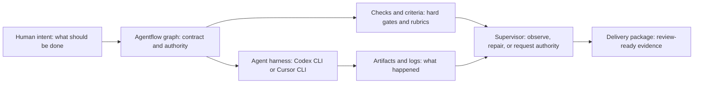
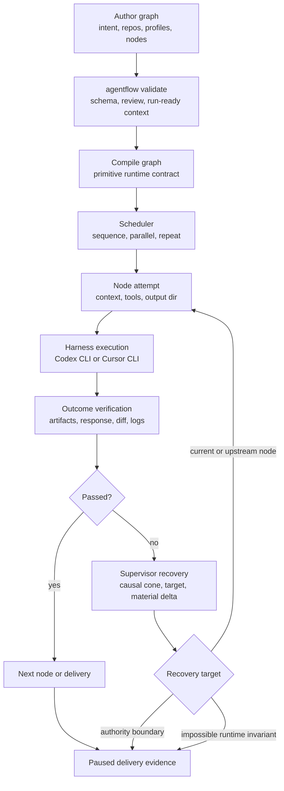
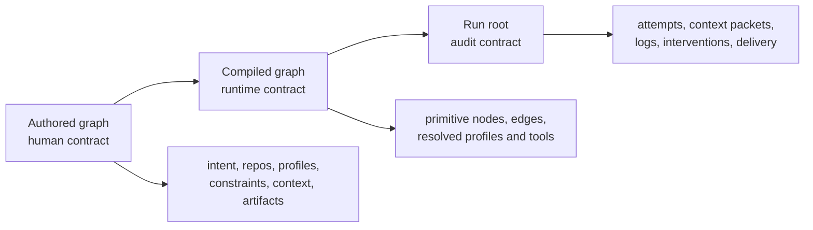
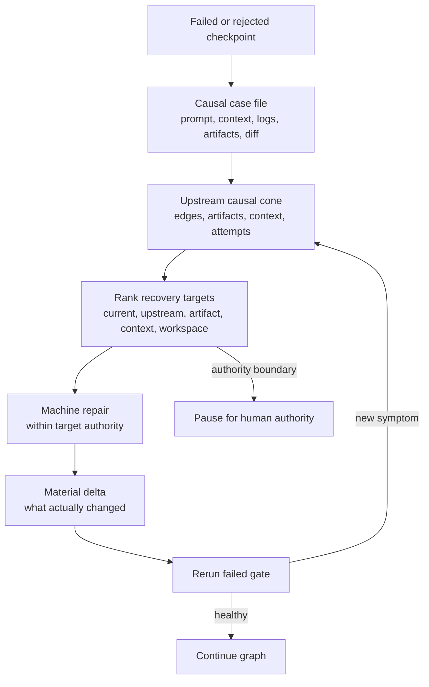

# Agentflow

Agentflow is a local-first runtime for supervised agent workflows in real repositories.

You write a graph that states the intent, authority, context, tools, validation, and artifacts for the work. Agentflow validates that contract, runs substantial nodes through agent harnesses such as Codex CLI or Cursor CLI, supervises failures, and produces a durable delivery package for review.

Agentflow exists because long-running agent work needs more than an ad hoc prompt. Teams need the original intent preserved, the right context materialized, failures repaired without losing the thread, and final evidence organized so a human can review the result.



## What It Is

| Concept | What it means | Why it matters | Details |
| --- | --- | --- | --- |
| Graph | A file-backed execution contract for a workflow. | Keeps intent, authority, context, validation, and delivery explicit before launch. | [Product scope](docs/product/scope.md), [operations](docs/product/operations.md) |
| Node | A meaningful unit of work: `agent`, `exec`, `check`, `checkpoint`, or a container such as `sequence`, `parallel`, or `repeat`. | Lets agents own outcomes instead of receiving tiny brittle prompt fragments. | [Examples](docs/examples/README.md) |
| Context | The material Agentflow gives a node: authored text, selected files, globs, prior artifacts, and supervisor repair packets. | Context quality is prompt quality. Too much noise hurts runs; missing context causes avoidable failures. | [Context and artifacts](docs/technical/context-and-artifacts.md) |
| Artifacts | Named durable outputs produced by nodes. | Future nodes and reviewers consume artifacts, not hidden chat state. | [Runtime lifecycle](docs/technical/runtime-lifecycle.md) |
| Checks | Deterministic or AI gates inside the run. | Provides hard evidence and semantic sensors without relying on final prose alone. | [Outcome verification](docs/technical/outcome-verification.md) |
| Supervisor | The runtime recovery system for failed or misaligned node attempts. | Keeps the graph progressing when context, validation, artifact, workspace, or environment issues are machine-fixable. | [Architecture](docs/technical/architecture.md) |
| Managed patterns | Higher-level workflow shapes that compile into normal graph execution. | Gives authors simple contracts for common deep research and deep work loops. | [Managed patterns](docs/product/managed-patterns.md) |
| Plugins | Packaged workflow exports and CLI tools. | Lets teams expose reusable capabilities, credential boundaries, and composed CLI behavior. | [Plugins](docs/product/plugins.md) |
| Evals | Offline workflow evaluations across scenarios, variants, trials, criteria, trajectory, and simulation. | Gives teams confidence in graphs, plugins, prompts, tools, and supervisor behavior. | [Evals](docs/product/evals.md) |
| Delivery | Terminal run package with summaries, evidence, decisions, risks, and review order. | Lets humans review the result without spelunking raw logs first. | [Operations](docs/product/operations.md) |

## Why It Exists

Agentflow is for work that should be accountable and repeatable:

- Implementing code changes that need clear validation and review evidence.
- Running multi-node investigations where downstream work needs durable artifacts.
- Splitting large repo work into planned, validated, reviewable chunks.
- Giving agents access to local tools while keeping credential and tool boundaries explicit.
- Evaluating workflow quality over repeated realistic trials instead of judging one lucky run.

Agentflow is not an invisible planner, remote devbox, or alternate chat memory system. The graph is the source of truth. Runtime state, context packets, supervisor interventions, and delivery artifacts are written to disk so the run can be inspected, resumed, and reviewed.

## How It Works



Agentflow keeps three contracts separate:



That separation is why validation can explain the workflow before launch, execution can resume from durable state, and review can start from `delivery/` instead of raw node directories.

## Supervisor Recovery

Every executable node is a supervised checkpoint. The supervisor observes healthy attempts and stays out of the way. When a node fails or is rejected, the failed node is treated as a symptom: the supervisor builds an upstream causal cone, chooses the nearest intent-aligned recovery target, repairs within that target's existing authority, reruns the failed gate, and records the recovery chain.



Human pause is reserved for authority, credentials, security or compliance judgment, product intent ambiguity, explicit checkpoints, or graph-contract changes. Ordinary context, validation, artifact, workspace, and local environment failures should attempt machine recovery first.

## Setup

Agentflow is a Node project. Use Node `>=20.7.0`.

```bash
npm install
npm run build
npm run setup:link
agentflow --help
agentflow graph-help
```

`npm run setup:link` links the built package so local usage matches how operators invoke Agentflow: `agentflow ...`. The repository still has development scripts, but examples and docs should use the linked CLI for Agentflow commands.

To remove the linked CLI:

```bash
npm run setup:unlink
```

Core repository validation:

```bash
npm run typecheck
npm test
npm run build
npm run validate:smoke
```

`validate:smoke` verifies the built CLI against the repeat fixture across Codex CLI and Cursor CLI adapters with both `inplace` and `worktree` workspace backends.

## First Run

1. Create `agentflow.graph.json` from the minimal graph below or an example under [docs/examples](docs/examples/README.md).
2. Validate the graph before launching:

   ```bash
   agentflow validate --graph agentflow.graph.json --run-ready
   ```

3. Inspect the compiled shape when the graph changes:

   ```bash
   agentflow validate --graph agentflow.graph.json --show-compiled
   agentflow validate --graph agentflow.graph.json --diagram-output graph.mmd
   ```

4. Run the graph:

   ```bash
   agentflow run --graph agentflow.graph.json
   ```

5. Review the terminal delivery package, starting with `delivery/manifest.json` and `delivery/reviewer-guide.md`.

## Minimal Graph

This is the canonical small graph shape: explicit repo, profiles, supervisor profile, node-level `intent`, declared artifact, and deterministic check.

```json
{
  "version": "1",
  "graph_id": "ship-reviewable-change",
  "intent": {
    "goal": "Implement a focused change and leave it ready for review.",
    "constraints": [
      "Keep the graph outcome-oriented.",
      "Avoid unrelated refactors."
    ],
    "acceptance_criteria": [
      "The change is implemented.",
      "Tests or checks provide evidence.",
      "The reviewer guide explains risk and review order."
    ]
  },
  "repos": {
    "main": {
      "path": "."
    }
  },
  "defaults": {
    "launch_profile": "codex",
    "workspace_backend": "worktree"
  },
  "profiles": {
    "codex": {
      "harness": "codex-cli",
      "model": "gpt-5-codex",
      "reasoning_effort": "medium",
      "sandbox": "workspace-write",
      "timeout_sec": 1800
    },
    "cursor": {
      "harness": "cursor-cli",
      "model": "auto",
      "sandbox": "workspace-write",
      "timeout_sec": 1800
    },
    "supervisor": {
      "harness": "codex-cli",
      "model": "gpt-5-codex",
      "reasoning_effort": "medium",
      "sandbox": "workspace-write",
      "timeout_sec": 900
    }
  },
  "supervision": {
    "profile": "supervisor",
    "max_total_interventions": 3
  },
  "graph": {
    "type": "sequence",
    "id": "root",
    "steps": [
      {
        "type": "agent",
        "id": "implement_slice",
        "repo": "main",
        "profile": "codex",
        "intent": {
          "goal": "Implement the scoped change and leave reviewer-ready evidence.",
          "acceptance_criteria": [
            "Targeted validation is run or clearly explained.",
            "The handoff names changed files, validation, and residual risks."
          ],
          "constraints": [
            "Write a concise handoff to $AGENTFLOW_OUTPUT_DIR/change-summary.md."
          ]
        },
        "context": [
          {
            "name": "goal",
            "from": "text",
            "text": "Keep the change focused and reviewable."
          }
        ],
        "artifacts": {
          "change_summary": {
            "from": "output_dir",
            "path": "change-summary.md",
            "description": "Implementation summary written by the agent."
          }
        }
      },
      {
        "type": "check",
        "id": "test",
        "repo": "main",
        "intent": {
          "goal": "Run the repository test suite to validate the scoped change.",
          "acceptance_criteria": [
            "`npm test` exits successfully.",
            "The check output is usable as reviewer evidence."
          ],
          "constraints": []
        },
        "check_kind": "deterministic",
        "command": "npm",
        "args": [
          "test"
        ]
      }
    ]
  }
}
```

Switching from Codex CLI to Cursor CLI is a launch-profile choice, not a different graph language. Both harnesses receive the same context packet, runtime CLI, tool contract, artifact contract, output directory, and timeout budget. `model: "auto"` means Agentflow does not pass an explicit model flag to the selected harness.

## CLI Commands

| Task | Command |
| --- | --- |
| See graph syntax help | `agentflow graph-help` |
| Resolve plugin packages and lock tools | `agentflow plugin resolve --graph agentflow.graph.json` |
| Validate the graph | `agentflow validate --graph agentflow.graph.json` |
| Run authoring review | `agentflow validate --graph agentflow.graph.json --review` |
| Fail on serious review findings | `agentflow validate --graph agentflow.graph.json --strict-review` |
| Check local launch readiness and context token budgets | `agentflow validate --graph agentflow.graph.json --run-ready` |
| Inspect compiled runtime contract | `agentflow validate --graph agentflow.graph.json --show-compiled` |
| Write Mermaid diagram | `agentflow validate --graph agentflow.graph.json --diagram-output graph.mmd` |
| Render graph image | `agentflow validate --graph agentflow.graph.json --diagram-image-output graph.svg` |
| Launch a run | `agentflow run --graph agentflow.graph.json` |
| Inspect a run root | `agentflow inspect <run-root>` |
| Resume a paused or failed run | `agentflow resume --run-root <run-root>` |
| Resume the latest run for a graph | `agentflow resume --graph agentflow.graph.json --latest` |
| List graph runs | `agentflow runs list --graph agentflow.graph.json` |
| Validate an eval suite | `agentflow eval validate evals/<suite-id>` |
| Run an eval suite | `agentflow eval run evals/<suite-id> --variant current --scenario all --trials 1` |
| Generate an eval report | `agentflow eval report .agentflow/evals/<eval-run>` |

Image export uses `npx -y @mermaid-js/mermaid-cli` by default. Use `--diagram-image-package` to choose a package spec, or `--diagram-image-renderer mmdc` with `AGENTFLOW_MERMAID_CLI_BIN` for an installed binary.

## Documentation Map

| Reader | Start here | What you get |
| --- | --- | --- |
| New reader | [docs/README.md](docs/README.md) | Full documentation map split by product, technical, and examples. |
| Workflow author | [docs/product/operations.md](docs/product/operations.md) | Validation, launch, resume, inspect, and delivery workflow. |
| Product reviewer | [docs/product/scope.md](docs/product/scope.md) | Active product boundary and release bar. |
| Managed-pattern author | [docs/product/managed-patterns.md](docs/product/managed-patterns.md), [patterns](docs/product/patterns/README.md) | When to use deep research or deep work and how their contracts behave. |
| Eval author | [docs/product/evals.md](docs/product/evals.md) | Suites, scenarios, variants, criteria, trajectory checks, simulation, reports, and comparison. |
| Plugin author | [docs/product/plugins.md](docs/product/plugins.md) | Workflow exports, CLI tool exports, credentials, config, naming, and consumption. |
| Runtime implementer | [docs/technical/README.md](docs/technical/README.md) | Implementation reading order for runtime, context, tools, verification, and delivery. |
| Runtime debugger | [docs/technical/runtime-lifecycle.md](docs/technical/runtime-lifecycle.md) | Launch-to-delivery execution flow. |
| Context debugger | [docs/technical/context-and-artifacts.md](docs/technical/context-and-artifacts.md) | Context materialization, artifact refs, and downstream handoffs. |
| Tooling debugger | [docs/technical/runtime-tooling.md](docs/technical/runtime-tooling.md) | Generated `af` and plugin tool wrappers. |
| Example user | [docs/examples/README.md](docs/examples/README.md) | Runnable graph, eval, and plugin examples. |
| Agent authoring with skills | [skills](skills) | Agentflow, plugin, and eval skill guidance aligned to the repo contract. |

## Graph Contract At A Glance

| Field | Purpose |
| --- | --- |
| `version` | Graph schema version. Current value is `"1"`. |
| `graph_id` | Stable id used for run roots and inspection. |
| `intent` | Top-level goal, constraints, and acceptance criteria. |
| `repos` | Local repository aliases. Defaults to `main` at `.` when omitted. |
| `defaults` | Launch profile and workspace backend defaults. |
| `profiles` | Harness, model, sandbox, env, timeout, tool policy, and budget settings. |
| `supervision` | Required supervisor profile plus total recovery budget. |
| `plugins` and `tools` | Plugin-bundled CLI capabilities exposed to eligible nodes. |
| `prerequisites` | Local launch checks for files, commands, env vars, and repos. |
| `graph` | The execution shape: containers, executable nodes, or managed patterns. |

Executable nodes are `agent`, `exec`, `check`, and `checkpoint`; all require `intent.goal` and non-empty `intent.acceptance_criteria`, with optional `intent.constraints` normalized to `[]`. Containers are `sequence`, `parallel`, and `repeat`. Managed patterns are `pattern_deep_research` and `pattern_deep_work`.

Use `checkpoint` for authored human gates, usually inside a `repeat` body. Supervisor authority pauses are different: they are runtime pauses chosen only when recovery needs credentials, scope, product intent, security/compliance judgment, or graph-contract authority that the runtime must not infer.

## Runtime Surfaces

| Surface | Who uses it | Purpose |
| --- | --- | --- |
| `agentflow` | Humans and automation outside a run. | Validate, run, resume, inspect, resolve plugins, auth, eval, and report. |
| `af` | Agents inside a node attempt. | Inspect node contract, list granted tools, show context, write artifacts, log decisions, and spawn focused helpers. |
| Run root | Operators and debuggers. | Durable state, events, attempts, context packets, logs, supervisor interventions, and delivery files. |
| `delivery/` | Human reviewers. | High-signal terminal package with reviewer guide, implementation summary, evidence ledger, risks, and follow-ups. |

Agentflow injects `af` into every agent node on `PATH`. Humans normally do not use `af` outside a running node.

## Eval Setup

Agentflow includes local-first eval suites for workflow quality and real-world issue repair. Some suites materialize ignored local repos before running.

```bash
npm run setup:eval-repos
npm run setup:realworld-evals
agentflow eval validate evals/agentflow-capability-workflows
agentflow eval validate evals/agentflow-realworld-issues
```

The eval architecture follows Anthropic's [Demystifying evals for AI agents](https://www.anthropic.com/engineering/demystifying-evals-for-ai-agents) as the primary workflow-eval reference and adopts useful ADK mechanics for criteria, trajectory, and deterministic environment simulation. See [docs/product/evals.md](docs/product/evals.md) for suite authoring and operation.

## Repository Map

| Path | Purpose |
| --- | --- |
| `src/graph/` | Authored schema, normalization, validation, review, Mermaid diagrams, and compilation. |
| `src/runtime/` | Scheduler, execution engine, harness calls, context resolution, supervision, resume, and delivery. |
| `src/supervisor/` | Policy, failure classification, recovery planning, and runtime overlays. |
| `src/plugins/` | Local or Git plugin workflows, tool exports, and credential metadata. |
| `src/artifacts/` | Run-root paths, event projection, reconciliation, and artifact readers. |
| `src/cli/` | Human/operator CLI commands and progress rendering. |
| `docs/` | Product docs, technical docs, and examples. |
| `evals/` | Committed eval suite definitions and templates. |
| `skills/` | Agentflow skills for graph authoring, plugins, and evals. |
| `scripts/` | Setup and validation scripts. |
| `tests/` | Unit and runtime tests. |
