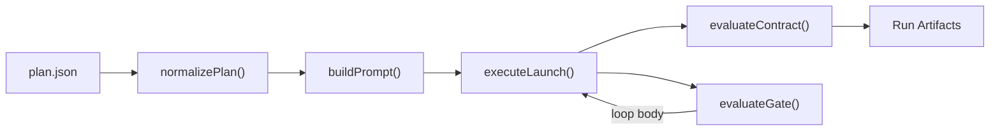

# agentflow

`agentflow` is a file-driven workflow orchestrator for coding agents.

You define a JSON plan with task, group, and loop nodes, and `agentflow` executes it against a target repository -- spawning agent CLI sessions, managing worktrees, evaluating gates, and writing deterministic run artifacts.

## Architecture



**Execution model:**

- **task** -- one agent CLI invocation (codex or cursor)
- **group** -- a container of child nodes; `parallel: false` for sequential, `parallel: true` for concurrent
- **loop** -- repeats its body until a gate passes or `max_iterations` is exhausted
- **gate** -- loop evaluator, either deterministic (run a command) or AI (prompt a model); outputs `{ passed, score, reasons }`

Each task gets an isolated git worktree (when `worktrees: true`), a structured prompt with persona/context/prior-task summaries, and writes a report + summary on completion.

## Prerequisites

- Node.js `>=20`
- `git` on `PATH`
- At least one supported provider CLI installed and authenticated:
  - `codex` CLI (default provider)
  - Cursor CLI (`agent` command) -- install via `curl https://cursor.com/install -fsS | bash`

Quick checks:

```bash
node -v
git --version
codex --help    # if using codex provider
agent --version # if using cursor provider
```

## Install

```bash
npm install
```

## Run

```bash
npm run dev -- --plan example_plan.json
```

Dry-run:

```bash
npm run dev -- --plan example_plan.json --dry-run
```

Validate plan without running:

```bash
npm run dev -- --plan example_plan.json --validate
```

Resume a failed run:

```bash
npm run dev -- --plan example_plan.json --resume tmp/agentflow_runs/<run_id>
```

CLI help:

```bash
npm run start
npm run plan-help
```

## CLI Options

| Flag | Description |
|---|---|
| `--plan <path>` | Plan file path (JSON). Also accepted as a positional argument. |
| `--validate` | Validate plan schema and context files, then exit. No directories created. |
| `--resume <run_dir>` | Resume a previously failed run, skipping already-completed tasks. |
| `--dry-run` | Simulate execution without launching agent CLI sessions. |
| `--skip-git-repo-check` | Pass through to provider CLI for non-git or trust-check-blocked repos. |
| `--sandbox <mode>` | Worker sandbox mode: `read-only`, `workspace-write` (default), or `danger-full-access`. For cursor, maps to `enabled`/`disabled`. |
| `--plan-help` | Print detailed plan schema reference. |
| `--help` / `-h` | Show usage overview. |

## Plan Schema

### Top-Level Keys

| Key | Type | Required | Default | Description |
|---|---|---|---|---|
| `version` | string | No | none | Optional metadata. |
| `setup` | string | No | `""` | Global background/instructions injected into every task prompt. |
| `objective` | string | No | `null` | Overall goal shared with agents and loop evaluators. |
| `persona` | string | No | `null` | Agent identity/personality injected at top of prompt. |
| `repo` | string | No | `"."` | Repo root path, resolved from plan file directory when relative. |
| `provider` | `"codex"` \| `"cursor"` | No | `"codex"` | Default launch provider. |
| `model` | string | No | `"gpt-5-nano"` | Default model identifier passed to provider CLI. |
| `reasoning` | string | No | `"xhigh"` | Reasoning effort (codex only; ignored by cursor). |
| `profile` | string | No | `null` | Optional profile (codex only; ignored by cursor). |
| `on_failure` | `"stop"` \| `"continue"` | No | `"stop"` | Stop on first failure or continue. |
| `worktrees` | boolean | No | `true` | Use git worktrees for per-task workspace isolation. |
| `context_files` | string[] | No | `[]` | Files every task should read first. |
| `limits` | object | No | see below | Resource limits, retries, and caps. |
| `options` | object | No | see below | Rarely changed runtime settings. |
| `flow` | node[] | Yes | none | Ordered workflow nodes (non-empty). |

Unknown keys are rejected at every schema level.

### `limits`

| Key | Type | Default | Description |
|---|---|---|---|
| `max_retries` | integer | `0` | Retry count per failed task. |
| `retry_on` | string[] | `["FAILED","TIMEOUT"]` | Which statuses trigger retry. |
| `max_iterations` | integer | `null` | Global loop iteration cap. |
| `max_runtime_sec` | integer | `null` | Max total run time in seconds. |
| `max_total_tasks` | integer | `null` | Max total task executions. |
| `max_failures` | integer | `null` | Max allowed failures before abort. |
| `worker_timeout_sec` | integer | `7200` | Per-task timeout in seconds. |
| `timeout_grace_sec` | integer | `20` | Grace period between SIGTERM and SIGKILL. |
| `max_parallel_tasks` | integer | `null` | Concurrency cap for parallel groups. |

### `options`

| Key | Type | Default | Description |
|---|---|---|---|
| `run_root` | string | `"tmp/agentflow_runs"` | Output directory base. |
| `run_id` | string | `null` | Override auto-generated run ID. |
| `cleanup_worktrees` | boolean | `true` | Remove worktrees after run. |

## Flow Nodes

### `task`

| Key | Type | Required | Default | Description |
|---|---|---|---|---|
| `type` | `"task"` | Yes | | Node discriminator. |
| `id` | string | Yes | | Globally unique task identifier. |
| `prompt` | string | Yes | | Task instruction text. |
| `provider` | string | No | plan-level | Per-task provider override. |
| `model` | string | No | plan-level | Per-task model override. |
| `persona` | string | No | plan-level | Per-task persona override. |
| `context_files` | string[] | No | `[]` | Task-specific context files (added after globals). |
| `context_from` | string[] | No | all prior | Array of task IDs whose summaries to inject. When omitted, all completed prior tasks are included. |

### `group`

| Key | Type | Required | Default | Description |
|---|---|---|---|---|
| `type` | `"group"` | Yes | | Node discriminator. |
| `id` | string | Yes | | Group identifier. |
| `parallel` | boolean | Yes | | `true` for concurrent, `false` for sequential. |
| `steps` | node[] | Yes | | Non-empty child node array. |

### `loop`

| Key | Type | Required | Default | Description |
|---|---|---|---|---|
| `type` | `"loop"` | Yes | | Node discriminator. |
| `id` | string | Yes | | Loop identifier. |
| `max_iterations` | integer | No | `null` | Per-loop cap; falls back to `limits.max_iterations`; defaults to 1. |
| `gate` | object | Yes | | Loop evaluator gate. |
| `body` | node[] | Yes | | Non-empty child node array run each iteration. |

## Gates

### Deterministic Gate (`type: "deterministic"`)

Runs a command and parses its stdout as JSON.

| Key | Type | Required | Default |
|---|---|---|---|
| `command` | string | Yes | |
| `args` | string[] | No | `[]` |
| `cwd` | string | No | project root |
| `timeout_sec` | integer | No | `30` |
| `score_threshold` | number | No | `null` |
| `required_artifacts` | string[] | No | `[]` |

### AI Gate (`type: "ai"`)

Prompts a model and parses its output as JSON.

| Key | Type | Required | Default |
|---|---|---|---|
| `prompt` | string | Yes | |
| `provider` | string | No | plan-level |
| `model` | string | No | plan-level |
| `reasoning` | string | No | plan-level |
| `profile` | string | No | plan-level |
| `include_recent_tasks` | integer | No | `20` |
| `timeout_sec` | integer | No | `120` |
| `score_threshold` | number | No | `null` |
| `required_artifacts` | string[] | No | `[]` |

### Gate Output Contract

Gates must output a JSON object: `{ "passed": boolean, "score": number|null, "reasons": string[] }`.
If `score_threshold` is set, passing requires `score >= threshold`. Otherwise passing requires `passed: true`.

## Path Resolution

For `context_files` values:

- **absolute path**: used as-is
- **`repo:<path>`**: resolved from repo root
- **`plan:<path>`**: resolved from plan file directory
- **plain relative path**: resolved from plan file directory

## Completion Contract

Each task is evaluated after its agent process exits:

- **DONE**: exit code 0 and report file exists
- **FAILED**: anything else (nonzero exit, timeout, or missing report)

Each task is prompted to write two files:

- `report.md` -- detailed report (required for DONE status)
- `summary.md` -- concise summary for downstream task context (not enforced, but strongly prompted)

## Artifacts

Run directory: `options.run_root/<run_id>/`

**Per run:**

| File | Description |
|---|---|
| `run_state.json` | Single source of truth for run state. |
| `run_summary.md` | Human-readable markdown summary. |

**Per task** (in `group_NN/task_<slug>/`):

| File | Description |
|---|---|
| `prompt.md` | The full prompt sent to the agent. |
| `worker_exec.log` | Execution log (command + stdout/stderr). |
| `worker_last_message.md` | Agent's final output capture. |
| `worker_report.md` | Agent-written detailed report. |
| `worker_summary.md` | Agent-written concise summary. |

## Exit Codes

| Code | Meaning |
|---|---|
| `0` | All tasks completed successfully. |
| `1` | Validation or execution failure. |
| `2` | CLI usage error. |

## Example

See [example_plan.json](./example_plan.json) for a plan demonstrating all node types, provider overrides, `context_from`, and per-task `persona`.

## Development

```bash
npm run typecheck
npm test
```

## Providers

### codex (default)

Uses `codex exec` with stdin piping and `-o` for output capture. Supports `--profile`, `--sandbox`, and `-c model_reasoning_effort=...` flags.

### cursor

Uses Cursor CLI (`agent -p`) in non-interactive print mode. The prompt is passed as a positional argument. Output is captured from stdout. Runs with `--force` and `--trust` for headless operation.

Sandbox mapping: `read-only` and `workspace-write` map to `--sandbox enabled`; `danger-full-access` maps to `--sandbox disabled`.

The `reasoning` and `profile` plan fields are silently ignored when the cursor provider is used.
