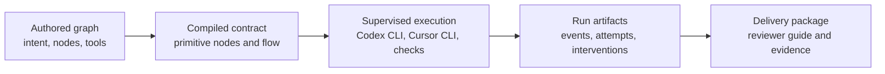

# Agentflow

Agentflow is a supervised execution runtime for long-running coding work.

Teams author a readable graph, hand meaningful work to external agent harnesses such as Codex CLI or Cursor CLI, and get back a durable run record with supervisor interventions, validation evidence, and a review-ready delivery package.

Agentflow is built for local repositories and local control. The authored DAG remains the human-facing source of intent; the runtime compiles it into primitive executable nodes; the supervisor keeps execution bounded and inspectable; the delivery package makes the final change understandable.

## Core Promise

- Humans define the goal, constraints, acceptance criteria, repos, profiles, tools, and outcome artifacts.
- Agent nodes own substantial engineering outcomes rather than tiny prompt handoffs.
- Deterministic and AI checks are in-run sensors that feed structured evidence to the supervisor.
- Planned `checkpoint` nodes capture human approval inside repeat loops; supervisor `pause_for_human` handles safety stops outside the authored path.
- Supervisor interventions are policy-bounded, durable, and visible in `interventions.jsonl`.
- Terminal runs write a `delivery/` package that helps humans review the work quickly.

## Runtime Model



The graph is not a free-form planner. It is an accountable execution contract. The supervisor can retry with guidance, repair missing artifacts, rebuild context, run diagnostics, run a semantic-evaluation intervention, pause for human input, or fail the run. It cannot silently change the task, widen authority, bypass checks, or hide its interventions.

## Where To Start

- Humans evaluating Agentflow should read this README, then `docs/README.md` for the documentation map, `docs/product/scope.md` for the product boundary, and `docs/technical/architecture.md` for the runtime model.
- Graph authors should use the minimal graph below, `docs/examples/graphs/`, and `docs/product/operations.md` for validation and launch.
- Plugin authors should use `docs/product/plugins.md` for local or Git plugin packages, workflow exports, tool exports, and secure auth.
- Workflow evaluators should use `docs/product/evals.md` for suite layout, scenarios, variants, criteria, environment simulation, trajectory checks, benchmark reports, and the built-in dogfood suites. Use `npm run setup:eval-repos` before running the generated local-repo capability suite, and `npm run setup:realworld-evals` before running the pinned GitHub issue suite.
- Implementers and debuggers who need the mechanics should use `docs/technical/` for runtime lifecycle, context/artifact materialization, and tool injection details.
- Operators reviewing a terminal run should start with `delivery/manifest.json` and the human entrypoints it lists.
- Agents authoring or debugging Agentflow should use the packaged `agentflow`, `agentflow-evals`, and `agentflow-plugins` skills under `skills/`.

## Install And Build

```bash
npm install
npm run typecheck
npm test
npm run build
```

Run from source:

```bash
npm run graph-help
npm run validate -- --graph agentflow.graph.json
npm run run -- --graph agentflow.graph.json
```

After `npm run build`, the packaged CLI entries are `dist/cli/index.js` and `dist/af/index.js`. The npm binary names are:

- `agentflow`: human/operator CLI for validation, launch, resume, inspection, plugin resolution, and auth.
- `af`: agent-facing runtime CLI. Agentflow injects this into every agent node on `PATH`; humans normally do not use it outside a running node.

## Minimal Graph

```json
{
  "version": "1",
  "graph_id": "ship-reviewable-change",
  "intent": {
    "goal": "Implement a focused change and leave it ready for review.",
    "constraints": [
      "Keep the graph outcome-oriented.",
      "Avoid unrelated refactors."
    ],
    "acceptance_criteria": [
      "The change is implemented.",
      "Tests or checks provide evidence.",
      "The reviewer guide explains risk and review order."
    ]
  },
  "repos": {
    "main": { "path": "." }
  },
  "defaults": {
    "launch_profile": "codex",
    "workspace_backend": "worktree"
  },
  "profiles": {
    "codex": {
      "harness": "codex-cli",
      "model": "gpt-5-codex",
      "reasoning_effort": "medium",
      "sandbox": "workspace-write",
      "timeout_sec": 1800
    },
    "cursor": {
      "harness": "cursor-cli",
      "model": "auto",
      "sandbox": "workspace-write",
      "timeout_sec": 1800
    }
  },
  "supervision": {
    "actions": {
      "retry_with_guidance": { "max_uses": 2 },
      "repair_artifact": { "max_uses": 2 },
      "rebuild_context": { "max_uses": 1 },
      "run_diagnostic": { "max_uses": 3 },
      "pause_for_human": { "max_uses": 1 },
      "semantic_evaluation": { "max_uses": 2 }
    },
    "max_total_interventions": 8,
    "policy": {
      "pause_on_policy_risk": true,
      "pause_on_repeated_recovery": true,
      "drift_score_threshold": 0.8
    }
  },
  "graph": {
    "type": "sequence",
    "id": "root",
    "steps": [
      {
        "type": "agent",
        "id": "implement_slice",
        "repo": "main",
        "profile": "codex",
        "goal": "Implement the scoped change and leave reviewer-ready evidence.",
        "acceptance_criteria": [
          "Targeted validation is run or clearly explained.",
          "The handoff names changed files, validation, and residual risks."
        ],
        "constraints": [
          "Write a concise handoff to $AGENTFLOW_OUTPUT_DIR/change-summary.md."
        ],
        "context": [
          {
            "name": "goal",
            "from": "text",
            "text": "Keep the change focused and reviewable."
          }
        ],
        "artifacts": {
          "change_summary": {
            "from": "output_dir",
            "path": "change-summary.md",
            "description": "Implementation summary written by the agent."
          }
        }
      },
      {
        "type": "check",
        "id": "test",
        "repo": "main",
        "check_kind": "deterministic",
        "command": "npm",
        "args": ["test"]
      }
    ]
  }
}
```

Switching from Codex CLI to Cursor CLI is a graph-level launch-profile choice, not a different graph language. Both harnesses receive the same context packet, runtime CLI, tool contract, artifact contract, output directory, and timeout budget. `model: "auto"` means "do not pass an explicit model flag to the selected harness"; it does not select or fall back between Codex CLI and Cursor CLI.

## Graph Contract

Top-level fields:

- `version`: currently `"1"`.
- `graph_id`: stable id used for run roots and inspection.
- `intent`: required goal plus optional constraints and acceptance criteria.
- `repos`: local repository aliases. Defaults to `{ "main": { "path": "." } }`.
- `defaults`: launch profile and workspace backend.
- `profiles`: harness, model, sandbox, env, timeout, and input budget settings. Omit `model` or set `"model": "auto"` to let the installed Codex CLI or Cursor CLI choose its default model.
- `supervision`: resolved supervisor actions, intervention budget, drift threshold, and pause rules.
- `plugins` and `tools`: plugin-bundled CLI capabilities. Put non-secret defaults inline under `tools[].config`.
- `prerequisites`: local launch checks for files, commands, env vars, and repos.
- `graph`: `sequence`, `parallel`, `repeat`, executable nodes, or managed patterns.

Executable nodes are `agent`, `exec`, `check`, and `checkpoint`. Containers are `sequence`, `parallel`, and `repeat`. Managed patterns are `pattern_deep_research` and `pattern_deep_work`.

`checkpoint` is the planned human gate. In this release it belongs inside a `repeat` body so a human pass, deny, or abort decision can drive loop control and operator feedback. Supervisor `pause_for_human` is different: it is a safety pause chosen by runtime policy after a failure or risk classification, persisted in run state, and resumed with `agentflow resume --human-action ...`.

Top-level `repos` are operational bindings: they say which local checkouts exist and where nodes execute. Top-level `profiles` are operational authority: they say which harness, sandbox, timeout, model, and tool policy a node receives. Scope boundaries belong in plain-language `constraints` so authors do not have to choose between overlapping soft fields.

Agent and AI check nodes require `goal`. Executable nodes may add `acceptance_criteria` and `constraints`; Agentflow renders those structured fields into Codex CLI and Cursor CLI prompts, supervisor repair prompts, and resume fingerprints.

Nodes exchange material through:

- `context`: text, workspace files, workspace globs, and named prior artifacts.
- `artifacts`: named durable files produced from `$AGENTFLOW_OUTPUT_DIR` or the workspace.

Reserved automatic artifacts are `agent_response`, `verification_json`, `stdout`, and `stderr`.

## Authoring Workflow

1. Write the top-level `intent.goal` and `acceptance_criteria` first.
2. Declare `repos` and `profiles` so execution authority is visible.
3. Add outcome-sized nodes with node-level `goal`, `acceptance_criteria`, and named `artifacts`.
4. Add deterministic checks for hard gates. Use AI checks only when another node needs an explicit in-run sensor; passing agent attempts are already graded against their acceptance criteria by outcome verification.
5. Add plugin tools only when a team capability should be available to the agent; keep secret values in plugin `credentials`.
6. Run `agentflow plugin resolve --graph <path>` when plugins are declared.
7. Run `agentflow validate --graph <path>`, `--review` or `--strict-review` for authoring guidance, `--run-ready` for local readiness, and `--show-compiled` or `--diagram` to inspect the compiled shape.
8. Launch only after the compiled graph and authoring review show the expected harnesses, sandboxes, tools, context, artifacts, checks, handoffs, and supervision policy.

## Supervisor

The runtime records supervisor decisions in `supervisor-timeline.jsonl`, intervention worker records in `interventions.jsonl`, and worker evidence from `af log` in `runtime/log.jsonl`. Supervision happens at scheduler boundaries after node attempts complete or fail:

- `retry_with_guidance`
- `repair_artifact`
- `rebuild_context`
- `run_diagnostic`
- `pause_for_human`
- `semantic_evaluation`
- `fail`

Each configured action uses `actions.<action>.max_uses`, with `max_total_interventions` enforcing the overall cap. The configured action is the budget entry point; internally, the supervisor applies a runtime overlay such as context repair, evidence-backed retry, artifact repair, terminal fail, or authority pause. The default supervisor action is observe; it intervenes only when graph success, node alignment, artifact integrity, or policy safety is at risk.

If a successful agent attempt misses a declared artifact, validation has already accepted the graph shape, so the runtime treats it as a repairable execution problem. When a harness is available, the supervisor runs an intent-aware repair intervention under the same node authority. When exactly one missing artifact is a human-readable text handoff and no harness is available, the supervisor can synthesize it from the captured `agent_response`; machine-readable artifacts and multi-artifact contracts are not synthesized from prose. Failed harness attempts keep their real failure output as the primary diagnostic; any files they wrote remain evidence for repair, not published declared handoffs.

Context packaging failures are recovered deterministically when possible. `agentflow validate --run-ready` tokenizes real matched context, reports broad glob samples and largest files, honors default dependency/generated-tree ignores, and fails before launch when a node would exceed `max_total_tokens`. At runtime, the supervisor classifies these as `context_contract_failure`, writes context analysis and a context repair patch, then retries with a compact `supervisor_context_repair` packet instead of repeating the same oversized context.

The same recovery loop handles other machine-fixable failures before it considers a pause. Validation timeouts receive focused validation guidance, forbidden failed-attempt workspace edits are restored from node snapshots before retry, and transient runtime wrapper/PATH failures retry with regenerated per-execution Agentflow tool wrappers. Human pause is reserved for authority, credentials, security/compliance, product intent, explicit checkpoints, or graph-contract changes.

`retry_with_guidance` records a case file, evidence patches, a recovery plan, a material delta, and a recovery envelope, tracks repeated failure fingerprints, emits `supervisor.retry_scheduled`, then waits before re-queueing the node. The original goal, acceptance criteria, constraints, repo authority, sandbox, and declared artifacts remain unchanged. The default delay is 10 seconds with exponential backoff capped at 2 minutes; `AGENTFLOW_RETRY_BASE_DELAY_MS` and `AGENTFLOW_RETRY_MAX_DELAY_MS` override those values for local testing or operations.

## Evaluation Lanes

- Graph `check` nodes are in-run sensors. Deterministic checks verify hard facts; AI checks judge semantic criteria and return structured evidence.
- Outcome verification is the always-on runtime contract for passing `agent` attempts. It audits the final response, declared artifacts, decision logs, and per-node workspace-change evidence before the attempt can remain passed.
- Supervisor `semantic_evaluation` is an intervention. It spends supervisor budget after a runtime classification and records recovery evidence.
- Managed pattern evaluation is authored workflow structure. `pattern_deep_work` expands completion criteria into command checks, rubric checks, artifact-rubric checks, a deterministic scorecard gate, and a bounded repair loop.
- `agentflow eval` is offline workflow evaluation for file-backed suites, scenarios, variants, repeated trials, required criteria, quality criteria, trajectory checks, and deterministic environment simulation. Its design follows Anthropic's [Demystifying evals for AI agents](https://www.anthropic.com/engineering/demystifying-evals-for-ai-agents) and adopts useful ADK eval mechanics, and it writes `.agentflow/evals` artifacts such as `eval-run.json`, `evaluation-ledger.json`, `trace-packet.json`, `scorecard.json`, `benchmark.json`, and `report.md`. See `docs/product/evals.md` for the full suite schema and operating loop.

## Plugin Tools

Plugins expose team capabilities as ordinary CLI tools. Each tool declares an `executable` and a clear `description`; tools that need auth declare `credentials`; tools that accept graph-provided defaults may declare `config_schema`.

Agentflow resolves plugin tools, places generated launch wrappers on the node `PATH`, and renders the tool contract into the harness prompt without exposing configured values. Non-secret inline `tools[].config` values and secret credentials are resolved only inside the generated launcher when it starts the plugin tool subprocess. `tools[].config` is for graph-provided defaults, not the tool's CLI argument schema; exact CLI arguments belong in the tool executable's `--help`. `agentflow auth` stores secret fields in macOS Keychain and requires `--value-stdin` for secret values. Credential and tool-config values are not exported into the Codex CLI or Cursor CLI harness environment. Declaring a tool in the graph is the operator approval to expose it to eligible nodes. The tool name `af` is reserved for Agentflow's runtime CLI.

For the implementation mechanics, see `docs/technical/runtime-tooling.md`.

## Agent Runtime CLI

Every agent node receives a generated `af` command on `PATH`. It is a local runtime broker backed by files under the run root; it does not expose credentials to the harness. The command gives agents a concrete way to inspect their contract, publish artifacts, record structured evidence, and spawn focused helper sub-nodes.

Core commands available inside an agent node:

- `af status`: show run id, agent id, node id, workspace, output directory, required artifacts, and granted tools.
- `af tools list`: show plugin tools granted to this node.
- `af context show`: show the materialized context manifest and packet path.
- `af artifact list|write`: inspect and publish declared artifacts.
- `af log --type progress|finding|blocker|risk|question|handoff_note|decision --summary ...`: record worker evidence for supervisor and delivery review. Use `--type decision --decision ... --rationale ... --evidence ...` for major scope-affecting decisions.
- `af spawn --brief ... --artifact ... --wait`: request a supervised helper with selected skills/tools and wait for its artifact.

Logs are coordination evidence; artifacts are the durable handoff. If an agent has ended, rely on declared artifacts and post-attempt supervisor handling rather than assuming an online collaborator.

## Delivery Package

Every terminal run writes:

- `summary.md`
- `events.jsonl`
- `interventions.jsonl`
- `delivery/manifest.json`
- `delivery/task-brief.md`
- `delivery/implementation-summary.md`
- `delivery/run-map.md`
- `delivery/grouped-change-map.json`
- `delivery/decision-log.md`
- `delivery/evaluation-ledger.json`
- `delivery/reviewer-guide.md`
- `delivery/risk-notes.md`
- `delivery/follow-up-items.md`
- `delivery/intervention-trace.json`

The delivery package is intentionally higher signal than raw logs. `delivery/manifest.json` separates human entrypoints (`reviewer-guide.md`, `task-brief.md`, `implementation-summary.md`, `run-map.md`, `risk-notes.md`, `follow-up-items.md`) from evidence files (`grouped-change-map.json`, `evaluation-ledger.json`, `decision-log.md`, `intervention-trace.json`) and internal runtime artifacts (`state.json`, `events.jsonl`, `interventions.jsonl`, node attempt directories). Humans should start with the delivery files; resume and low-level debugging use the internal artifacts.

## CLI Workflow

```bash
agentflow graph-help
agentflow plugin resolve --graph agentflow.graph.json
agentflow validate --graph agentflow.graph.json
agentflow validate --graph agentflow.graph.json --review
agentflow validate --graph agentflow.graph.json --strict-review
agentflow validate --graph agentflow.graph.json --run-ready
agentflow validate --graph agentflow.graph.json --show-compiled
agentflow validate --graph agentflow.graph.json --diagram-output graph.mmd
agentflow validate --graph agentflow.graph.json --diagram-image-output graph.svg
agentflow validate --graph agentflow.graph.json --diagram-image-output graph.svg --diagram-image-package @mermaid-js/mermaid-cli@latest
agentflow run --graph agentflow.graph.json
agentflow inspect <run-root>
agentflow resume --run-root <run-root>
agentflow resume --run-root <run-root> --dry-run
agentflow resume --run-root <run-root> --reset-supervisor-budget
agentflow resume --graph agentflow.graph.json --latest
agentflow runs list --graph agentflow.graph.json
```

`validate` always includes the standard authoring review warnings. Use `--review` for deeper node-by-node guidance, `--strict-review` to fail on serious review findings, `--show-compiled` to inspect the compiled payload, `--diagram` or `--diagram-output` to produce Mermaid for the resolved execution plan, and `--diagram-image-output` to render an image. Image export uses `npx -y @mermaid-js/mermaid-cli` by default; use `--diagram-image-package` to choose a package spec, or `--diagram-image-renderer mmdc` with `AGENTFLOW_MERMAID_CLI_BIN` for an installed local binary.

## Validation

Use the same checks before merging runtime or contract changes:

```bash
npm run typecheck
npm test
npm run build
npm run validate:smoke
```

`validate:smoke` also verifies the built CLI against the repeat fixture across Codex CLI and Cursor CLI adapters with both `inplace` and `worktree` workspace backends.

## Repository Map

- `src/graph/`: authored schema, normalization, validation, and compilation.
- `src/runtime/`: scheduler, execution engine, harness calls, supervision, context resolution, delivery packaging.
- `src/supervisor/`: policy, failure classification, and intervention actions.
- `src/plugins/`: Git or local plugin workflows, plugin tool exports, and credential metadata.
- `src/artifacts/`: run-root paths, event projection, reconciliation, and readers.
- `src/cli/`: CLI commands and progress rendering.
- `docs/`: documentation map, product guidance, technical implementation notes, and runnable examples.
- `docs/product/`: workflow authoring, operations, eval, plugin, and managed-pattern guidance.
- `docs/technical/`: medium-level implementation docs for runtime lifecycle, context/artifact flow, and generated runtime tooling.
- `skills/`: installable Agentflow skills aligned to the supervised v1 contract.
