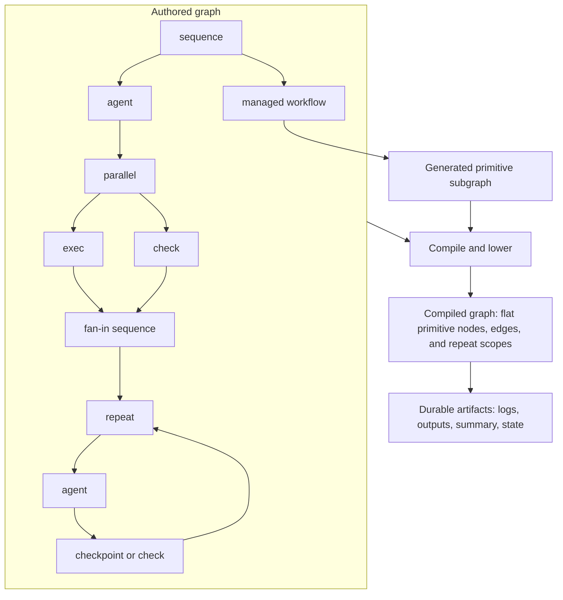

# Agentflow

Agentflow is a local-first execution engine for coding graphs.

It is for cases where you want a coding workflow to be explicit, reviewable, and reproducible instead of hidden inside an opaque prompt loop. You author a graph JSON document that declares repos, profiles, nodes, context flow, and outputs. Agentflow validates that authored graph, compiles it into a flat executable graph, runs it against one or more local repositories, and writes durable artifacts for inspection or resume.

The important boundary is simple: authors write an ergonomic nested graph, but the runtime executes compiled primitive nodes only.



The point is not just that Agentflow has several node kinds. It is that those node kinds compose into deliberate coding graphs: inspect, fan out, fan in, validate, repair, and hand off work with explicit structure.

## Why Agentflow

- Author the orchestration as data, not as hidden control flow inside a single agent prompt.
- Keep execution local-first with explicit repos, workspaces, harnesses, and checks.
- Compile author-friendly control flow into a runtime contract you can inspect before launch.
- Preserve a durable run trail with summaries, logs, outputs, events, and projected state.
- Reuse structured managed workflows when you want higher-level scaffolds without inventing new runtime node kinds.

## Node Model

| Category | Kinds | Runtime behavior |
| --- | --- | --- |
| Primitive executable nodes | `agent`, `exec`, `check`, `checkpoint` | Executed directly by the runtime |
| Authoring containers | `sequence`, `parallel`, `repeat` | Authoring-only control flow, compiled into primitive execution edges and scopes |
| Managed workflows | `deep_research`, `spec_design`, `execute_spec`, `review_change` | Authored as structured intent, lowered into generated primitive subgraphs |

## Release Boundary

- The runtime executes compiled graphs only.
- Agentflow does not provide a generalized tool plugin system yet.
- Agentflow does not support remote devboxes or native non-CLI harnesses in this release.

## Requirements

- Node `>= 20.7.0`
- npm
- Git
- Codex CLI if you want to run agent nodes or AI checks
- Cursor CLI only if you want to use `cursor-cli` profiles

Install dependencies:

```bash
npm install
```

Optional but useful:

```bash
npm run setup:link
```

That lets you use `agentflow ...` directly from the shell.

If you are working from source without linking, use the corresponding `npm run ... -- ...` wrapper commands instead. The docs below use the installed CLI form by default.

## 2-Minute Quick Start

Inspect the graph contract:

```bash
agentflow graph-help
```

Validate the included showcase graph:

```bash
agentflow validate --graph docs/examples/graphs/feature-showcase.json
```

Compile it:

```bash
agentflow compile --graph docs/examples/graphs/feature-showcase.json
```

Run it:

```bash
agentflow run --graph docs/examples/graphs/feature-showcase.json
```

## Included Example Graphs

See also: [`docs/examples/graphs/README.md`](docs/examples/graphs/README.md)

- [`docs/examples/graphs/fake-plan.json`](docs/examples/graphs/fake-plan.json)
  Small read-only sample with primitive `agent` and deterministic `check` nodes.
- [`docs/examples/graphs/feature-showcase.json`](docs/examples/graphs/feature-showcase.json)
  Broader sample that demonstrates profiles, `sequence`, `parallel`, `repeat`, primitive `agent`, `exec`, deterministic `check`, AI `check`, inputs, context flow, and outputs.
- [`docs/examples/graphs/deep-research-showcase.json`](docs/examples/graphs/deep-research-showcase.json)
  Managed workflow sample showing `deep_research` plus a downstream handoff node that consumes the synthesized result.
- [`docs/examples/graphs/spec-design-showcase.json`](docs/examples/graphs/spec-design-showcase.json)
  Managed workflow sample showing `spec_design` plus a downstream handoff node that consumes the published design spec.
- [`docs/examples/graphs/execute-spec-showcase.json`](docs/examples/graphs/execute-spec-showcase.json)
  Managed workflow sample showing the `spec_design -> execute_spec` path plus a downstream handoff node that consumes the published implementation handoff.
- [`docs/examples/graphs/review-change-showcase.json`](docs/examples/graphs/review-change-showcase.json)
  Managed workflow sample showing the `execute_spec -> review_change` path plus a downstream handoff node that consumes the final published review.

Important path rule:

- `--graph` resolves from the shell current working directory.
- `$.repos.*.path` resolves relative to the graph file directory.

That is why the sample graphs under `docs/examples/graphs/` use `"path": "../../.."` for the main repo.

## Mental Model

### Graph

A graph is the authored execution document.

Top-level fields:

- `version`
- `graph_id`
- `repos`
- `defaults`
- `profiles`
- `graph`

Current graph version:

```json
{ "version": "1" }
```

### Profile

A profile is a reusable execution-policy bundle.

Profiles typically define:

- `harness`
- `model`
- `reasoning_effort`
  Supported values: `none`, `low`, `medium`, `high`, `xhigh`
- `sandbox`
- `timeout_sec`
- `input_rules`

Profiles do not define graph structure.

### Node kinds

Three authoring categories matter:

- Primitive executable nodes: `agent`, `exec`, `check`, `checkpoint`
- Authoring containers: `sequence`, `parallel`, `repeat`
- Managed workflows: `deep_research`, `spec_design`, `execute_spec`, `review_change`

Only primitive executable nodes run directly. Containers compile into control-flow edges and scopes, and managed workflows compile into generated primitive subgraphs.

`deep_research`, `spec_design`, `execute_spec`, and `review_change` are structured managed workflows that compile into generated primitive subgraphs. Start with [`docs/MANAGED_WORKFLOWS.md`](docs/MANAGED_WORKFLOWS.md). The workflow-specific contracts live in [`docs/DEEP_RESEARCH_WORKFLOW.md`](docs/DEEP_RESEARCH_WORKFLOW.md), [`docs/SPEC_DESIGN_WORKFLOW.md`](docs/SPEC_DESIGN_WORKFLOW.md), [`docs/EXECUTE_SPEC_WORKFLOW.md`](docs/EXECUTE_SPEC_WORKFLOW.md), and [`docs/REVIEW_CHANGE_WORKFLOW.md`](docs/REVIEW_CHANGE_WORKFLOW.md).

Managed workflow summary:

- `deep_research`
  Clarifies a research question, fans out investigators, reconciles contradictions, and publishes a final report.
- `spec_design`
  Turns a problem statement into an implementation-ready design spec using repo-first inspection and targeted fallback research.
- `execute_spec`
  Executes a structured spec source through planning, implementation, validation, and bounded repair.
- `review_change`
  Reviews a structured change source with a multi-reviewer panel and publishes merged findings.

For workflow fields, authored examples, and compiled phases:

- [`docs/MANAGED_WORKFLOWS.md`](docs/MANAGED_WORKFLOWS.md)
- [`docs/DEEP_RESEARCH_WORKFLOW.md`](docs/DEEP_RESEARCH_WORKFLOW.md)
- [`docs/SPEC_DESIGN_WORKFLOW.md`](docs/SPEC_DESIGN_WORKFLOW.md)
- [`docs/EXECUTE_SPEC_WORKFLOW.md`](docs/EXECUTE_SPEC_WORKFLOW.md)
- [`docs/REVIEW_CHANGE_WORKFLOW.md`](docs/REVIEW_CHANGE_WORKFLOW.md)

Authoring contract references:

- Primitive nodes, shared executable fields, containers, `inputs`, `context_from`, and `outputs`: [`docs/ARCHITECTURE.md`](docs/ARCHITECTURE.md)
- `deep_research`: [`docs/DEEP_RESEARCH_WORKFLOW.md`](docs/DEEP_RESEARCH_WORKFLOW.md)
- `spec_design`: [`docs/SPEC_DESIGN_WORKFLOW.md`](docs/SPEC_DESIGN_WORKFLOW.md)
- `execute_spec`: [`docs/EXECUTE_SPEC_WORKFLOW.md`](docs/EXECUTE_SPEC_WORKFLOW.md)
- `review_change`: [`docs/REVIEW_CHANGE_WORKFLOW.md`](docs/REVIEW_CHANGE_WORKFLOW.md)

### Runs root

Every run writes durable artifacts under a runs root.

Resolution rules:

- If `AGENTFLOW_RUNS_ROOT` is set, it must be an absolute path and CLI commands use it.
- Otherwise Agentflow uses `<launch-cwd>/.agentflow/runs`.

## Minimal Graph

```json
{
  "version": "1",
  "graph_id": "example-graph",
  "repos": {
    "main": { "path": "." }
  },
  "defaults": {
    "launch_profile": "default",
    "workspace_backend": "worktree"
  },
  "profiles": {
    "default": {
      "harness": "codex-cli",
      "sandbox": "read-only"
    }
  },
  "graph": {
    "type": "sequence",
    "id": "root",
    "steps": [
      {
        "type": "agent",
        "id": "inspect_repo",
        "repo": "main",
        "prompt": "Inspect the repository and summarize what it does."
      },
      {
        "type": "check",
        "id": "verify_package",
        "repo": "main",
        "check_kind": "deterministic",
        "command": "node",
        "args": ["-e", "console.log(JSON.stringify({passed:true}))"],
        "pass_if": {
          "json_path": "$.passed",
          "equals": true
        }
      }
    ]
  }
}
```

## CLI Commands

### `graph-help`

Prints the current graph contract and a minimal example.

```bash
agentflow graph-help
```

### `validate`

Validates and compiles a graph without running it.

```bash
agentflow validate --graph ./agentflow.graph.json
```

Use this first whenever you author or change a graph.

### `compile`

Shows the compiled graph contract that the runtime will actually execute.

```bash
agentflow compile --graph ./agentflow.graph.json
```

Use this when you want to inspect lowered managed nodes, resolved profiles, compiled ids, repeat wiring, and dependency edges.

### `run`

Compiles and executes the graph and writes a new run root with artifacts.

```bash
agentflow run --graph ./agentflow.graph.json
```

Useful flags:

```bash
agentflow run --graph ./agentflow.graph.json --workspace-backend worktree
agentflow run --graph ./agentflow.graph.json --profile default --label demo
```

During a run, `agent` and AI `check` nodes append live harness output into each execution's `stdout.log` and `stderr.log` under the run root. The final completed logs still remain the authoritative artifact.

While the graph is running, the CLI also prints human-readable progress to `stderr`. The final machine-readable command result remains on `stdout`, so piping `agentflow run ... | jq` still works.

Cancel behavior:

- Press `Ctrl-C` in the terminal that launched the run.
- The runtime performs cleanup and writes durable canceled state.
- `summary.md`, `state.json`, and `events.jsonl` reflect that state from artifacts.

### `resume`

Resumes a failed or canceled run root in place.

```bash
agentflow resume --run-root ./.agentflow/runs/<run-id>
```

Resume behavior:

- recompiles from the original graph path with the current Agentflow build
- preserves only nodes whose latest durable outcome is `passed` and whose compiled execution contract is unchanged
- restarts failed, canceled, blocked, skipped, and pending nodes
- restarts repeat scopes from iteration 1 when they were unfinished or their compiled contract changed
- appends new events and attempts into the same run root

Like `run`, `resume` prints live graph progress to `stderr` and keeps its final structured result on `stdout`.

This is meant for interrupted or failed runs where you want to keep unchanged passed work while still picking up graph or workflow fixes.

## Inputs, Context, and Outputs

Supported input kinds:

- `file`
- `glob`
- `text`

Context can be pulled from earlier nodes with `context_from`.

Supported context includes:

- `summary`
- `result`
- `output`

Outputs let one node expose named material for downstream use.

This is how later nodes can consume:

- a prior agent summary
- a deterministic check result
- an AI check output file
- the latest passed loop iteration output

## Harness Notes

### Codex

- Works for `agent` nodes
- Works for AI `check` nodes
- If `reasoning_effort` is omitted, Agentflow resolves Codex to `medium`

### Cursor

- Works for `agent` nodes
- Read-only agent flows run without `--force`, so they stay in proposal mode
- AI checks are currently Codex-only because strict read-only evaluator guarantees are enforced there

## Validation and Confidence

Use these in increasing order of proof.

### Basic graph checks

```bash
agentflow validate --graph docs/examples/graphs/fake-plan.json
agentflow compile --graph docs/examples/graphs/feature-showcase.json
```

### Package-level smoke gate

```bash
npm run validate:smoke
```

This runs:

- canonical docs check
- `typecheck`
- `test`
- `build`
- built CLI smoke over the shipped graph fixture
- built run smoke with mock Codex and Cursor harnesses

### Stronger deterministic confidence

```bash
npm run validate:confidence
```

This adds:

- coverage policy enforcement

### Real harness smoke

```bash
npm run validate:real-harness
```

This is optional and machine-local. It only runs for harness binaries detected on your machine.

## Day-One Commands

If you only want the commands most people need first:

```bash
npm install
npm run setup:link
agentflow graph-help
agentflow validate --graph docs/examples/graphs/feature-showcase.json
agentflow compile --graph docs/examples/graphs/feature-showcase.json
agentflow run --graph docs/examples/graphs/feature-showcase.json
agentflow resume --run-root ./.agentflow/runs/<run-id>
```

## Where To Read Next

You should not need anything else to get started. If you want deeper detail after that:

- [`docs/SCOPE.md`](docs/SCOPE.md): supported product surface
- [`docs/ARCHITECTURE.md`](docs/ARCHITECTURE.md): compiler, runtime, and artifact contracts
- [`docs/OPERATIONS.md`](docs/OPERATIONS.md): runs-root behavior, lifecycle, cleanup, and operator runbook
- [`docs/MANAGED_WORKFLOWS.md`](docs/MANAGED_WORKFLOWS.md): managed workflow model and shipped workflow nodes
