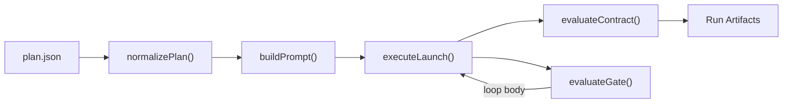

# agentflow

`agentflow` is a file-driven workflow orchestrator for coding agents.

You define a JSON plan with task, command, group, and loop nodes, and `agentflow` executes it against a target repository — spawning agent CLI sessions, running deterministic commands, managing worktrees, evaluating gates, and writing deterministic run artifacts.

Plans are **blueprints** — structured specifications that decompose large-scale codebase changes into atomic, sequential agent tasks with built-in validation and review.

**Want an AI to help you write plans?** Copy [docs/blueprints.md](./docs/blueprints.md) into any LLM conversation — it contains the complete schema, methodology, prompt patterns, and plan architectures in a single document.

## Architecture



**Execution model:**

- **task** -- one agent CLI invocation (codex or cursor)
- **command** -- one deterministic shell command invocation (`command` + `args`)
- **group** -- a container of child nodes; `parallel: false` for sequential, `parallel: true` for concurrent
- **loop** -- repeats its body until a gate passes or `max_iterations` is exhausted
- **gate** -- loop evaluator, either deterministic (run a command) or AI (prompt a model); outputs `{ passed, score, reasons }`

Each task gets an isolated git worktree (when `worktrees: true`), a structured prompt with persona/context/prior-task summaries (plus loop gate feedback when applicable), and writes a report + summary on completion.

## Prerequisites

- Node.js `>=20`
- `git` on `PATH`
- At least one supported provider CLI installed and authenticated:
  - `codex` CLI (default provider)
  - Cursor CLI (`agent` command) -- install via `curl https://cursor.com/install -fsS | bash`

Quick checks:

```bash
node -v
git --version
codex --help    # if using codex provider
agent --version # if using cursor provider
```

## Install

```bash
git clone <repo-url> && cd agentflow
npm install
```

### Global CLI (recommended)

Link the module once so you can run `agentflow` from any directory:

```bash
npm run setup:link      # creates the global "agentflow" command
```

Verify it works:

```bash
agentflow --help
```

To unlink later:

```bash
npm run setup:unlink
```

## Run

With the global link installed:

```bash
agentflow --plan path/to/plan.json
```

Or from the project directory without linking:

```bash
npm run dev -- --plan example_plan.json
```

### Common commands

```bash
# Dry-run (no agent sessions launched)
agentflow --plan plan.json --dry-run

# Validate plan schema without executing
agentflow --plan plan.json --validate

# Resume a previously failed run
agentflow --plan plan.json --resume tmp/agentflow_runs/<run_id>

# Detailed plan schema reference
agentflow --plan-help
```

## CLI Options

| Flag | Description |
|---|---|
| `--plan <path>` | Plan file path (JSON). Also accepted as a positional argument. |
| `--validate` | Validate plan schema and context files, then exit. No directories created. |
| `--resume <run_dir>` | Resume a previously failed run, skipping already-completed tasks. |
| `--dry-run` | Simulate execution without launching agent CLI sessions. |
| `--skip-git-repo-check` | Pass through to provider CLI for non-git or trust-check-blocked repos. |
| `--sandbox <mode>` | Worker sandbox mode: `read-only`, `workspace-write` (default), or `danger-full-access`. For cursor, maps to `enabled`/`disabled`. |
| `--plan-help` | Print detailed plan schema reference. |
| `--help` / `-h` | Show usage overview. |

## Plans

A plan is a JSON file with `repos` (target repositories) and `flow` (an ordered array of nodes):

- **task** -- one agent CLI invocation with a prompt
- **command** -- one deterministic shell command
- **group** -- a container of child nodes (sequential or parallel)
- **loop** -- repeats its body until a gate passes or iterations are exhausted

Minimal example:

```json
{
  "repos": { "main": "." },
  "flow": [
    { "type": "task", "id": "implement", "prompt": "Implement the feature." }
  ]
}
```

For the complete plan schema, methodology, prompt patterns, and plan architectures, see [docs/blueprints.md](./docs/blueprints.md) — a self-contained reference you can also paste into any LLM conversation for plan-authoring help.

## Exit Codes

| Code | Meaning |
|---|---|
| `0` | All tasks completed successfully. |
| `1` | Validation or execution failure. |
| `2` | CLI usage error. |

## Multi-Repo

`agentflow` supports plans that span multiple repositories. Define a `repos` map with one alias per repo:

```json
{
  "repos": {
    "api": "../api-service",
    "web": "../web-app"
  },
  "flow": [
    { "type": "task", "id": "schema", "repo": "api", "prompt": "Update the API schema." },
    { "type": "task", "id": "client", "repo": "web", "prompt": "Regenerate the client from the new schema.", "context_from": ["schema"] }
  ]
}
```

When `repos` has a single entry, the task-level `repo` field is optional. When multiple entries exist, every task must specify which repo it targets.

Context files can reference any repo by alias: `"context_files": ["api:src/schema.ts"]`.

## Example

See [example_plan.json](./example_plan.json) for a plan demonstrating all node types, provider overrides, `context_from`, and per-task `persona`.

## Docs

| Guide | What it covers |
|---|---|
| [**Blueprints**](./docs/blueprints.md) | **Start here.** Complete self-contained reference — paste into any LLM to get help writing plans |
| [Blueprint Guide](./docs/guide.md) | Core principles, plan architecture, context strategy, anti-patterns |
| [Prompt Patterns](./docs/prompt-patterns.md) | Reusable prompt structures: persona, batch modification, extraction, review, validation |
| [Plan Patterns](./docs/plan-patterns.md) | Composable plan architectures: ETV, batch+review, loop-until-clean, multi-branch |
| [Troubleshooting](./docs/troubleshooting.md) | Common errors, resume strategies, reading run artifacts |
| [Cursor Rule](./docs/cursor-rule.md) | Copyable Cursor rule for AI-assisted plan authoring in your own repo |

## Development

```bash
npm run typecheck   # type-check without emitting
npm test            # run all unit + integration tests
```

## Providers

### codex (default)

Uses `codex exec` with stdin piping and `-o` for output capture. Supports `--profile`, `--sandbox`, and `-c model_reasoning_effort=...` flags.

### cursor

Uses Cursor CLI (`agent -p`) in non-interactive print mode. The prompt is passed as a positional argument. Output is captured from stdout. Runs with `--force` and `--trust` for headless operation.

Sandbox mapping: `read-only` and `workspace-write` map to `--sandbox enabled`; `danger-full-access` maps to `--sandbox disabled`.

The `reasoning` and `profile` plan fields are silently ignored when the cursor provider is used.
