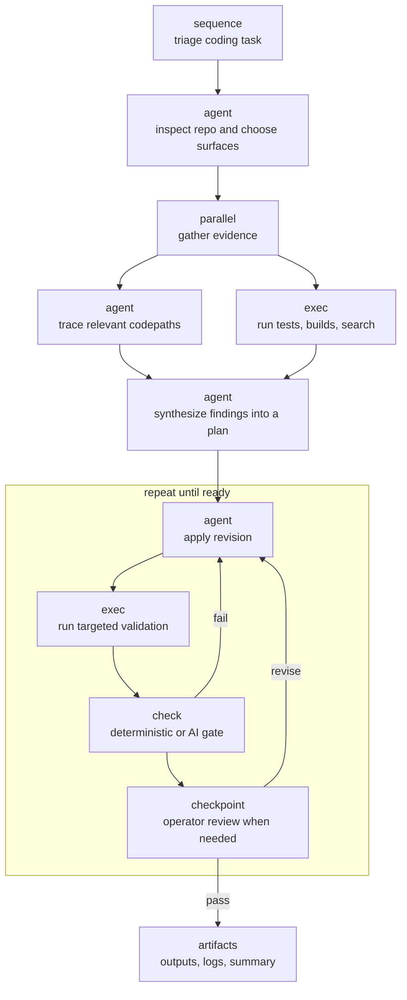

# Agentflow

Agentflow is a graph-native execution engine for coding tasks.

It turns coding work into an explicit executable graph instead of burying the workflow inside one long prompt. A graph can inspect a repository, gather evidence in parallel, merge those findings into a plan, iterate on implementation, and gate completion with automated or operator review. The CLI validates that graph, compiles it into a runtime plan, runs it against local repositories, and leaves durable artifacts behind so the work can be inspected or resumed.

The key boundary is simple: you author readable control flow, but the runtime executes compiled primitive nodes only.



Managed patterns such as `pattern_deep_research`, `pattern_spec_design`, `pattern_generate_evaluate_fix`, and `pattern_review_change` are authored shortcuts that lower into generated primitive subgraphs rather than introducing a separate runtime model. Plugins use the same idea for team-owned workflows: a graph can reference a Git-resolved plugin workflow, resolve it into a lockfile, and compile it into normal Agentflow nodes.

The point is not just that Agentflow has several node kinds. It is that those node kinds compose into deliberate coding graphs: fan out when evidence gathering is independent, fan in when a plan needs synthesis, and use repair loops only where implementation and validation genuinely need iteration.

## Why Agentflow

- Author the orchestration as data, not as hidden control flow inside a single agent prompt.
- Keep execution local-first with explicit repos, workspaces, harnesses, and checks.
- Compile author-friendly control flow into a runtime contract you can inspect before launch.
- Preserve a durable run trail with summaries, logs, artifacts, events, and projected state.
- Reuse structured managed patterns when you want higher-level scaffolds without inventing new runtime node kinds.
- Reuse Git-distributed plugin workflows when a team needs its own managed graph, context files, scripts, and local conventions.

## Node Model

| Category | Kinds | Runtime behavior |
| --- | --- | --- |
| Primitive executable nodes | `agent`, `exec`, `check`, `checkpoint` | Executed directly by the runtime |
| Authoring containers | `sequence`, `parallel`, `repeat` | Authoring-only control flow, compiled into primitive execution edges and scopes |
| Managed patterns | `pattern_deep_research`, `pattern_spec_design`, `pattern_generate_evaluate_fix`, `pattern_review_change` | Authored as structured intent, lowered into generated primitive subgraphs |
| Plugin workflows | `plugin` | Git-resolved reusable managed workflows, lowered into generated primitive subgraphs before compile |

## Release Boundary

- The runtime executes compiled graphs only.
- Plugins package reusable managed workflows. They do not add runtime sidecars, new primitive node kinds, or harness-specific tool semantics.
- Agentflow does not support remote devboxes or native non-CLI harnesses in this release.

## Requirements

- Node `>= 20.7.0`
- npm
- Git
- Codex CLI if you want to run agent nodes or AI checks
- Cursor CLI only if you want to use `cursor-cli` profiles

Install dependencies:

```bash
npm install
```

Optional but useful:

```bash
npm run setup:link
```

That lets you use `agentflow ...` directly from the shell.

If you are working from source without linking, use the corresponding `npm run ... -- ...` wrapper commands instead. The docs below use the installed CLI form by default.

## 2-Minute Quick Start

Inspect the graph contract:

```bash
agentflow graph-help
```

Validate the included showcase graph:

```bash
agentflow validate --graph docs/examples/graphs/feature-showcase.json
```

Compile it:

```bash
agentflow compile --graph docs/examples/graphs/feature-showcase.json
```

Run it:

```bash
agentflow run --graph docs/examples/graphs/feature-showcase.json
```

## Included Example Graphs

See also: [`docs/examples/graphs/README.md`](docs/examples/graphs/README.md)

- [`docs/examples/graphs/fake-plan.json`](docs/examples/graphs/fake-plan.json)
  Small read-only sample with primitive `agent` and deterministic `check` nodes.
- [`docs/examples/graphs/feature-showcase.json`](docs/examples/graphs/feature-showcase.json)
  Broader sample that demonstrates profiles, `sequence`, `parallel`, `repeat`, primitive `agent`, `exec`, deterministic `check`, AI `check`, context flow, declared artifacts, and a repair loop that uses `latest_failed` and `latest_passed`.
- [`docs/examples/graphs/pattern-deep-research-showcase.json`](docs/examples/graphs/pattern-deep-research-showcase.json)
  Managed pattern sample showing `pattern_deep_research` plus a downstream handoff node that consumes the published research package.
- [`docs/examples/graphs/pattern-spec-design-showcase.json`](docs/examples/graphs/pattern-spec-design-showcase.json)
  Managed pattern sample showing `pattern_spec_design` plus a downstream handoff node that consumes the published design package.
- [`docs/examples/graphs/pattern-generate-evaluate-fix-showcase.json`](docs/examples/graphs/pattern-generate-evaluate-fix-showcase.json)
  Managed pattern sample showing the `pattern_spec_design -> pattern_generate_evaluate_fix` path plus a downstream handoff node that consumes the published change package.
- [`docs/examples/graphs/pattern-review-change-showcase.json`](docs/examples/graphs/pattern-review-change-showcase.json)
  Managed pattern sample showing the `pattern_generate_evaluate_fix -> pattern_review_change` path plus a downstream handoff node that consumes the final published review package.

## Packaged Skills

This repo also ships one installable agent skill under [`skills/`](skills/README.md) in a `skills.sh` compatible layout.

Included skill:

- [`agentflow`](skills/agentflow/SKILL.md)
  A compact router skill with packaged references for graph authoring, managed workflows, local eval suites, run debugging, graph contracts, CLI validation, failure semantics, and examples.

Once the repo is published, supporting agents can install the package with:

```bash
npx skills add <owner/repo>
```

Important path rule:

- `--graph` resolves from the shell current working directory.
- `$.repos.*.path` resolves relative to the graph file directory.

That is why the sample graphs under `docs/examples/graphs/` use `"path": "../../.."` for the main repo.

## Mental Model

### Graph

A graph is the authored execution document.

Top-level fields:

- `version`
- `graph_id`
- `repos`
- `plugins`
- `defaults`
- `profiles`
- `graph`

Current graph version:

```json
{ "version": "1" }
```

### Profile

A profile is a reusable execution-policy bundle.

Profiles typically define:

- `harness`
- `model`
- `reasoning_effort`
  Supported values: `none`, `low`, `medium`, `high`, `xhigh`
- `sandbox`
- `skip_git_repo_check`
- `env_files`
- `timeout_sec`
- `input_rules`
- `artifact_repair`

Profiles do not define graph structure.

### Node kinds

Four authoring categories matter:

- Primitive executable nodes: `agent`, `exec`, `check`, `checkpoint`
- Authoring containers: `sequence`, `parallel`, `repeat`
- Managed patterns: `pattern_deep_research`, `pattern_spec_design`, `pattern_generate_evaluate_fix`, `pattern_review_change`
- Plugin workflows: `plugin`

Only primitive executable nodes run directly. Containers compile into control-flow edges and scopes. Managed patterns and plugin workflows compile into generated primitive subgraphs.

`pattern_deep_research`, `pattern_spec_design`, `pattern_generate_evaluate_fix`, and `pattern_review_change` are structured managed patterns that compile into generated primitive subgraphs. Start with [`docs/MANAGED_PATTERNS.md`](docs/MANAGED_PATTERNS.md). The pattern-specific contracts live in [`docs/PATTERN_DEEP_RESEARCH.md`](docs/PATTERN_DEEP_RESEARCH.md), [`docs/PATTERN_SPEC_DESIGN.md`](docs/PATTERN_SPEC_DESIGN.md), [`docs/PATTERN_GENERATE_EVALUATE_FIX.md`](docs/PATTERN_GENERATE_EVALUATE_FIX.md), and [`docs/PATTERN_REVIEW_CHANGE.md`](docs/PATTERN_REVIEW_CHANGE.md).

Plugin workflows are team-authored managed graphs distributed through Git. A graph declares plugin sources at the top level, resolves them with `agentflow plugin resolve --graph`, and then uses `type = "plugin"` nodes with `uses = "alias/workflow"`. See [`docs/PLUGINS.md`](docs/PLUGINS.md).

Managed patterns share a common base:

- `brief`
- `context_policy`
- `strategy`
- optional `runtime`

Pattern-specific fields vary:

- `pattern_deep_research`: optional `approval_policy`, `delivery`
- `pattern_spec_design`: optional `approval_policy`, `delivery`
- `pattern_generate_evaluate_fix`: `task_source`, `evaluation`
- `pattern_review_change`: `review_source`, `delivery`

They are autonomous by default. Only `pattern_deep_research` and `pattern_spec_design` expose `approval_policy`, and a checkpoint appears only when that field explicitly enables one.

Managed pattern summary:

- `pattern_deep_research`
  Plans and runs research, consolidates evidence, and publishes a sourced report plus machine-readable packet.
- `pattern_spec_design`
  Turns a repo-grounded problem statement into an implementation-ready design package plus machine-readable packet.
- `pattern_generate_evaluate_fix`
  Consumes a prepared task packet, generates or fixes a change, evaluates concrete commands independently, and optionally loops until the hard gate passes.
- `pattern_review_change`
  Reviews a structured change source with a reviewer panel and publishes a calibrated review summary plus machine-readable bundle.

For pattern fields, authored examples, and compiled phases:

- [`docs/MANAGED_PATTERNS.md`](docs/MANAGED_PATTERNS.md)
- [`docs/PATTERN_DEEP_RESEARCH.md`](docs/PATTERN_DEEP_RESEARCH.md)
- [`docs/PATTERN_SPEC_DESIGN.md`](docs/PATTERN_SPEC_DESIGN.md)
- [`docs/PATTERN_GENERATE_EVALUATE_FIX.md`](docs/PATTERN_GENERATE_EVALUATE_FIX.md)
- [`docs/PATTERN_REVIEW_CHANGE.md`](docs/PATTERN_REVIEW_CHANGE.md)

Authoring contract references:

- Primitive nodes, shared executable fields, containers, `context`, and `artifacts`: [`docs/ARCHITECTURE.md`](docs/ARCHITECTURE.md)
- `pattern_deep_research`: [`docs/PATTERN_DEEP_RESEARCH.md`](docs/PATTERN_DEEP_RESEARCH.md)
- `pattern_spec_design`: [`docs/PATTERN_SPEC_DESIGN.md`](docs/PATTERN_SPEC_DESIGN.md)
- `pattern_generate_evaluate_fix`: [`docs/PATTERN_GENERATE_EVALUATE_FIX.md`](docs/PATTERN_GENERATE_EVALUATE_FIX.md)
- `pattern_review_change`: [`docs/PATTERN_REVIEW_CHANGE.md`](docs/PATTERN_REVIEW_CHANGE.md)

### Runs root

Every run writes durable artifacts under a runs root.

Resolution rules:

- If `AGENTFLOW_RUNS_ROOT` is set, it must be an absolute path and CLI commands use it.
- Otherwise Agentflow uses `<launch-cwd>/.agentflow/runs`.

## Minimal Graph

```json
{
  "version": "1",
  "graph_id": "example-graph",
  "repos": {
    "main": { "path": "." }
  },
  "defaults": {
    "launch_profile": "default",
    "workspace_backend": "worktree"
  },
  "profiles": {
    "default": {
      "harness": "codex-cli",
      "sandbox": "read-only"
    }
  },
  "graph": {
    "type": "sequence",
    "id": "root",
    "steps": [
      {
        "type": "agent",
        "id": "inspect_repo",
        "repo": "main",
        "prompt": "Inspect the repository and summarize what it does."
      },
      {
        "type": "check",
        "id": "verify_package",
        "repo": "main",
        "check_kind": "deterministic",
        "command": "node",
        "args": ["-e", "console.log(JSON.stringify({passed:true}))"],
        "pass_if": {
          "json_path": "$.passed",
          "equals": true
        }
      }
    ]
  }
}
```

## CLI Commands

### `graph-help`

Prints the current graph contract, including `prerequisites.checks`, soft verification via `on_failure`, repeat selector guidance, and a minimal example.

```bash
agentflow graph-help
```

### `validate`

Validates and compiles a graph without running it. In an interactive terminal, success output is intentionally compact. Structured JSON remains available when stdout is redirected or when callers use the API-level command result.

```bash
agentflow validate --graph ./agentflow.graph.json
```

Use this first whenever you author or change a graph, especially when managed patterns or run prerequisites are involved.

Add run-ready validation when you need proof that the local machine can launch the graph:

```bash
agentflow validate --graph ./agentflow.graph.json --run-ready
```

`--run-ready` checks runtime dependencies such as `git`, referenced repo worktrees, executable node commands, and harness binaries for agent and AI-check nodes.

### `compile`

Shows the compiled graph contract that the runtime will actually execute.

```bash
agentflow compile --graph ./agentflow.graph.json
```

Use this when you want to inspect lowered managed nodes, resolved profiles, compiled ids, repeat wiring, and dependency edges.

### `plugin resolve`

Resolves Git-distributed plugin workflows declared by a graph and writes `agentflow.plugins.lock.json` next to that graph.

```bash
agentflow plugin resolve --graph ./agentflow.graph.json
```

Run this before `validate`, `compile`, or `run` when a graph has a top-level `plugins` block. Normal validation and execution use the lockfile and local cache; they do not clone plugins implicitly.

### `run`

Compiles and executes the graph and writes a new run root with artifacts.

```bash
agentflow run --graph ./agentflow.graph.json
```

Useful forms:

```bash
agentflow run --graph ./agentflow.graph.json
agentflow run --graph ./agentflow.graph.json --label demo
```

During a run, `agent` and AI `check` nodes append live harness output into each execution's `logs/stdout.log` and `logs/stderr.log` under the run root. The final completed logs still remain the authoritative artifact.

While the graph is running, the CLI also prints human-readable progress to `stderr`. When `stdout` is a terminal, `run` prints a compact terminal summary with the final status and duration. When `stdout` is redirected or piped, the final machine-readable JSON result remains on `stdout`, so `agentflow run ... | jq` still works.

Cancel behavior:

- Press `Ctrl-C` in the terminal that launched the run.
- The runtime performs cleanup and writes durable canceled state.
- `summary.md`, `state.json`, and `events.jsonl` reflect that state from artifacts.

### `resume`

Resumes a failed or canceled run root in place.

```bash
agentflow resume --run-root ./.agentflow/runs/<run-id>
```

Resume behavior:

- recompiles from the original graph path with the current Agentflow build
- preserves only nodes whose latest durable outcome is `passed` and whose compiled contract is unchanged
- restarts failed, canceled, blocked, skipped, and pending nodes
- restarts repeat scopes from iteration 1 when they were unfinished or their compiled contract changed
- does not treat live workspace file changes as a resume invalidation boundary
- appends new events and attempts into the same run root

Like `run`, `resume` prints live graph progress to `stderr`, shows a compact terminal summary on interactive `stdout`, and keeps its final structured JSON result on `stdout` when redirected or piped.

This is meant for interrupted or failed runs where you want to keep unchanged passed work while still picking up graph or workflow fixes.

### `apply`

Applies captured workspace changes from a run back to a git repo.

```bash
agentflow apply --run-root ./.agentflow/runs/<run-id>
agentflow apply --run-root ./.agentflow/runs/<run-id> --commit-message "Apply Agentflow run changes"
```

`apply` reads `workspace-changes/<repo>/diff.patch` and defaults to the source repo path recorded in `execution_manifest.json`. If a run touched multiple repos, pass `--repo <alias>`. The command refuses to apply onto an already-dirty target unless `--allow-dirty` is passed.

## Context and Artifacts

Executable nodes use one `context` array for all material passed into the node.

Think of the workspace and artifacts as separate channels:

- The workspace is where source changes happen while the graph runs.
- Artifacts are durable named files that later nodes may consume.
- Downstream nodes do not implicitly receive arbitrary files from a prior execution directory. They receive only their authored `context`, including explicitly named artifacts.

Supported context sources:

- `text`
- `workspace_file`
- `workspace_glob`
- `artifact`

Context resolution rules:

- authored `workspace_file` and `workspace_glob` context resolves from the live repo workspace when the node starts
- missing live files, empty globs, first-iteration repeat history, and artifact context references marked `if_available: true` become explicit omitted context instead of crashing the run
- executable nodes inside `repeat.body` receive automatic `repeat_history` context after iteration 1, built from completed prior iterations, retry causes, prior agent responses, failed check excerpts, checkpoint feedback, and artifact inventories
- path escapes and unknown repo aliases are still hard errors
- `run` and `resume` only resolve repo aliases the compiled graph actually references
- `workspace_glob` uses a deterministic sorted filesystem walk with root `.gitignore` and `.ignore` filtering plus hard exclusions for `.git`, `.agentflow`, and `node_modules`
- `workspace_glob.max_files` is a local cap applied after deterministic sorting

Nodes publish durable named material with an `artifacts` map.

Supported declared artifact sources:

- `output_dir`, for files the executor or harness writes under `AGENTFLOW_OUTPUT_DIR`
- `workspace`, for files copied from the node's repo workspace

Automatic artifacts are always reserved:

- `agent_response`, the final agent response for every `agent` node, persisted as `artifacts/agent-response.md`
- `result_json`, the normalized executable result, persisted as `artifacts/result.json`

Every graph-consumable artifact lives under the node execution's `artifacts/` directory. The root `execution.json`, root `result.json`, `context/`, and `logs/` files remain inspectable runtime bookkeeping.

Agent harness prompts explain that the model is executing one node in a graph, list declared artifacts with their descriptions, and tell the model that the final response is captured as `agent_response`. Use that final response for concise narrative handoff: outcome, work completed, artifacts produced, validation run, and notes for the next node or human. Do not use it as a substitute for a declared machine-readable artifact.

Agent nodes also have a bounded artifact-repair policy. If an agent reports success but misses a declared artifact, Agentflow can invoke the same harness again in the same workspace with the same context and output directory, using a focused repair prompt that asks the agent to put the missing artifact at the declared path. The policy is `artifact_repair.max_attempts`, defaults to `1` for agent nodes, can be set on a profile or an individual agent node, and can be disabled with `0`. Keep the default on for declared handoffs; it avoids brittle failures caused by an agent doing the work but writing the handoff to the wrong place.

Downstream nodes consume only named artifacts through `context` items with `"from": "artifact"`. Old public data-flow fields `inputs`, `context_from`, and `outputs` are invalid graph syntax.

Example handoff:

```json
{
  "type": "agent",
  "id": "design",
  "prompt": "Write the implementation packet.",
  "context": [
    { "name": "goal", "from": "text", "text": "Keep the CLI contract stable." },
    { "name": "architecture", "from": "workspace_file", "path": "docs/ARCHITECTURE.md" }
  ],
  "artifacts": {
    "design_packet": {
      "from": "output_dir",
      "path": "design-packet.json",
      "description": "Structured JSON implementation packet for downstream implementation nodes."
    }
  }
}
```

```json
{
  "type": "agent",
  "id": "implement",
  "prompt": "Implement the approved packet.",
  "context": [
    {
      "name": "design_packet",
      "from": "artifact",
      "node": "design",
      "artifact": "design_packet",
      "attempt": "latest_passed"
    }
  ]
}
```

During execution, agents and commands also receive:

- `AGENTFLOW_WORKSPACE`, the repo workspace where source edits happen
- `AGENTFLOW_OUTPUT_DIR`, the execution artifact directory where declared `output_dir` artifacts should be written
- `AGENTFLOW_CONTEXT_PACKET`, the resolved context packet
- `AGENTFLOW_CONTEXT_MANIFEST`, the human-readable context manifest

## Local Command Environment

`exec` nodes and deterministic `check` nodes run with a narrow baseline process environment. They do not inherit arbitrary shell variables by default.

Use `env_files` to load repo-local dotenv-style files for local commands:

```json
{
  "profiles": {
    "zero_mock": {
      "env_files": [".env.development"]
    }
  }
}
```

Rules:

- profile-level `env_files` apply to `exec` and deterministic `check` nodes using that profile
- node-level `env_files` replaces the profile list for that node
- paths resolve relative to the node workspace root and must stay inside it
- files load in order, and inline node `env` overrides loaded values
- declared env files are required; missing files fail the command node hard
- AI checks and agent harnesses do not consume `env_files`

## Harness Notes

### Codex

- Works for `agent` nodes
- Works for AI `check` nodes
- If `reasoning_effort` is omitted, Agentflow resolves Codex to `medium`
- Set profile `skip_git_repo_check: true` only when a Codex-backed node must run from an intentional non-git workspace root

### Cursor

- Works for `agent` nodes
- Read-only agent flows run without `--force`, so they stay in proposal mode
- Does not support AI `check` nodes in this release
- AI checks are currently Codex-only because strict read-only evaluator guarantees are enforced there

## Validation and Confidence

Use these in increasing order of proof.

### Basic graph checks

```bash
agentflow validate --graph docs/examples/graphs/fake-plan.json
agentflow compile --graph docs/examples/graphs/feature-showcase.json
```

### Package-level smoke gate

```bash
npm run validate:smoke
```

This runs:

- canonical docs check
- `typecheck`
- `test`
- `build`
- built CLI smoke over the shipped graph fixture
- built run smoke with mock Codex and Cursor harnesses

### Stronger deterministic confidence

```bash
npm run validate:confidence
```

This adds:

- coverage policy enforcement

### Real harness smoke

```bash
npm run validate:real-harness
```

This is optional and machine-local. It only runs for harness binaries detected on your machine.

## Day-One Commands

If you only want the commands most people need first:

```bash
npm install
npm run setup:link
agentflow graph-help
agentflow validate --graph docs/examples/graphs/feature-showcase.json
agentflow compile --graph docs/examples/graphs/feature-showcase.json
agentflow run --graph docs/examples/graphs/feature-showcase.json
agentflow resume --run-root ./.agentflow/runs/<run-id>
```

## Where To Read Next

You should not need anything else to get started. If you want deeper detail after that:

- [`docs/SCOPE.md`](docs/SCOPE.md): supported product surface
- [`docs/ARCHITECTURE.md`](docs/ARCHITECTURE.md): compiler, runtime, and artifact contracts
- [`docs/OPERATIONS.md`](docs/OPERATIONS.md): runs-root behavior, lifecycle, cleanup, and operator runbook
- [`docs/MANAGED_PATTERNS.md`](docs/MANAGED_PATTERNS.md): managed pattern model and shipped workflow nodes
- [`docs/PLUGINS.md`](docs/PLUGINS.md): Git-resolved plugin workflow packaging and consumption
