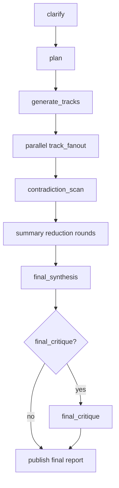

# `deep_research` Workflow

This document defines the authored contract and compiled behavior for the `deep_research` managed workflow.

`deep_research` compiles into a generated primitive subgraph during graph normalization.

## Purpose

`deep_research` turns a research question into a grounded synthesized report with explicit coverage, contradictions, and source tracking.

It typically sits before:

- `spec_design`

but it can also run as a standalone research workflow when the final deliverable is analysis rather than implementation.

The usual lifecycle is:

1. `deep_research` determines what is true
2. `spec_design` decides what should be built
3. `execute_spec` implements the chosen design
4. `review_change` critiques the resulting implementation

## Workflow Shape



## Core Principle

`deep_research` is coverage-driven, not single-thread-summary driven.

That means:

- it should decompose the question into multiple distinct research tracks
- it should preserve disagreements and uncertainty instead of collapsing them away early
- it should reduce parallel findings through explicit synthesis steps
- it should produce a final report that is grounded in the full track set rather than one dominant narrative

## Authored Contract

Required fields:

- `type: "deep_research"`
- `id`
- `question`
- `objective`

Optional common execution fields:

- `label`
- `repo`
- `profile`
- `inputs`
- `context_from`
- `outputs`
- `timeout_sec`

Optional workflow fields:

- `audience`
- `sources`
- `deliverable`
- `orchestration`

## Example Authored Schema

```json
{
  "type": "deep_research",
  "id": "managed_workflows_research",
  "repo": "main",
  "profile": "default",
  "question": "What is the cleanest long-term contract shape for Agentflow managed workflows?",
  "objective": "Produce a grounded recommendation for the shipped managed workflow surface and its next design steps.",
  "audience": "engineering",
  "sources": {
    "web": true,
    "files": true,
    "apps": false,
    "allow_domains": ["openai.com", "developers.openai.com"],
    "deny_domains": ["reddit.com"]
  },
  "deliverable": {
    "format": "report",
    "citations": "inline",
    "sections": [
      "question",
      "current_state",
      "findings",
      "recommendation",
      "risks",
      "open_questions"
    ]
  },
  "orchestration": {
    "track_count": 4,
    "max_parallel_tracks": 3,
    "summary_fan_in": 2,
    "final_critique": true
  }
}
```

## Field Semantics

### `question`

The research question being investigated.

This should be framed in terms of the unknown that needs to be resolved, not the workflow steps to execute.

### `objective`

The decision or outcome the research is meant to support.

This clarifies why the question matters and what the final report should enable.

### `audience`

The primary reader for the final report.

This influences framing and depth, but it does not change the requirement to preserve grounded evidence.

### `sources`

Controls where research is allowed to come from.

Supported fields:

- `web`
- `files`
- `apps`
- `allow_domains`
- `deny_domains`

Default behavior:

- `web: true`
- `files: true`
- `apps: false`

### `deliverable`

Controls the final report shape.

Supported fields:

- `format`
- `citations`
- `sections`

Default behavior:

- `format: "report"`
- `citations: "inline"`

### `orchestration`

Controls the workflow size and synthesis shape.

Supported fields:

- `track_count`
- `max_parallel_tracks`
- `summary_fan_in`
- `final_critique`

Default behavior:

- `track_count: 6`
- `max_parallel_tracks: 6`
- `summary_fan_in: 3`
- `final_critique: false`

Validation rules:

- `summary_fan_in` must be at least `2`
- `max_parallel_tracks` is capped to `track_count`

## Compiled Workflow

`deep_research` compiles into an internal primitive workflow shaped like this:

1. `clarify`
2. `plan`
3. `generate_tracks`
4. `parallel track_fanout`
5. `contradiction_scan`
6. one or more `summary reduction` rounds
7. `final_synthesis`
8. optional `final_critique`

## Phase Details

### `clarify`

Rewrite the research ask into a concrete brief.

Artifact:

- `clarified-brief.md`

The brief should restate:

- the question
- the objective
- scope boundaries
- assumptions
- evaluation criteria
- evidence expectations

### `plan`

Create the research plan from the clarified brief.

Artifact:

- `research-plan.md`

This should identify the major dimensions and subquestions that the track set must cover.

### `generate_tracks`

Generate the parallel research track briefs.

Artifact:

- `track-briefs.json`

Each track brief should include:

- a stable `track_id`
- a title
- a focus
- an angle
- concrete questions
- suggested sources
- success criteria

### `parallel track_fanout`

Run one worker per research track in parallel.

Artifacts per worker:

- `track-report.md`
- `track-summary.md`
- `sources.json`

Each worker should maximize unique coverage rather than repeating other tracks.

### `contradiction_scan`

Review the track summaries for contradictions, overlap, unresolved questions, and missing angles.

Artifact:

- `contradictions.md`

### `summary reduction` rounds

Reduce the track summaries into progressively smaller synthesis inputs.

Artifact per reducer:

- `reduce-summary.md`

The reduction tree is controlled by `orchestration.summary_fan_in`.

### `final_synthesis`

Produce the final research report.

Artifact:

- `final-report.md`

The final report should:

- preserve the strongest findings from every major problem cluster
- retain contradictions and uncertainty
- keep source-quality caveats visible
- satisfy the deliverable section contract when one is provided

### `final_critique`

Optional AI quality gate over the final report.

Artifact:

- `result.json`

This gate should fail if:

- major contradictions were dropped
- important uncertainties disappeared
- the report misses required sections
- the synthesis over-focuses on one track and loses overall coverage

## Output Contract

The final published node should expose:

- `research_report`

Optional additional outputs may be authored by the caller through standard `outputs`.

When no explicit outputs are authored, the workflow still writes `final-report.md` and exposes it as `research_report`.

## UI Implications

Collapsed managed-node view should show:

- clarification status
- planning status
- track fan-out progress
- reduction progress
- final synthesis status
- optional critique status

Expanded view should expose:

- clarified brief
- research plan
- track briefs
- worker summaries
- contradiction scan
- reduction artifacts
- final report
- optional critique result

## Implementation Notes

1. authored node parsing lives in the normalizer
2. `deep_research` lowers into a generated primitive subgraph in `src/managed`
3. the original authored node id maps to the final synthesis node
4. graph-level tests should cover fan-out, reduction rounds, optional final critique, and downstream dependency behavior
5. the showcase graph under `docs/examples/graphs/` should demonstrate downstream consumption of the final report
