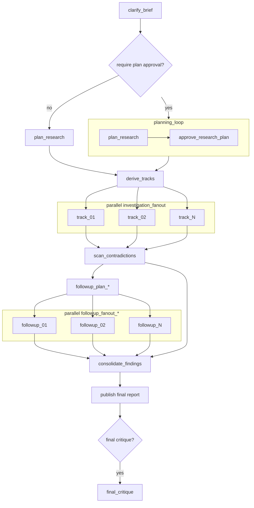

# `deep_research` Workflow

`deep_research` turns a research question into a sourced report with explicit plan artifacts, provenance, interim findings, and uncertainty tracking.

It is autonomous by default. It only pauses for operator input when `approval_policy.require_plan_approval` is enabled.

## Workflow Shape



## Authored Contract

Required fields:

- `type: "deep_research"`
- `id`
- `brief`

Shared execution fields are optional:

- `label`
- `repo`
- `profile`
- `inputs`
- `context_from`
- `outputs`
- `timeout_sec`

Workflow fields:

- `context_policy`
- `approval_policy`
- `strategy`
- `delivery`
- `runtime`

## Example

```json
{
  "type": "deep_research",
  "id": "managed_workflows_research",
  "brief": {
    "question": "What should Agentflow's first managed workflows be?",
    "objective": "Produce a grounded recommendation for Agentflow's managed workflow roadmap.",
    "audience": "engineering",
    "scope_cues": ["managed workflow contracts", "compiled subgraphs"],
    "success_bar": ["preserve uncertainty", "capture competing patterns"]
  },
  "context_policy": {
    "web": true,
    "files": true,
    "apps": false,
    "allow_domains": ["openai.com", "developers.openai.com", "perplexity.ai"]
  },
  "approval_policy": {
    "require_plan_approval": false
  },
  "strategy": {
    "depth": "standard",
    "coverage_mode": "balanced",
    "followup_passes": 1,
    "final_critique": true
  },
  "delivery": {
    "format": "report",
    "citation_style": "inline",
    "sections": ["patterns", "recommendation", "uncertainties"]
  },
  "runtime": {
    "max_concurrency": 2
  }
}
```

## Field Notes

### `brief`

`brief` expresses research intent:

- `question`
- `objective`
- optional `audience`
- optional `scope_cues`
- optional `success_bar`

### `context_policy`

Controls allowed research surfaces:

- `web`
- `files`
- `apps`
- optional `allow_domains`
- optional `deny_domains`
- optional `preferred_sources`

### `approval_policy`

`require_plan_approval` inserts a checkpoint loop around the research plan. If it is `false`, the plan runs once and the workflow continues autonomously.

### `strategy`

Intent-level knobs only:

- `depth`
- `coverage_mode`
- `followup_passes`
- `final_critique`

### `delivery`

Defines final report expectations:

- `format`
- `citation_style`
- optional `sections`

### `runtime`

Advanced execution tuning:

- `max_concurrency`

This caps parallel execution. It does not define research breadth.

## Produced Artifacts

Core planning and status artifacts:

- `workflow-brief.md`
- `workflow-plan.md`
- `workflow-plan.json`
- `workflow-status.json`
- `workflow-events.jsonl`

Research-specific artifacts:

- `research-brief.md`
- `research-plan.md`
- `research-plan.json`
- `track-briefs.json`
- `contradictions.md`
- `interim-findings.jsonl`
- `source-ledger.json`
- `uncertainties.md`
- `final-report.md`

Optional approval or critique artifacts:

- `result.json` from `approve_research_plan`
- `result.json` from `final_critique`

## Default Behavior

- Plan approval is off by default.
- Final critique is off by default.
- Research breadth is derived from `strategy.depth`.
- Follow-up passes default to `1`.
