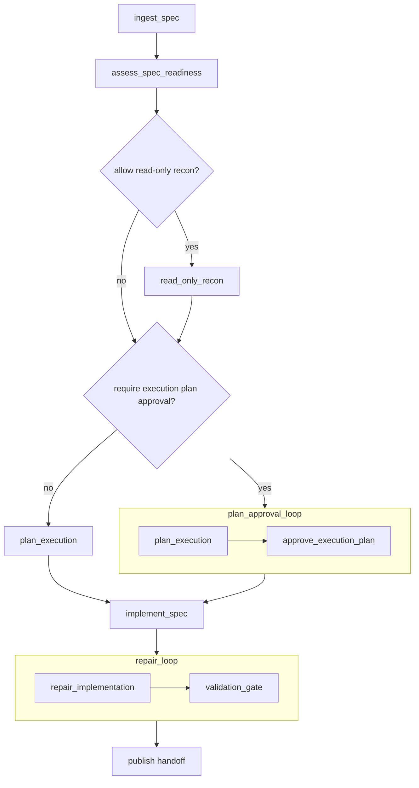

# `execute_spec` Workflow

`execute_spec` turns a structured spec source into a validated code change with a single writer.

It is autonomous by default. It only pauses for operator input when `approval_policy.require_execution_plan_approval` is enabled.

## Workflow Shape



## Authored Contract

Required fields:

- `type: "execute_spec"`
- `id`
- `spec_source`
- `validation`

Shared execution fields are optional:

- `label`
- `repo`
- `profile`
- `inputs`
- `context_from`
- `outputs`
- `timeout_sec`

Workflow fields:

- `brief`
- `context_policy`
- `approval_policy`
- `strategy`
- `delivery`
- `runtime`

## Example

```json
{
  "type": "execute_spec",
  "id": "implement_managed_nodes",
  "brief": {
    "objective": "Implement the managed workflow model described by the upstream spec.",
    "scope": {
      "paths": ["src/**", "docs/**", "tests/**"],
      "areas": ["graph", "managed workflows", "docs"]
    }
  },
  "spec_source": {
    "kind": "managed_node",
    "node": "managed_nodes_spec"
  },
  "context_policy": {
    "allow_official_docs_fallback": true,
    "allow_domains": ["developers.openai.com"]
  },
  "approval_policy": {
    "require_execution_plan_approval": false
  },
  "strategy": {
    "single_writer": true,
    "allow_readonly_recon": true,
    "max_repair_cycles": 2
  },
  "validation": {
    "commands": ["npm run typecheck", "npm test"],
    "required": true
  },
  "delivery": {
    "write_handoff": true,
    "write_validation_ledger": true,
    "write_repair_log": true
  }
}
```

## `spec_source`

### `managed_node`

Use a prior managed workflow node, usually `spec_design`:

```json
{
  "kind": "managed_node",
  "node": "managed_nodes_spec"
}
```

When available, `execute_spec` will consume:

- `design_spec`
- `direction_proposal`
- `tradeoff_matrix`
- `decision_log`
- `implementation_readiness`

### `artifact_bundle`

Use files or prior managed outputs directly:

```json
{
  "kind": "artifact_bundle",
  "design_spec": { "kind": "file", "path": "docs/spec.md" },
  "tradeoff_matrix": { "kind": "file", "path": "docs/tradeoff-matrix.md" },
  "decision_log": { "kind": "managed_output", "node": "upstream_plan", "output": "decision_log" }
}
```

Supported bundle keys:

- `design_spec`
- optional `direction_proposal`
- optional `tradeoff_matrix`
- optional `decision_log`
- optional `implementation_readiness`

Reference kinds:

- `{ "kind": "file", "path": "..." }`
- `{ "kind": "managed_output", "node": "...", "output": "..." }`

## Field Notes

### `brief`

`brief` adds execution framing:

- optional `objective`
- optional `scope`

### `context_policy`

Controls narrow implementation-time lookup policy:

- `allow_official_docs_fallback`
- optional `allow_domains`

### `approval_policy`

`require_execution_plan_approval` inserts a checkpoint loop around the execution plan. If it is `false`, the workflow plans once and continues autonomously.

### `strategy`

Execution intent only:

- `single_writer`
- `allow_readonly_recon`
- `max_repair_cycles`

In this release, `single_writer` must stay `true`.

### `validation`

Required deterministic validation contract:

- `commands`
- optional `required`

### `delivery`

Final publication controls:

- `write_handoff`
- `write_validation_ledger`
- `write_repair_log`

## Produced Artifacts

Shared planning and status artifacts:

- `workflow-brief.md`
- `workflow-plan.md`
- `workflow-plan.json`
- `workflow-status.json`
- `workflow-events.jsonl`

Execution-specific artifacts:

- `spec-packet.json`
- `recon-notes.md`
- `execution-plan.md`
- `file-plan.md`
- `mutation-boundary.md`
- `validation-plan.md`
- `implementation-notes.md`
- `repair-notes.md`
- `handoff.md`
- `validation-ledger.json`
- `repair-log.md`

Approval and validation artifacts:

- `result.json` from `approve_execution_plan`
- `result.json` from `assess_spec_readiness`
- deterministic validation result from `validation_gate`

## Default Behavior

- Execution-plan approval is off by default.
- Read-only recon is on by default.
- Repair is bounded by `strategy.max_repair_cycles`.
- Final publication includes workflow status and workflow events.
