# Managed Workflows

Agentflow has three authoring categories:

- Primitive executable nodes: `agent`, `exec`, `check`, `checkpoint`
- Primitive control-flow containers: `sequence`, `parallel`, `repeat`
- Managed workflows: `deep_research`, `spec_design`, `execute_spec`, `review_change`

Managed workflows are authored shortcuts. They compile into generated primitive subgraphs. They do not introduce a separate runtime model.

## Workflow Relationships

```mermaid
flowchart LR
    subgraph research["deep_research"]
        dr1["brief and plan"]
        dr2["parallel investigation"]
        dr3["consolidate and publish"]
        dr1 --> dr2 --> dr3
    end

    subgraph design["spec_design"]
        sd1["repo inspection"]
        sd2["parallel options"]
        sd3["direction and revision"]
        sd1 --> sd2 --> sd3
    end

    subgraph execute["execute_spec"]
        es1["ingest and plan"]
        es2["single-writer implementation"]
        es3["validation and repair"]
        es1 --> es2 --> es3
    end

    subgraph review["review_change"]
        rc1["prepare and plan"]
        rc2["parallel reviewers"]
        rc3["merge and calibrate"]
        rc1 --> rc2 --> rc3
    end

    dr3 --> sd1
    sd3 --> es1
    es3 --> rc1
```

## Shared Managed Contract

Every managed workflow uses the same top-level shape:

- `brief`
  User intent, audience, scope, and success bar.
- `context_policy`
  Which sources and context classes the workflow may use.
- `approval_policy`
  Whether the workflow should insert explicit checkpoint gates.
- `strategy`
  Workflow-specific intent and quality knobs.
- `delivery`
  Final artifact shape and delivery controls.
- `runtime`
  Optional advanced execution tuning such as `max_concurrency`.

Common execution fields are still available:

- `label`
- `repo`
- `profile`
- `inputs`
- `context_from`
- `outputs`
- `timeout_sec`

## Design Rules

- Managed workflows are autonomous by default.
- A managed workflow only pauses for operator approval if its `approval_policy` explicitly enables a checkpoint.
- Workflow contracts should describe intent, quality, and outputs, not scheduler math.
- Runtime concurrency belongs in `runtime`, not in workflow semantics.

## Workflow Inventory

### `deep_research`

Purpose:
- Clarify a research question, build a research plan, investigate in parallel, preserve contradictions, and publish a sourced report.

Key authored fields:
- `brief.question`
- `brief.objective`
- optional `brief.audience`
- optional `brief.scope_cues`
- optional `brief.success_bar`
- `context_policy.web`
- `context_policy.files`
- `context_policy.apps`
- optional `approval_policy.require_plan_approval`
- `strategy.depth`
- `strategy.coverage_mode`
- `strategy.followup_passes`
- `strategy.final_critique`
- `delivery.format`
- `delivery.citation_style`
- optional `delivery.sections`

Important behavior:
- Research breadth is derived from `strategy.depth`.
- `runtime.max_concurrency` only caps execution concurrency.
- Plan approval is opt-in.

Reference:
- [`DEEP_RESEARCH_WORKFLOW.md`](DEEP_RESEARCH_WORKFLOW.md)

### `spec_design`

Purpose:
- Turn a repo-grounded problem statement into an implementation-ready design package.

Key authored fields:
- `brief.problem`
- `brief.goal`
- optional `brief.audience`
- optional `brief.constraints`
- optional `brief.decision_drivers`
- optional `brief.scope`
- `context_policy.repo_first`
- `context_policy.allow_web_fallback`
- optional `context_policy.web_triggers`
- optional `approval_policy.require_direction_approval`
- `strategy.alternatives`
- `strategy.critique_profiles`
- `strategy.max_revision_cycles`
- `delivery.format`
- optional `delivery.sections`

Important behavior:
- Repo inspection is first-class.
- External research is targeted and conditional.
- Direction approval is opt-in.
- Revision stays autonomous unless the graph author explicitly asks for a checkpoint elsewhere.

Reference:
- [`SPEC_DESIGN_WORKFLOW.md`](SPEC_DESIGN_WORKFLOW.md)

### `execute_spec`

Purpose:
- Turn a structured spec source into a validated code change with a single writer.

Key authored fields:
- optional `brief.objective`
- optional `brief.scope`
- `spec_source`
- `context_policy.allow_official_docs_fallback`
- optional `approval_policy.require_execution_plan_approval`
- `strategy.single_writer`
- `strategy.allow_readonly_recon`
- `strategy.max_repair_cycles`
- `validation.commands`
- optional `validation.required`
- `delivery.write_handoff`
- `delivery.write_validation_ledger`
- `delivery.write_repair_log`

Important behavior:
- `execute_spec` is single-writer only in this release.
- The execution plan checkpoint is opt-in.
- Validation and repair are first-class runtime phases.

Reference:
- [`EXECUTE_SPEC_WORKFLOW.md`](EXECUTE_SPEC_WORKFLOW.md)

### `review_change`

Purpose:
- Turn a diff, handoff, or review bundle into a calibrated findings package.

Key authored fields:
- optional `brief.review_goal`
- optional `brief.focus`
- optional `brief.audience`
- optional `brief.scope`
- `review_source`
- `context_policy.include_surrounding_code`
- `context_policy.include_tests`
- `context_policy.include_docs`
- `context_policy.include_validation`
- `strategy.reviewer_profiles`
- `strategy.severity_policy`
- `strategy.include_surrounding_context`
- `strategy.false_positive_challenge`
- `strategy.require_file_references`
- `delivery.write_review_summary`
- `delivery.write_raw_findings`
- `delivery.write_calibrated_findings`

Important behavior:
- `review_change` is read-only and does not use approval checkpoints by default.
- Reviewer fan-out is role-based.
- Findings are aggregated, merged, and calibrated before publication.

Reference:
- [`REVIEW_CHANGE_WORKFLOW.md`](REVIEW_CHANGE_WORKFLOW.md)

## Implementation Surface

Shipped in this release:

- canonical managed-workflow kinds in `src/graph/schema.ts`
- managed workflow builders in `src/managed/`
- normalization support that lowers managed workflows into primitive subgraphs
- registry metadata in `src/managed/registry.ts`
- committed example graphs in [`docs/examples/graphs/`](examples/graphs/README.md)

Deferred:

- UI-native collapsed managed-workflow visualization
- remote or controller-driven workflow orchestration
- a second runtime model beyond compiled primitive execution
