# Managed Workflows

Agentflow supports primitive executable nodes:

- `agent`
- `exec`
- `check`
- `checkpoint`

and primitive control-flow containers:

- `sequence`
- `parallel`
- `repeat`

Agentflow also supports these managed workflow kinds:

- `deep_research`
- `spec_design`
- `execute_spec`
- `review_change`

These compile into generated primitive subgraphs with built-in orchestration, prompts, artifacts, and workflow phases.

## Workflow Relationships

```mermaid
flowchart LR
    subgraph research["deep_research"]
        dr1["clarify"]
        dr2["fan-out tracks"]
        dr3["fan-in synthesis"]
        dr1 --> dr2 --> dr3
    end

    subgraph design["spec_design"]
        sd1["inspect"]
        sd2["fan-out options"]
        sd3["fan-in critique"]
        sd1 --> sd2 --> sd3
    end

    subgraph execute["execute_spec"]
        es1["ingest"]
        es2["implement"]
        es3["validate and repair loop"]
        es1 --> es2 --> es3
    end

    subgraph review["review_change"]
        rc1["prepare"]
        rc2["fan-out reviewers"]
        rc3["fan-in findings"]
        rc1 --> rc2 --> rc3
    end

    dr3 --> sd1
    sd3 --> es1
    es3 --> rc1
```

## Design Rule

A primitive node is user-prompted.

- The graph author writes the exact `prompt`.
- The runtime executes one primitive step.

A managed workflow is system-authored.

- The graph author supplies structured intent and constraints.
- Agentflow expands that into an internal subgraph of primitive nodes.
- The runtime executes the compiled subgraph.

## Managed Workflow Inventory

### `deep_research`

Purpose:
- Clarify a research ask, decompose it, run multiple investigators, reconcile conflicts, and synthesize a final report.

Compiled workflow phases:
- clarify
- plan
- investigate
- reconcile
- council
- deliver

Workflow orchestration:
- planner
- parallel workers
- synthesis council
- validation

Key contract details:
- authored managed node
- generated primitive subgraph expansion during normalization
- track fan-out and summary-tree reduction
- optional final critique gate

Authored fields:
- `question`
- `objective`
- optional `audience`
- optional `inputs`
- optional `context_from`
- optional `sources`
- optional `deliverable`
- optional `orchestration.track_count`
- optional `orchestration.max_parallel_tracks`
- optional `orchestration.summary_fan_in`
- optional `orchestration.final_critique`

Authoring note:
- `orchestration.max_parallel_tracks` is an advanced runtime concurrency cap, not a research-breadth control. `track_count` defines how many logical tracks exist; `max_parallel_tracks` only limits how many workers may run at the same time.

Concrete contract:
- see [`DEEP_RESEARCH_WORKFLOW.md`](DEEP_RESEARCH_WORKFLOW.md)

### `spec_design`

Purpose:
- Turn an idea or problem into an implementation-ready architecture or design spec.

Compiled workflow phases:
- clarify
- inspect
- assess information gap
- optional targeted external research
- synthesize constraints
- explore
- tradeoffs
- draft
- critique
- revise
- finalize

Workflow orchestration:
- planner
- repo-first inspection
- targeted web fallback when repo context is insufficient
- parallel option exploration
- critique council
- validation

Concrete contract:
- see [`SPEC_DESIGN_WORKFLOW.md`](SPEC_DESIGN_WORKFLOW.md)

Design rule:
- repo-first, not repo-only
- the workflow should inspect the repository first, then use targeted web research only if the repository does not contain enough information to support a strong design

Key contract details:
- authored managed node
- generated primitive subgraph expansion during normalization
- repo inspection, information-gap assessment, and targeted external research fan-out
- parallel option generation
- bounded revision loop with critique panel and quality check

### `execute_spec`

Purpose:
- Execute an existing spec by planning work, applying changes, validating them, and repairing failures.

Compiled workflow phases:
- clarify
- plan
- implement
- validate
- repair
- handoff

Workflow orchestration:
- planner
- single-writer implementation
- deterministic validation
- repair loop

Concrete contract:
- see [`EXECUTE_SPEC_WORKFLOW.md`](EXECUTE_SPEC_WORKFLOW.md)

Design rule:
- spec-driven, not idea-driven
- the workflow must require a structured `spec_source`
- it should implement an existing design, not invent one during execution

Contract highlights:
- required structured `spec_source`
- supports `managed_node` sources for `spec_design -> execute_spec`
- supports `artifact_bundle` sources for hand-written or external specs
- spec-readiness gate before implementation begins
- single-writer implementation path
- deterministic validation plus bounded repair loop

Key contract details:
- authored managed node
- generated primitive subgraph expansion during normalization
- structured `spec_source` parsing for managed-node and artifact-bundle sources
- spec-readiness AI gate
- single-writer implementation path with bounded repair loop
- deterministic validation gate and final handoff outputs

### `review_change`

Purpose:
- Review a diff or artifact with multiple reviewer passes, merge findings, normalize severity, and publish a final review.

Compiled workflow phases:
- prepare
- reviewers
- merge
- normalize
- deliver

Workflow orchestration:
- parallel reviewers
- council merge
- validation

Concrete contract:
- see [`REVIEW_CHANGE_WORKFLOW.md`](REVIEW_CHANGE_WORKFLOW.md)

Design rule:
- findings-driven, not commentary-driven
- the workflow must require a structured `review_source`
- it should prioritize concrete bugs, regressions, and missing tests over low-value style commentary

Contract highlights:
- required structured `review_source`
- supports `managed_node` sources for `execute_spec -> review_change`
- supports `artifact_bundle` sources for file-based review bundles
- parallel role-based reviewer panel
- merged machine-readable findings plus normalization gate
- final prose and JSON review outputs

Key contract details:
- authored managed node
- generated primitive subgraph expansion during normalization
- structured `review_source` parsing for managed-node and artifact-bundle sources
- reviewer panel, merge step, normalization AI gate, and final review outputs

## Implementation Surface

Shipped in this release:
- canonical managed-workflow kinds in `src/graph/schema.ts`
- a managed-workflow registry in `src/managed/registry.ts`
- `deep_research` authored node support and graph expansion
- `spec_design` authored node support and graph expansion
- `execute_spec` authored node support and graph expansion
- `review_change` authored node support and graph expansion
- CLI help and docs that describe the shipped workflow surface

Deferred:
- runtime and UI treatment of managed workflows as collapsible, inspectable workflow groups
