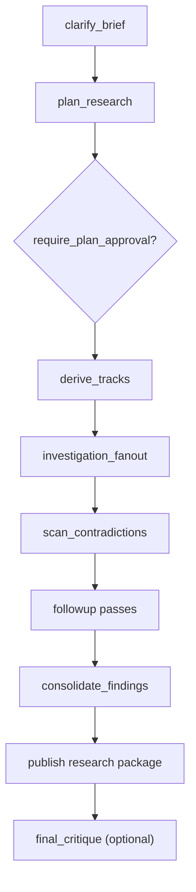

# `pattern_deep_research`

`pattern_deep_research` turns a research question into a sourced report plus a machine-readable research packet.

## Workflow Shape



## Authored Contract

Required fields:

- `type: "pattern_deep_research"`
- `id`
- `brief.question`
- `brief.objective`

Optional fields:

- `brief.audience`
- `brief.scope_cues`
- `brief.success_bar`
- `context_policy`
- `approval_policy`
- `strategy`
- `delivery`
- `runtime`

## Core Outputs

- `research-report.md`
- `research-packet.json`
- `source-ledger.json`
- `uncertainties.md`
- `interim-findings.jsonl`

## Notes

- `approval_policy.require_plan_approval` is opt-in.
- `strategy.depth` controls the breadth of the track fan-out.
- `runtime.max_concurrency` only caps execution concurrency.
- `strategy.final_critique` adds one final AI quality check after publication.

## Example

```json
{
  "type": "pattern_deep_research",
  "id": "market_scan",
  "brief": {
    "question": "What should Agentflow's first managed patterns be?",
    "objective": "Produce a grounded recommendation for the managed pattern surface.",
    "scope_cues": ["pattern contracts", "compiled subgraphs"]
  },
  "context_policy": {
    "web": true,
    "files": true,
    "apps": false
  },
  "strategy": {
    "depth": "standard",
    "coverage_mode": "balanced",
    "followup_passes": 1,
    "final_critique": true
  }
}
```
