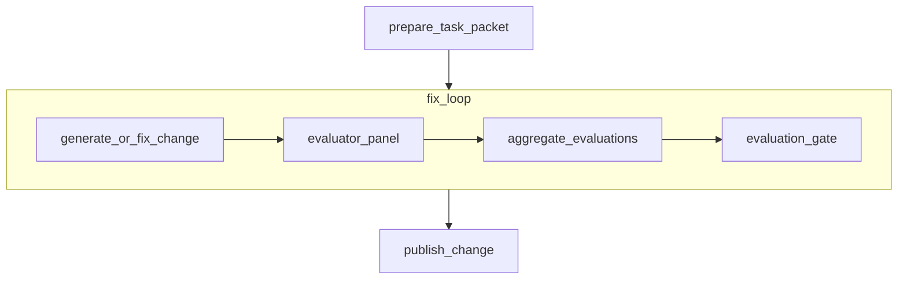
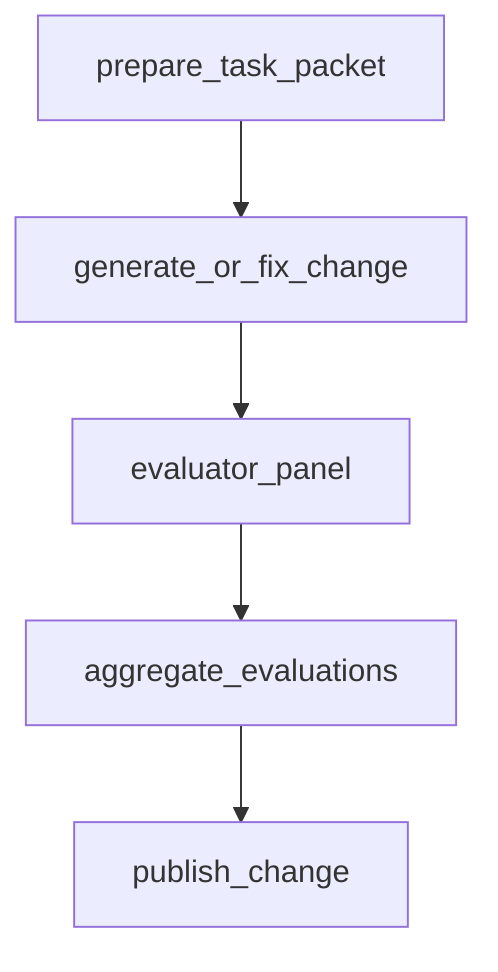

# `pattern_generate_evaluate_fix`

`pattern_generate_evaluate_fix` is the narrow implementation pattern. It consumes a prepared task packet, generates or fixes a change, evaluates concrete commands independently, and publishes a change package.

It is autonomous by default. This pattern has no approval surface and no planning surface.

## Workflow Shape

Hard evaluation mode:



Soft evaluation mode:



## Authored Contract

Required fields:

- `type: "pattern_generate_evaluate_fix"`
- `id`
- `task_source`
- `evaluation`

Optional pattern fields:

- `brief`
- `context_policy`
- `strategy`
- `runtime`

Shared executable fields are also available:

- `label`
- `repo`
- `profile`
- `context`
- `timeout_sec`

## Example

```json
{
  "type": "pattern_generate_evaluate_fix",
  "id": "implement_managed_nodes",
  "brief": {
    "objective": "Implement the managed pattern model described by the upstream design packet.",
    "scope": {
      "paths": ["src/**", "docs/**", "tests/**"],
      "areas": ["graph", "managed patterns"]
    }
  },
  "task_source": {
    "kind": "managed_node",
    "node": "managed_nodes_spec"
  },
  "context_policy": {
    "allow_official_docs_fallback": true,
    "allow_domains": ["developers.openai.com"]
  },
  "strategy": {
    "max_fix_cycles": 2
  },
  "evaluation": {
    "commands": ["npm run typecheck", "npm test"],
    "required": true
  }
}
```

## `task_source`

### `managed_node`

Use a prior pattern node, usually `pattern_spec_design`:

```json
{
  "kind": "managed_node",
  "node": "managed_nodes_spec"
}
```

When available, the pattern consumes:

- `design_packet`
- optional `design_spec`
- optional `direction_proposal`
- optional `tradeoff_matrix`
- optional `decision_log`
- optional `implementation_readiness`

### `artifact_bundle`

Use files or prior artifacts directly:

```json
{
  "kind": "artifact_bundle",
  "design_packet": { "kind": "file", "path": "artifacts/design-packet.json" },
  "design_spec": { "kind": "file", "path": "docs/design-spec.md" },
  "decision_log": { "kind": "artifact", "node": "upstream_plan", "artifact": "decision_log" }
}
```

Supported bundle keys:

- `design_packet`
- optional `design_spec`
- optional `direction_proposal`
- optional `tradeoff_matrix`
- optional `decision_log`
- optional `implementation_readiness`
- optional `additional_context`

Reference kinds:

- `{ "kind": "file", "path": "..." }`
- `{ "kind": "artifact", "node": "...", "artifact": "..." }`

## Field Notes

### `brief`

Adds task framing:

- optional `objective`
- optional `scope.paths`
- optional `scope.areas`

### `context_policy`

Controls narrow implementation-time lookup policy:

- `allow_official_docs_fallback`
- optional `allow_domains`

### `strategy`

Execution intent only:

- `max_fix_cycles`

`max_fix_cycles` counts retries after the initial generation pass. The compiled repeat `max_attempts` is `max_fix_cycles + 1`.

### `evaluation`

Required deterministic evaluation contract:

- `commands`
- optional `required`

Behavior:

- `required` defaults to `true`
- when `required = true`, each evaluator runs independently with soft node semantics, the aggregated ledger feeds a hard `evaluation_gate`, and the repeat loop retries until the gate passes or attempts exhaust
- when `required = false`, the pattern runs one evaluation pass, records the true results as soft evidence, and skips the repeat loop entirely

## Produced Artifacts

Core artifacts:

- `change-summary.md`
- `change-packet.json`
- `evaluation-ledger.json`
- `fix-log.md`

Internal supporting artifacts:

- `task-packet.json`
- `workflow-brief.md`
- `change-notes.md`
- one `result.json` per evaluator node

## Default Behavior

- `strategy.max_fix_cycles` defaults to `2`
- `evaluation.required` defaults to `true`
- evaluator commands always run independently rather than collapsing into one shell gate
