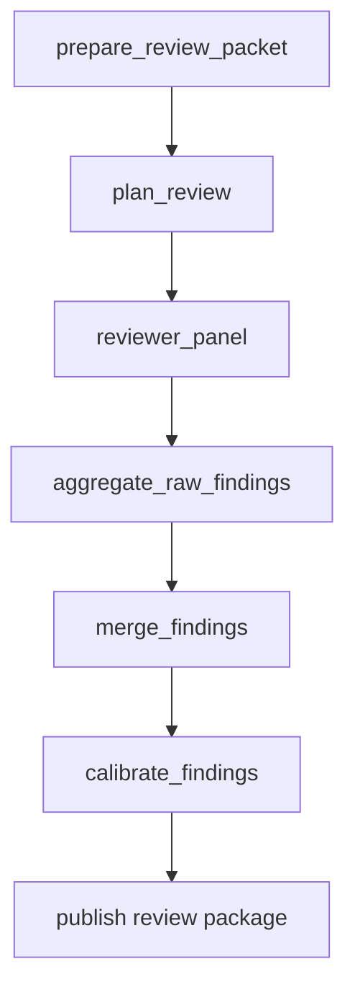

# `pattern_review_change`

`pattern_review_change` turns a diff, change summary, or change package into a calibrated review package.

## Workflow Shape



## Authored Contract

Required fields:

- `type: "pattern_review_change"`
- `id`
- `review_source`

Optional fields:

- `brief`
- `context_policy`
- `strategy`
- `delivery`
- `runtime`

## `review_source`

### `managed_node`

Use a prior pattern node, usually `pattern_generate_evaluate_fix`:

```json
{
  "kind": "managed_node",
  "node": "implement_managed_nodes"
}
```

When available, the pattern consumes:

- optional `change_summary`
- optional `change_packet`
- optional `evaluation_ledger`
- optional `fix_log`

### `artifact_bundle`

Use files or prior managed outputs directly:

```json
{
  "kind": "artifact_bundle",
  "diff": { "kind": "file", "path": "artifacts/change.patch" },
  "summary": { "kind": "file", "path": "artifacts/change-summary.md" },
  "evaluation_ledger": {
    "kind": "managed_output",
    "node": "upstream_evaluation",
    "output": "evaluation_ledger"
  }
}
```

Supported bundle keys:

- optional `diff`
- optional `summary`
- optional `evaluation_ledger`
- optional `files_touched`
- optional `additional_context`

## Core Outputs

- `review-summary.md`
- `review-bundle.json`
- `raw-findings.json`
- `merged-findings.json`
- `calibrated-findings.json`

## Notes

- This pattern is read-only.
- `runtime.max_concurrency` caps reviewer fan-out concurrency.
- `delivery` only shapes review presentation. It does not toggle the core output set.

## Example

```json
{
  "type": "pattern_review_change",
  "id": "review_managed_nodes",
  "review_source": {
    "kind": "managed_node",
    "node": "implement_managed_nodes"
  },
  "brief": {
    "review_goal": "Find the highest-signal defects and missing tests."
  },
  "strategy": {
    "reviewer_profiles": ["correctness", "testing", "maintainability"],
    "severity_policy": "balanced"
  }
}
```
