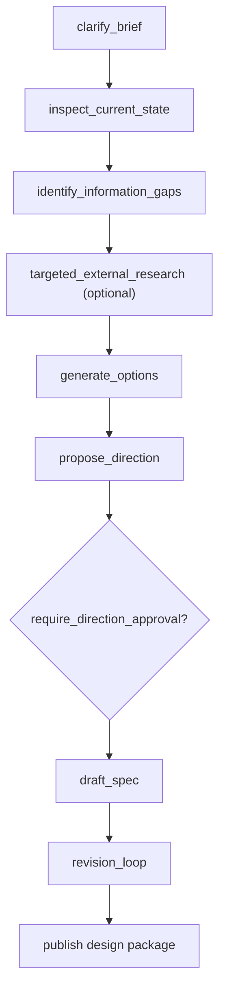

# `pattern_spec_design`

`pattern_spec_design` turns a repo-grounded problem statement into an implementation-ready design package.

## Workflow Shape



## Authored Contract

Required fields:

- `type: "pattern_spec_design"`
- `id`
- `brief.problem`
- `brief.goal`

Optional fields:

- `brief.audience`
- `brief.constraints`
- `brief.decision_drivers`
- `brief.scope`
- `context_policy`
- `approval_policy`
- `strategy`
- `delivery`
- `runtime`

## Core Outputs

- `design-spec.md`
- `design-packet.json`
- `direction-proposal.md`
- `tradeoff-matrix.md`
- `decision-log.md`
- `implementation-readiness.md`
- `critique-merged.md`
- `quality-review.json`

## Notes

- `approval_policy.require_direction_approval` is opt-in.
- `context_policy.repo_first` defaults to repo-first behavior.
- `strategy.max_revision_cycles` bounds the critique and quality loop.
- The design packet is the main machine-readable downstream handoff for `pattern_generate_evaluate_fix` or primitive graphs.

## Example

```json
{
  "type": "pattern_spec_design",
  "id": "managed_nodes_spec",
  "brief": {
    "problem": "Managed patterns need a clearer authored contract.",
    "goal": "Produce an implementation-ready managed pattern model.",
    "constraints": ["Keep primitive graph nodes stable."]
  },
  "context_policy": {
    "repo_first": true,
    "allow_web_fallback": false
  },
  "strategy": {
    "alternatives": 3,
    "critique_profiles": ["architecture", "implementation"],
    "max_revision_cycles": 2
  }
}
```
