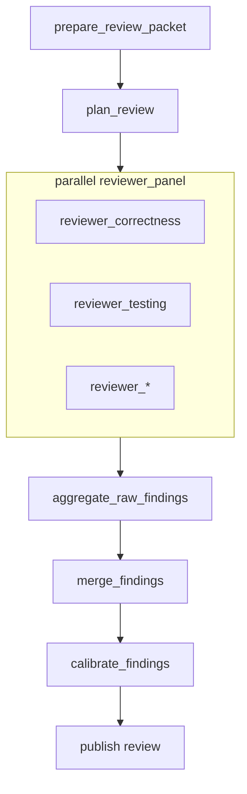

# `review_change` Workflow

`review_change` turns a diff, handoff, or review bundle into a calibrated findings package.

It is autonomous and read-only by default.

## Workflow Shape



## Authored Contract

Required fields:

- `type: "review_change"`
- `id`
- `review_source`

Shared execution fields are optional:

- `label`
- `repo`
- `profile`
- `inputs`
- `context_from`
- `outputs`
- `timeout_sec`

Workflow fields:

- `brief`
- `context_policy`
- `strategy`
- `delivery`
- `runtime`

## Example

```json
{
  "type": "review_change",
  "id": "review_managed_nodes",
  "review_source": {
    "kind": "managed_node",
    "node": "implement_managed_nodes"
  },
  "brief": {
    "review_goal": "Review the implementation for high-signal defects and missing tests.",
    "focus": ["correctness", "testing", "maintainability"],
    "audience": "engineering",
    "scope": {
      "paths": ["src/**", "docs/**", "tests/**"],
      "areas": ["graph", "managed workflows", "docs"]
    }
  },
  "context_policy": {
    "include_surrounding_code": true,
    "include_tests": true,
    "include_docs": true,
    "include_validation": true
  },
  "strategy": {
    "reviewer_profiles": ["correctness", "testing", "maintainability"],
    "severity_policy": "balanced",
    "include_surrounding_context": true,
    "false_positive_challenge": true,
    "require_file_references": true
  },
  "delivery": {
    "write_review_summary": true,
    "write_raw_findings": true,
    "write_calibrated_findings": true
  },
  "runtime": {
    "max_concurrency": 2
  }
}
```

## `review_source`

### `managed_node`

Use a prior managed workflow node, usually `execute_spec`:

```json
{
  "kind": "managed_node",
  "node": "implement_managed_nodes"
}
```

When available, `review_change` will consume:

- `handoff`
- `validation_ledger`
- `repair_log`
- `execution_plan`
- `file_plan`
- `mutation_boundary`

### `artifact_bundle`

Use files or prior managed outputs directly:

```json
{
  "kind": "artifact_bundle",
  "diff": { "kind": "file", "path": "artifacts/change.patch" },
  "summary": { "kind": "file", "path": "artifacts/change-summary.md" },
  "validation_ledger": {
    "kind": "managed_output",
    "node": "upstream_validation",
    "output": "validation_ledger"
  }
}
```

Supported bundle keys:

- optional `diff`
- optional `summary`
- optional `validation_ledger`
- optional `files_touched`
- optional `additional_context`

At least one of `diff`, `summary`, or `additional_context` must be present.

Reference kinds:

- `{ "kind": "file", "path": "..." }`
- `{ "kind": "managed_output", "node": "...", "output": "..." }`

## Field Notes

### `brief`

`brief` defines review intent:

- optional `review_goal`
- optional `focus`
- optional `audience`
- optional `scope`

### `context_policy`

Controls which supporting context classes may be included:

- `include_surrounding_code`
- `include_tests`
- `include_docs`
- `include_validation`

### `strategy`

Review-shaping knobs:

- `reviewer_profiles`
- `severity_policy`
- `include_surrounding_context`
- `false_positive_challenge`
- `require_file_references`

### `delivery`

Final publication controls:

- `write_review_summary`
- `write_raw_findings`
- `write_calibrated_findings`

### `runtime`

Advanced execution tuning:

- `max_concurrency`

This caps reviewer fan-out only.

## Produced Artifacts

Shared planning and status artifacts:

- `workflow-brief.md`
- `workflow-plan.md`
- `workflow-plan.json`
- `workflow-status.json`
- `workflow-events.jsonl`

Review-specific artifacts:

- `review-packet.json`
- `findings-*.json`
- `raw-findings.json`
- `merged-findings.json`
- `calibrated-findings.json`
- `review-summary.md`

## Default Behavior

- Review stays read-only.
- There are no approval checkpoints by default.
- Reviewer fan-out is derived from `strategy.reviewer_profiles`.
- Publication includes merged findings even if raw or calibrated outputs are disabled.
