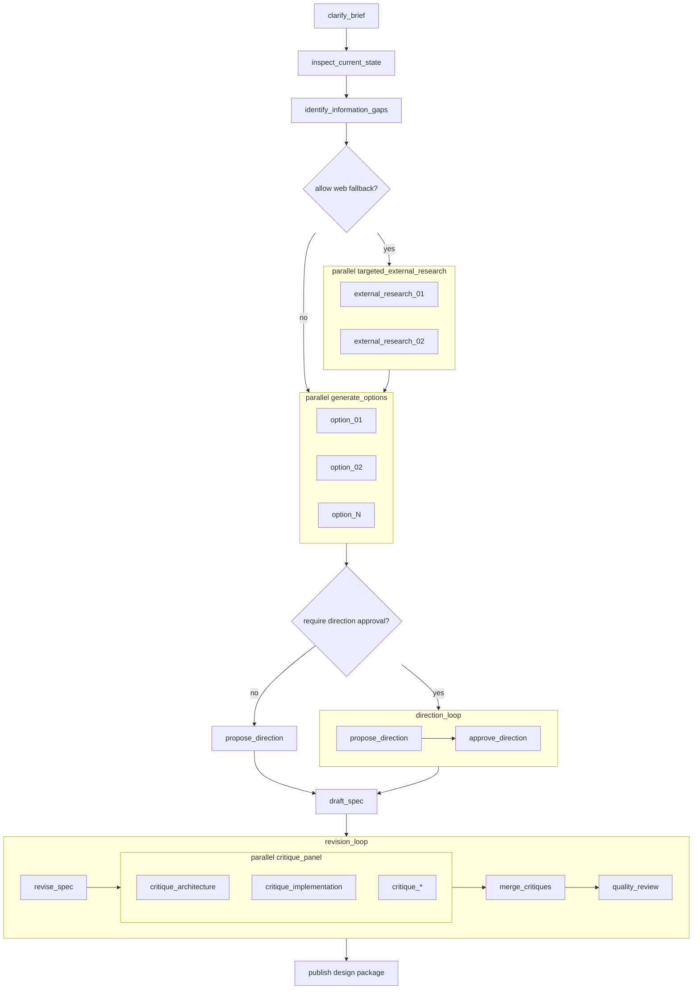

# `spec_design` Workflow

`spec_design` turns a repo-grounded problem statement into an implementation-ready design package.

It is autonomous by default. It only pauses for operator input when `approval_policy.require_direction_approval` is enabled.

## Workflow Shape



## Authored Contract

Required fields:

- `type: "spec_design"`
- `id`
- `brief`

Shared execution fields are optional:

- `label`
- `repo`
- `profile`
- `inputs`
- `context_from`
- `outputs`
- `timeout_sec`

Workflow fields:

- `context_policy`
- `approval_policy`
- `strategy`
- `delivery`
- `runtime`

## Example

```json
{
  "type": "spec_design",
  "id": "managed_nodes_spec",
  "brief": {
    "problem": "Agentflow needs true managed workflows instead of thin aliases.",
    "goal": "Design the first implementation-ready managed workflow model for Agentflow.",
    "audience": "engineering",
    "constraints": [
      "Keep primitive graph nodes stable.",
      "Managed workflows must compile into primitive subgraphs."
    ],
    "decision_drivers": ["clarity", "reliability", "operator ergonomics"],
    "scope": {
      "paths": ["src/**", "docs/**", "tests/**"],
      "areas": ["graph", "managed workflows", "docs"]
    }
  },
  "context_policy": {
    "repo_first": true,
    "allow_web_fallback": true,
    "web_triggers": ["missing pattern", "missing domain context"],
    "allow_domains": ["openai.com", "developers.openai.com"]
  },
  "approval_policy": {
    "require_direction_approval": false
  },
  "strategy": {
    "alternatives": 3,
    "critique_profiles": ["architecture", "implementation", "ux"],
    "max_revision_cycles": 2
  },
  "delivery": {
    "format": "design_spec",
    "sections": ["problem", "recommendation", "architecture", "implementation_readiness"]
  },
  "runtime": {
    "max_concurrency": 2
  }
}
```

## Field Notes

### `brief`

`brief` defines the design problem:

- `problem`
- `goal`
- optional `audience`
- optional `constraints`
- optional `decision_drivers`
- optional `scope`

### `context_policy`

Controls repo-first and web-fallback behavior:

- `repo_first`
- `allow_web_fallback`
- optional `web_triggers`
- optional `allow_domains`

### `approval_policy`

`require_direction_approval` inserts a checkpoint loop around the chosen direction. If it is `false`, the workflow selects a direction and continues autonomously.

### `strategy`

Intent-level knobs only:

- `alternatives`
- `critique_profiles`
- `max_revision_cycles`

### `delivery`

Defines the final package shape:

- `format`
- optional `sections`

### `runtime`

Advanced execution tuning:

- `max_concurrency`

This caps option generation and critique fan-out. It does not define how many directions the workflow should consider semantically.

## Produced Artifacts

Shared planning and status artifacts:

- `workflow-brief.md`
- `workflow-plan.md`
- `workflow-plan.json`
- `workflow-status.json`
- `workflow-events.jsonl`

Design-specific artifacts:

- `design-brief.md`
- `current-state.md`
- `information-gaps.md`
- optional `external-findings.md`
- `direction-proposal.md`
- `tradeoff-matrix.md`
- `spec-draft.md`
- `spec-revision.md`
- `critique-*.md`
- `critique-merged.md`
- `quality-review.json`
- `design-spec.md`
- `decision-log.md`
- `implementation-readiness.md`

Optional approval artifact:

- `result.json` from `approve_direction`

## Default Behavior

- Direction approval is off by default.
- Repo-first inspection is on by default.
- External research only appears when `allow_web_fallback` is enabled.
- Revision stays autonomous and ends on the quality review check.
