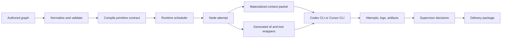

# Technical Implementation

These notes explain how Agentflow turns a human-authored graph into local supervised execution. They are intentionally more implementation-focused than `README.md`, `docs/product/scope.md`, or `docs/product/operations.md`, but they still describe stable concepts rather than every private function.

Use these when you need to understand why a run behaves the way it does, how material reaches an agent, how plugin tools are exposed without leaking credentials, or how run artifacts become the delivery package. For offline workflow eval suite authoring and operation, use `../product/evals.md`.

## Reading Order

1. `runtime-lifecycle.md`: the full path from `agentflow validate` and `agentflow run` to node attempts, supervisor decisions, resume state, and delivery.
2. `context-and-artifacts.md`: how authored `context` becomes files and prompt references, how `ref` resolves to prior artifacts, and how artifacts become downstream handoffs.
3. `runtime-tooling.md`: how `af` and plugin tools are injected into an agent's `PATH`, how tool help/config/credentials are resolved, and what the harness actually sees.
4. `node-workspace-snapshots.md`: how the engine captures a per-attempt git baseline, after-state, and diff for `agent` and `exec` nodes.
5. `outcome-verification.md`: how every passing `agent` attempt is graded by a fresh-context verifier, what the verifier prompt and output schema look like, and how rejection routes through the supervisor.

## Medium-Level Model

Agentflow keeps three contracts separate:

- The authored graph is the human contract: intent, repos, profiles, graph shape, constraints, context, artifacts, tools, checks, and supervision contract.
- The compiled graph is the runtime contract: primitive nodes, stable compiled ids, dependency edges, scopes, resolved profiles, resolved tools, credential specs, and artifact refs.
- The run root is the audit contract: compiled graph snapshot, state, events, attempts, context packets, logs, tool invocations, intervention records, workspace changes, and delivery files.

That separation is the reason validation can explain graph shape before launch, execution can resume from durable state, and review can start from the delivery package instead of raw logs.

## What Is Intentionally Not Hidden

Agentflow does not rely on invisible harness memory or live background coordination. A node receives an explicit prompt, context packet paths, output directory, runtime CLI, declared artifact contract, and granted tool wrappers. Future nodes consume named artifacts and recorded state, not chat history.

Agentflow also does not pass plugin credentials through the model environment. The harness sees tool names and credential scope names; generated launchers resolve secret values only when a plugin tool subprocess actually runs.
