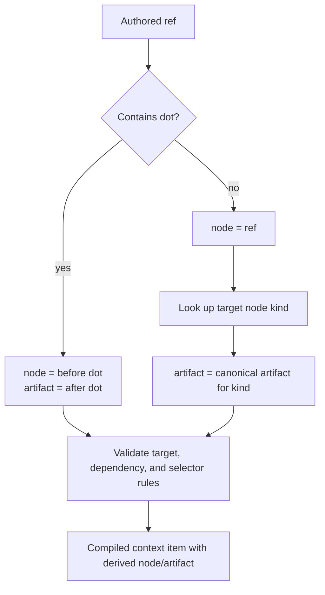
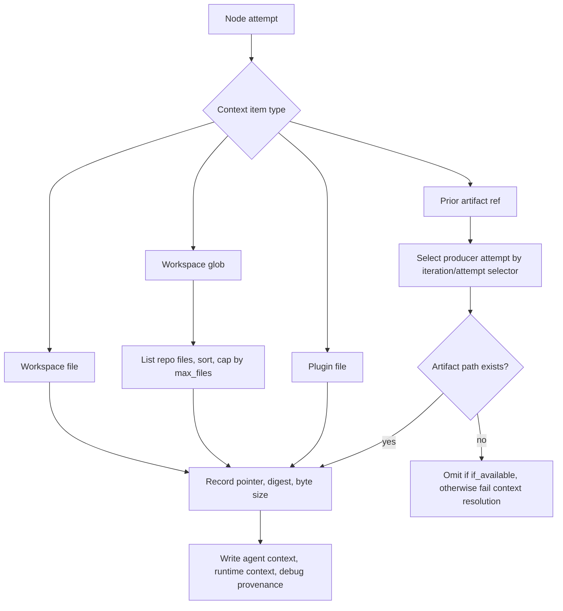

# Context And Artifacts

Context is what a node may inspect. Artifacts are what a node publishes. Agentflow keeps those concepts separate so prompts stay pointer-based, downstream handoffs are explicit, and resume can reason about source provenance without stuffing copied evidence into the harness prompt.

## High-Level Flow

```mermaid
flowchart LR
  authored["Authored support.context"] --> normalize["Normalize refs and selectors"]
  normalize --> compile["Compile dependency edges"]
  compile --> attempt["Node attempt starts"]
  attempt --> resolve["Resolve packet, manifest, provenance"]
  resolve --> prompt["Harness prompt references packet and manifest"]
  prompt --> worker["Agent/check/exec opens source pointers when needed"]
  worker --> artifacts["Declared artifacts and reserved artifacts"]
  artifacts --> downstream["Downstream refs"]
```

## Authored Context

Executable nodes receive authored context through `support.context`. Each entry must include `what` and `why` so the prompt can explain what the pointer is and why this node needs it.

Context kinds are:

- `workspace_file`: one file from the selected repo workspace.
- `workspace_glob`: a sorted set of files from the selected repo workspace.
- `plugin_file`: a plugin-owned file forwarded by a plugin workflow.
- `ref`: a prior node artifact reference such as `design_spec.spec` or bare `design_spec`.

Inline text context is not part of the graph contract. Durable context belongs in `intent`, a workspace file, a plugin file, or a prior artifact.

Authored artifact refs use `ref` as the source of truth. A dotted ref names `node.artifact`; a bare ref names a node and uses that node type's canonical artifact, such as `agent_response` for agent nodes. The normalizer derives `node` and `artifact` internally for compiled/runtime use.

## Artifact Ref Resolution

Compile-time validation checks that artifact refs point to known executable nodes, do not cross unordered parallel siblings, and use repeat selectors when a reference leaves a repeat scope. The compiled graph carries derived `node` and `artifact` fields so Mermaid diagrams, runtime context resolution, review, and delivery can explain the dependency without requiring redundant authored fields.

## Pointer Resolution

At execution time, `resolveExecutionContext` writes audience-specific files under the attempt directory:

- `agent/context.md`: prompt-facing pointer index. This is what normal agents see.
- `runtime/context.json`: compact machine state for resume, completion, verification, and recovery.
- `human-debug/context-provenance.json`: source provenance and digest metadata for audit/debug review.

Agentflow does not copy authored context text into attempt-local source clones and does not truncate source context. The prompt includes only available actionable pointers and omits optional omissions, digests, byte sizes, packet paths, and provenance paths. Each runtime context item points back to the source workspace file, artifact file, plugin file, or runtime-generated file.

## Validate Context Analysis

`agentflow validate --graph <path>` uses the same repo file discovery and path-safety rules as runtime context resolution. It reports pointer-level context analysis under `checks.context` in the validation payload:

- projected pointer counts per node
- projected byte sizes per context item when statically knowable
- sample glob matches and largest matched files
- non-text or unsafe source warnings
- default ignored roots and explicit ignored-root opt-ins
- unresolved artifact refs and missing `what` or `why`

Workspace globs skip common dependency and generated roots by default, including `.git`, `.agentflow`, `node_modules`, `.venv`, `venv`, `.tox`, cache directories, build output, coverage, `vendor`, `third_party`, `generated`, `gen`, `__generated__`, and Bazel output. Authors can intentionally opt into one of those roots by starting the authored context path inside that root, such as `.venv/*eval*.md`; broad globs like `**/*eval*` still skip those roots.

## Repeat Selectors

Artifact refs can select attempts with:

- `iteration`: `latest`, `latest_passed`, `latest_failed`, `previous`, or a positive integer.
- `attempt`: `latest`, `latest_passed`, `latest_failed`, or a positive integer.
- `if_available: true`: record an optional missing artifact reference in runtime/debug state rather than fail when the selected material does not exist. Optional omissions are not rendered into normal agent prompts.

Missing required workspace files, glob matches, plugin files, and artifact references fail context resolution before the node runs.

Inside repeat bodies, Agentflow can also add repeat history pointers for the current iteration. That gives a repair/retry node a concise view of previous failed attempts without making graph authors wire every internal attempt artifact manually. Supervisor retry guidance can also appear as runtime-provided context after `retry_with_guidance`; it contains the guidance brief, prompt revision, failure fingerprint, and prior execution id for the retrying node.

When a retry uses a supervisor runtime overlay, the overlay context is resolved before authored context:

- `supervisor_recovery_envelope` points to `agent/supervisor-recovery.md`, which summarizes the failure symptom, selected recovery action, required material delta, must-do guidance, evidence pointers, validation focus, and unchanged contract.
- `supervisor_context_repair` appears when context pointer resolution failed. It provides a compact context index, omitted-entry provenance, largest-file warnings, default ignored roots, and live paths the worker can inspect manually.
- Workspace and environment repairs are recorded in `runtime-overlay.json` and `material-delta.json`. Workspace repair also writes `workspace-repair-patch.json` and `workspace-repair-result.json` so reviewers can see which failed-attempt edits were restored before retry.

The overlay is not a graph contract change. It is an auditable runtime repair attached to machine state under `runtime/supervisor/` and raw debug evidence under `human-debug/interventions/`.

## Artifact Production

Nodes declare durable handoffs under `artifacts`. An artifact definition says where the runtime should look after a node reports success:

- `from: "output_dir"`: the file must exist under `$AGENTFLOW_OUTPUT_DIR`.
- `from: "workspace"`: the file must exist under the node workspace path.

Agent nodes also produce reserved automatic artifacts regardless of whether declared artifact projection succeeds:

- `agent_response`: final harness response.
- `stdout`: captured stdout log for human audit/debug.
- `stderr`: captured stderr log for human audit/debug.

Check nodes can produce `verification_json`; local exec/check nodes capture `stdout` and `stderr`. Passing agent attempts that project declared artifacts also receive `runtime/verifier.json` and `human-debug/verifier/verdict.md` from outcome verification. Raw logs and verifier internals are audit artifacts, not declared handoffs or default agent-facing context.

## Missing Artifacts

A missing declared artifact is a runtime failure, not a graph validation failure. Validation proves the contract is well formed; execution proves the worker honored it.

When an agent attempt reports success but required declared artifacts are missing, the supervisor may run `repair_artifact` if policy and budget allow. The runtime writes an agent-facing repair brief under `agent/` with missing artifacts, concise evidence pointers, and retry instructions. Raw harness logs stay under `human-debug/` for audit and diagnostic helpers. The repair is accepted only if the missing files now exist at the declared paths.

When an agent harness fails, the runtime preserves the harness failure as the primary diagnostic and does not convert the attempt into a missing-artifact failure. Files written before the failure are not registered as declared artifacts for downstream refs. Later repair or retry prompts may still list those existing paths as prior-attempt evidence so the next worker can inspect useful partial work without treating it as a completed handoff.

## Why This Shape

This design makes handoffs explicit and inspectable:

- Graph authors decide which inputs are important by naming context pointers.
- Graph authors decide which outputs matter by naming artifacts.
- Agents cannot smuggle durable state through hidden chat history.
- Downstream nodes depend on named artifacts instead of scratch paths.
- Resume can compare context provenance and compiled node contracts.
- Delivery can separate human-facing artifacts from debug-only runtime files.
