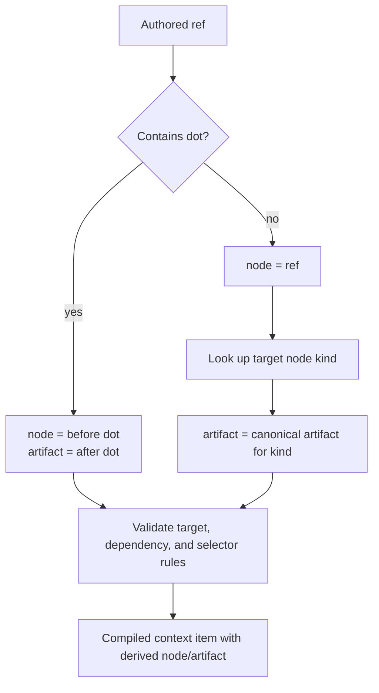
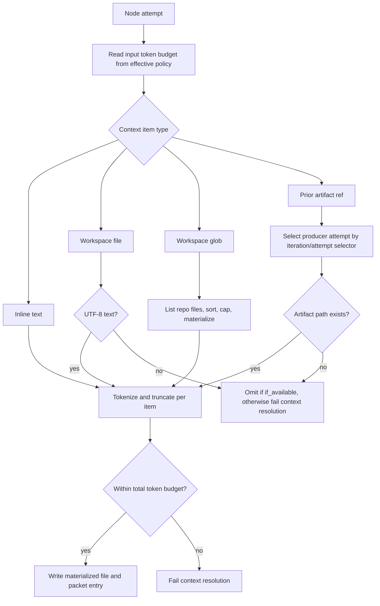

# Context And Artifacts

Context is what a node reads. Artifacts are what a node publishes. Agentflow keeps those concepts separate so prompts stay bounded, downstream handoffs are explicit, and resume can reason about what changed.

## High-Level Flow

```mermaid
flowchart LR
  authored["Authored context"] --> normalize["Normalize refs and selectors"]
  normalize --> compile["Compile dependency edges"]
  compile --> attempt["Node attempt starts"]
  attempt --> materialize["Materialize packet, manifest, provenance"]
  materialize --> prompt["Harness prompt references packet and manifest"]
  prompt --> worker["Agent/check/exec reads context"]
  worker --> artifacts["Declared artifacts and reserved artifacts"]
  artifacts --> downstream["Downstream refs"]
```

## Authored Context

Executable nodes can receive:

- `text`: inline operator-provided text.
- `workspace_file`: one file from the selected repo workspace.
- `workspace_glob`: a sorted set of files from the selected repo workspace.
- `ref`: a prior node artifact reference such as `design_spec.spec` or bare `design_spec`.

Authored artifact refs use `ref` as the source of truth. A dotted ref names `node.artifact`; a bare ref names a node and uses that node type's canonical artifact, such as `agent_response` for agent nodes. The normalizer derives `node` and `artifact` internally for compiled/runtime use.

## Artifact Ref Resolution

Compile-time validation checks that artifact refs point to known executable nodes, do not cross unordered parallel siblings, and use repeat selectors when a reference leaves a repeat scope. The compiled graph carries derived `node` and `artifact` fields so Mermaid diagrams, runtime context resolution, review, and delivery can explain the dependency without requiring redundant authored fields.

## Materialization

At execution time, `resolveExecutionContext` writes three files under the attempt directory:

- `context/packet.json`: structured list of materialized items, omitted items, sources, descriptions, token counts, and paths.
- `context/manifest.md`: human-readable index the harness prompt tells the agent to read first.
- `context/provenance.json`: digests and discovery metadata used by resume and debugging.

Materialized source files are copied into `context/materialized/...`. Agentflow only materializes valid UTF-8 text into the context packet. Binary or non-UTF-8 inputs are omitted with an explicit reason.

The prompt does not inline every context file. It includes the manifest text and points to `packet.json` and `provenance.json`. This keeps prompt construction stable while still letting the agent inspect exact materialized paths.

## Validate Context Analysis

`agentflow validate --graph <path>` uses the same tokenizer and repo file discovery rules as runtime context materialization. It estimates every executable node's context packet before launch and includes the report under `checks.context` in the validation payload:

- projected total tokens per node against `max_total_tokens`
- projected and actual tokens per context item
- sample glob matches and largest matched files
- per-item truncation and non-tokenizable counts
- default ignored roots and explicit ignored-root opt-ins
- launch-blocking diagnostics when current context would exceed the node budget

Validation fails before launch when the current workspace state would fail context materialization at runtime.

Workspace globs skip common dependency and generated roots by default, including `.git`, `.agentflow`, `node_modules`, `.venv`, `venv`, `.tox`, cache directories, build output, coverage, `vendor`, `third_party`, `generated`, `gen`, `__generated__`, and Bazel output. Authors can intentionally opt into one of those roots by starting the authored context path inside that root, such as `.venv/*eval*.md`; broad globs like `**/*eval*` still skip those roots.

## Repeat Selectors

Artifact refs can select attempts with:

- `iteration`: `latest`, `latest_passed`, `latest_failed`, `previous`, or a positive integer.
- `attempt`: `latest`, `latest_passed`, `latest_failed`, or a positive integer.
- `if_available: true`: omit rather than fail when the selected material does not exist.

Inside repeat bodies, Agentflow can also add repeat history context for the current iteration. That gives a repair/retry node a concise view of previous failed attempts without making graph authors wire every internal attempt artifact manually. Supervisor retry guidance can also appear as runtime-provided context after `retry_with_guidance`; it contains the guidance brief, prompt revision, failure fingerprint, and prior execution id for the retrying node.

When a retry uses a supervisor runtime overlay, the overlay context is materialized before authored context:

- `supervisor_recovery_envelope` summarizes the failure, case file, recovery plan, must-do guidance, and unchanged contract.
- `supervisor_context_repair` appears when authored context could not fit. It replaces authored context for that retry with a compact context index, omitted-entry provenance, largest-file warnings, default ignored roots, and live paths the worker can inspect manually.
- Workspace and environment repairs are recorded in `runtime-overlay.json` and `material-delta.json`. Workspace repair also writes `workspace-repair-patch.json` and `workspace-repair-result.json` so reviewers can see which failed-attempt edits were restored before retry.

The overlay is not a graph contract change. It is an auditable runtime repair attached to the failed attempt's `interventions/<intervention-id>/` directory.

## Artifact Production

Nodes declare durable handoffs under `artifacts`. An artifact definition says where the runtime should look after a node reports success:

- `from: "output_dir"`: the file must exist under `$AGENTFLOW_OUTPUT_DIR`.
- `from: "workspace"`: the file must exist under the node workspace path.

Agent nodes also produce reserved automatic artifacts regardless of whether declared artifact materialization succeeds:

- `agent_response`: final harness response.
- `stdout`: captured stdout log.
- `stderr`: captured stderr log.

Check nodes can produce `verification_json`; local exec/check nodes capture `stdout` and `stderr`. Passing agent attempts that materialize declared artifacts also receive `verify-outcome.json` and `verify-outcome.md` from outcome verification. Those verifier files are audit artifacts, not declared handoffs.

## Missing Artifacts

A missing declared artifact is a runtime failure, not a graph validation failure. Validation proves the contract is well formed; execution proves the worker honored it.

When an agent attempt reports success but required declared artifacts are missing, the supervisor may run `repair_artifact` if policy and budget allow. The repair worker receives the same node task, graph intent, context contract, artifact contract, sandbox boundary, and available evidence. The repair is accepted only if the missing files now exist at the declared paths.

When an agent harness fails, the runtime preserves the harness failure as the primary diagnostic and does not convert the attempt into a missing-artifact failure. Files written before the failure are not registered as declared artifacts for downstream refs. Later repair or retry prompts may still list those existing paths as prior-attempt evidence so the next worker can inspect useful partial work without treating it as a completed handoff.

## Why This Shape

This design makes handoffs explicit and inspectable:

- Graph authors decide which outputs matter by naming artifacts.
- Agents cannot smuggle durable state through hidden chat history.
- Downstream nodes depend on named artifacts instead of scratch paths.
- Resume can compare context provenance and compiled node contracts.
- Delivery can separate human-facing artifacts from debug-only runtime files.
