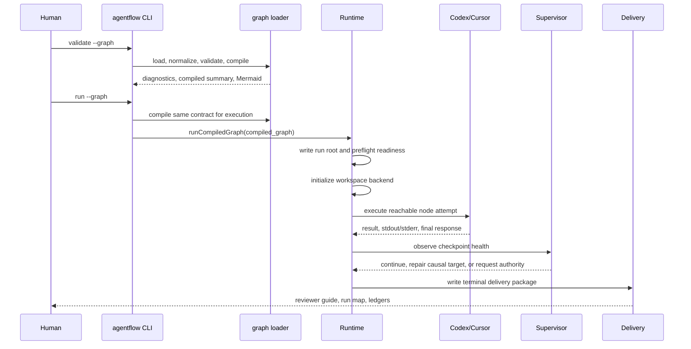
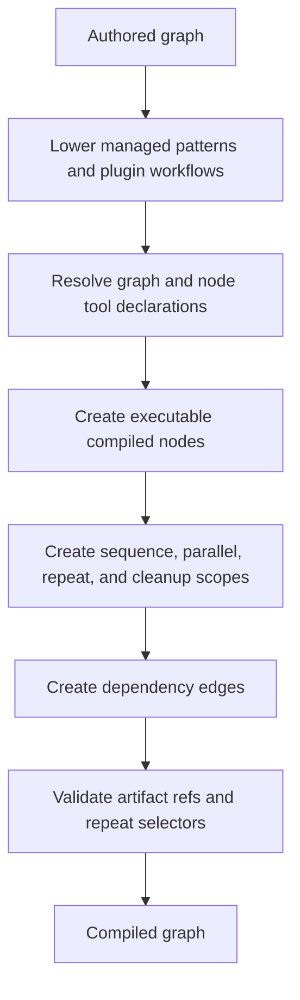
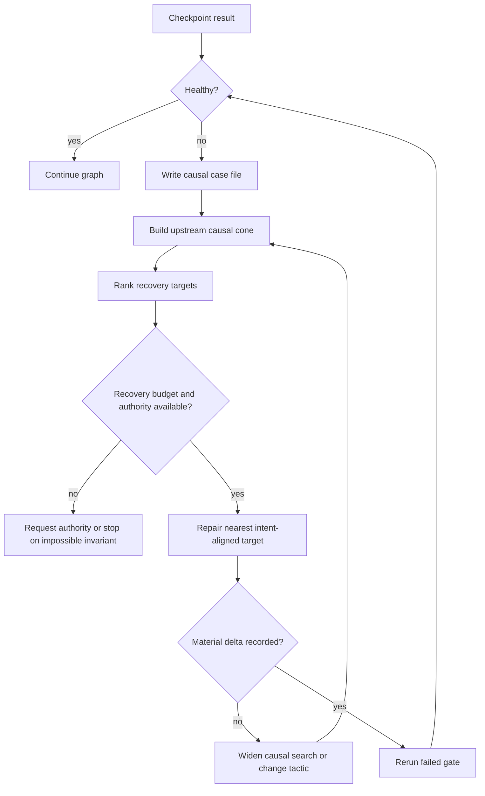

# Runtime Lifecycle

This document explains the implementation path from an authored graph to a terminal run. For operator commands, use `docs/product/operations.md`; this page focuses on how those commands work internally.

## High-Level Flow

## Validate

Validation follows the same front half as a run, but stops before execution:

1. Load the graph file and resolve paths relative to the graph directory where appropriate.
2. Normalize authored fields into the v1 graph contract.
3. Expand managed patterns and plugin workflow nodes into authored primitive graph nodes.
4. Resolve launch settings from `defaults` and `profiles`.
5. Compile the graph into primitive runtime nodes, edges, scopes, resolved tools, credential specs, and artifact references.
6. Run graph validation and authoring review diagnostics.
7. Optionally run local readiness checks with `--run-ready`.
8. Optionally emit compiled JSON, Mermaid text, or a rendered Mermaid image.

`validate --show-compiled` is the most direct way to inspect the contract the runtime will execute. `validate --diagram` and `--diagram-output` are for reviewing graph shape, dependencies, scopes, and artifact handoffs visually.

## Compile

Compilation is the boundary between human-authored structure and the runtime scheduler.

Compiled nodes carry the effective policy needed to launch them: repo alias, profile name, workspace backend, harness, model, sandbox, timeout, input token budgets, artifact repair policy, context list, declared artifacts, and granted tools.

Authored ids remain visible for humans. Compiled ids are stable runtime ids that include scope context, especially inside managed patterns and repeat bodies. The `authored_to_compiled` map preserves that relationship for inspection, delivery, and resume.

## Run

`runCompiledGraph` creates the run root and writes the first durable artifacts before doing substantial work. The runtime then:

1. Writes `run.json`, `compiled_graph.json`, `execution_manifest.json`, `state.json`, and initial event files.
2. Evaluates readiness that must block execution, such as missing repos, commands, env vars, plugin tool help, credentials, or harness binaries for reachable nodes.
3. Initializes the workspace backend:
   - `inplace` binds repo aliases to the configured checkout paths.
   - `worktree` creates isolated Git worktrees under the run root and cleans them up at terminal state.
4. Starts the scheduler loop with the compiled topology.
5. Opens an attempt directory for each runnable node.
6. Materializes context and prepares runtime tooling for harnessed agent nodes.
7. Executes the node through an agent harness, local `exec`, deterministic check, AI check, or checkpoint executor.
8. Records result files, logs, artifacts, events, state, and supervisor decisions.

## Node Attempt Boundary

Each attempt is the unit of execution and audit. A typical agent attempt includes:

- `context/packet.json`, `context/manifest.md`, and `context/provenance.json`
- `agentflow-tools/runtime.json`, `state.json`, generated `bin/af`, and generated plugin wrappers
- stdout/stderr logs from the harness or local command
- `tool-invocations.jsonl` and tool sidecar logs when generated wrappers are used
- declared output artifacts under the attempt artifact directory or workspace paths
- reserved artifacts such as `agent_response`, `stdout`, `stderr`, and `verification_json`
- `workspace-changes/` snapshots for agent and exec attempts that reach the execution boundary
- `verify-outcome.json` and `verify-outcome.md` for passing agent attempts after declared artifacts materialize

The attempt boundary matters because supervisor interventions attach to a specific attempt, downstream refs select from attempts, and resume decides whether completed attempts remain compatible with the current compiled contract.

Managed pattern internals also emit `managed.progress` events at meaningful boundaries such as internal node completion, ordinary deep-work completion feedback, and managed repeat exhaustion. Ordinary managed feedback stays inside the pattern while the pattern can still make progress. When a managed repeat exhausts its authored cycles, the runtime records the exhaustion as managed progress evidence and routes the failed boundary through the normal supervisor path. The supervisor may retry only when it can attach a material delta such as new evidence, repaired context, changed validation strategy, workspace cleanup, or safe environment repair.

## Supervision

The supervisor is engine-side control logic. It is not a separate always-running agent. It observes every executable checkpoint at scheduler boundaries and stays out of the way when the node is healthy. A failed or rejected checkpoint is treated as a symptom, not automatically as the root cause.

Supervisor decisions are written to event streams, `supervisor-timeline.jsonl`, `interventions.jsonl`, and state. Budget-spending recovery chains attach artifacts under the symptom attempt's `interventions/` directory. If the selected recovery target is upstream, the target writes normal attempt folders and the chain links the symptom, target, material delta, and rerun gate.

For recovery-oriented actions, the supervisor records a failure fingerprint, writes `causal-case-file.{json,md}`, ranks targets in `causal-targets.json`, writes `recovery-chain.{json,md}`, merges evidence into `recovery-plan.{json,md}`, writes `runtime-overlay.json`, records `material-delta.json`, emits `supervisor.retry_scheduled`, sleeps before re-queueing, and injects the recovery envelope into the selected target's next attempt prompt and context. A retry without a material delta is blocked so the supervisor does not spend budget repeating the same failed tactic. The default retry delay is 10 seconds with exponential backoff capped at 2 minutes; `AGENTFLOW_RETRY_BASE_DELAY_MS` and `AGENTFLOW_RETRY_MAX_DELAY_MS` override the values.

Context materialization can fail before the harness runs. Those failures are classified as `context_contract_failure`, analyzed with the shared run-ready context analyzer, and retried with a compact `supervisor_context_repair` packet when the supervisor can safely repair the packaging without changing graph authority.

Workspace repair uses the node-level baseline and after snapshots captured around every agent/exec attempt. If a failed attempt is classified as a forbidden or unrelated workspace edit, the overlay restores tracked files from the pre-attempt snapshot and removes untracked files introduced by that failed attempt before the retry is scheduled. Environment repair is intentionally narrower: it refreshes per-execution Agentflow tool wrappers and PATH/runtime metadata on the retry without mutating global machine state.

Authority pauses are last resort. The runtime pauses only for credentials, explicit human checkpoint boundaries, product or intent ambiguity, security or compliance judgment, repo/sandbox/scope expansion, or graph contract amendment. Local context, artifact, workspace, validation strategy, and recoverable environment issues should attempt machine repair first.

## Resume

Resume is contract-aware. It does not blindly continue old state.

1. Load the prior run root and run state.
2. Re-load and recompile the current graph.
3. Compare the prior compiled graph and current compiled graph.
4. Preserve completed attempts only when the graph intent, supervision contract, and node contracts remain compatible.
5. Invalidate affected nodes and dependent work when contracts changed.
6. Continue the scheduler loop from the reconstructed session.

`agentflow resume --dry-run` stops after reconstruction and reports what would be preserved, restarted, and initially startable without reconciling artifacts or creating workspaces. `--reset-supervisor-budget` keeps compatible completed work but restores the supervisor budget from the current graph, which is useful after fixing an exhausted run's graph or environment.

Paused supervisor runs additionally require explicit `--human-action` and optional `--human-note` when execution actually resumes; dry-run previews do not require human input. Planned checkpoint decisions are different: they happen during the original TTY run and are represented as checkpoint outcomes and operator feedback artifacts.

## Delivery

Terminal runs always attempt to write the delivery package. The collector reads state, attempts, events, checks, interventions, workspace changes, and declared artifacts, then writes human entrypoints such as `reviewer-guide.md`, `implementation-summary.md`, `risk-notes.md`, and `run-map.md`.

If delivery creation fails, the run is marked failed. This keeps the runtime contract honest: a successful terminal run must be reviewable, not merely complete.
