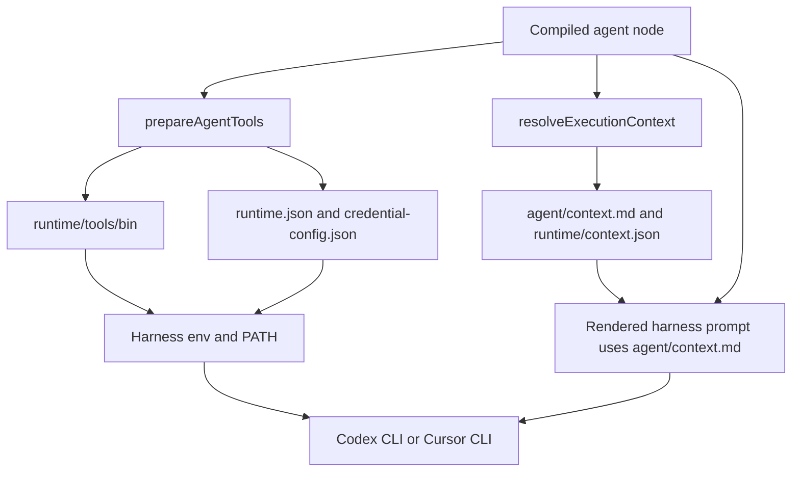
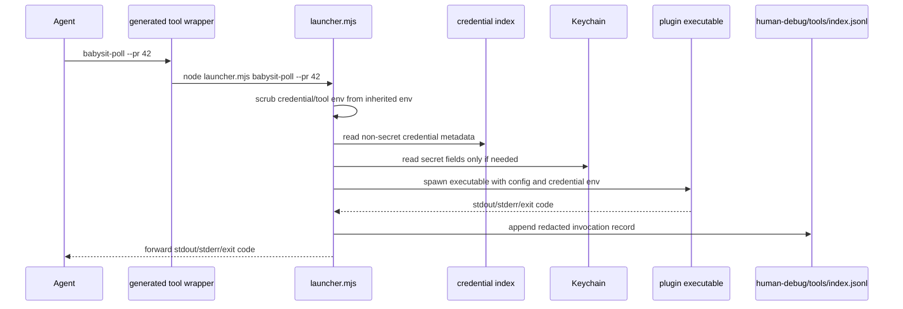
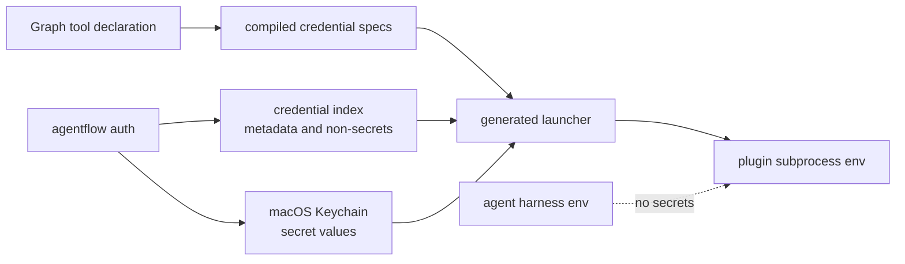

# Runtime Tooling

This page explains how Agentflow injects runtime tools into an agent node, what appears in the harness context window, and how plugin tools resolve config and credentials without exposing secrets to the model.

## What The Harness Receives

Before launching a Codex CLI or Cursor CLI agent node, Agentflow builds one `AgentInvocation` contract. The harness adapter renders that into a prompt and process environment.



The harness prompt includes:

- role and node task
- graph goal, acceptance criteria, and constraints when present
- workspace path and sandbox expectations
- priority-sectioned context pointers from `agent/context.md`, including generated glob indexes for broad reference sets
- `af` runtime CLI instructions
- declared artifact contract through `af artifact write <name>`
- optional skills table
- managed plugin tools table for node-granted tools
- ambient CLI hints table for normal shell commands
- validation and final handoff expectations
- retry orientation and attempt memory when the node is a supervisor-scheduled retry

The harness environment includes:

- `AGENTFLOW_WORKSPACE`
- `AGENTFLOW_OUTPUT_DIR` for runtime-owned artifact publishing
- `AGENTFLOW_CONTEXT_PACKET`
- `AGENTFLOW_CONTEXT_MANIFEST`
- `AGENTFLOW_RUNTIME_METADATA`
- `AGENTFLOW_TOOL_STATE`
- `AGENTFLOW_AF_BROKER_DIR` for parent-owned `af` command execution
- run/node identity values such as `AGENTFLOW_RUN_ID`, `AGENTFLOW_AGENT_ID`, and `AGENTFLOW_NODE_ID`
- a `PATH` with the generated tool directory prepended

It explicitly does not include `AGENTFLOW_CREDENTIAL_*` values or raw `AGENTFLOW_TOOL_<NAME>_<KEY>` config values.

## Harness Config Isolation

Primitive worker harnesses preserve the native Codex/Cursor experience by default. Normal `agent` nodes and artifact-repair workers inherit the user's harness config unless a profile explicitly sets `harness_config.isolation: "isolated"`. Node definitions still do not carry their own `harness_config`.

Profiles may declare:

```json
{
  "harness_config": {
    "isolation": "isolated",
    "codex": {
      "config": {},
      "mcp_servers": {},
      "plugins": {},
      "notify": []
    },
    "cursor": {
      "config": {},
      "permissions": {
        "allow": [],
        "deny": []
      }
    }
  }
}
```

`isolation` defaults to `inherit_user` for normal worker prompts. Launch profile config is inherited only when the effective harness matches; node and supervisor profiles then overlay it. Object maps merge by key, arrays replace, and the more specific profile wins. Codex profiles start with `codex.config.approval_policy = "never"` unless a profile explicitly overrides that key, which keeps Codex approval prompts out of non-interactive Agentflow runs. Validation fails unknown `harness_config` keys and harness-specific config under the wrong effective harness.

In Codex isolated mode, Agentflow creates a temporary `CODEX_HOME`, links auth when available, and passes only the effective `codex.config`, `codex.mcp_servers`, `codex.plugins`, and `codex.notify` values. If no MCP servers or plugins are declared, isolated Codex runs have none by default.

In Cursor isolated mode, Agentflow creates a generated `CURSOR_CONFIG_DIR`, writes the Agentflow workspace and sandbox permissions, then merges declared `cursor.config` and `cursor.permissions`. Cursor `inherit_user` cannot combine with declared `cursor.config` or `cursor.permissions` because Agentflow would have no generated config file to merge into.

If Cursor reports that sandbox mode is enabled but unavailable on the host, the Cursor harness treats it as a transient launch failure once: it waits 7 minutes and retries the same launch command. If the retry still fails, Agentflow records a trusted harness configuration failure, not an agent-recoverable task failure. The supervisor must not keep retrying the same node or silently disable sandboxing. Disable Cursor sandboxing only through the authored launch profile, for example by choosing a profile whose authority intentionally maps to disabled sandbox behavior.

`isolation: "inherit_user"` is the normal worker parity mode. Codex runs keep the user's `CODEX_HOME`; Cursor runs keep the user's `CURSOR_CONFIG_DIR` and ambient CLI config. Agentflow still supplies required workspace, sandbox, output, context, runtime CLI, and plugin-tool environment. Use `isolation: "isolated"` when reproducibility is more important than native harness parity.

Verifier, AI-check, supervisor-evidence, and delivery-curator invocations always force isolated no-external-tool harness config, even if their profile asks to inherit user config. Those prompts are runtime trust checks, not worker capability nodes.

Primitive worker attempts record native harness metadata when the CLI exposes it, including session or chat ids. Agentflow treats those ids as audit/debug evidence only. Retries start a fresh native harness session and continue from Agentflow-owned evidence: `events.jsonl`, artifacts, milestones, attempt memory, supervisor recovery decisions, and `af orient`.

Agentflow does not activate Codex Goal mode for normal workers. The node contract and `af orient` are Agentflow's goal surface; Codex Goal mode is only an external baseline in engineering-parity evals when comparing Agentflow against direct native harness behavior.

## Generated Tool Directory

For each agent execution, Agentflow creates:

```text
<execution-dir>/runtime/tools/
  bin/
    af
    <plugin-callable-name>
  launcher.mjs
  runtime.json
  state.json
  credential-config.json
```

`bin/af` is a generated wrapper around Agentflow's runtime CLI implementation. Plugin callable files in `bin/` are generated shell wrappers that execute `launcher.mjs <tool-name> "$@"`.

The generated `bin/` directory is prepended to `PATH` only for that node attempt. A downstream or helper node gets its own generated directory and metadata.

## Prompt Support Contract

Skills, managed tools, and CLI hints are selected per prompt-backed node directly or through capabilities. They are support metadata, not authority; required usage belongs in the node `intent` or acceptance criteria. Managed plugin tools are granted only to `agent` nodes; `ai` check nodes may receive skills and CLI hints but not managed tools. `exec`, deterministic `check`, and `checkpoint` nodes use `support.context` only.

The skills table includes skill name, description, and local `SKILL.md` path. The prompt tells agents to open `SKILL.md` only when relevant. Skill refs stay in compiled/runtime state, not in the default prompt.

Ambient CLI hints are normal shell commands already available in the environment. They are validated as callable and rendered as command plus description; Agentflow does not generate wrappers, inject config, attach credentials, or write ledgers for them.

## Prompt Tool Contract

Plugin tools are described to the agent as short selectable CLIs, not as fully inlined API docs. The prompt includes each callable name, description with plugin origin, and usage reminder. It tells the agent to run:

```bash
<tool> --help
```

before first use when exact arguments, defaults, output shape, exit codes, examples, or safety notes matter.

This keeps the context window small and makes the executable's own `--help` the source of truth. It also lets the same graph work across Codex CLI and Cursor CLI because both harnesses receive the same tool contract and generated `PATH`.

## Plugin Tool Invocation



The generated launcher has two paths:

- Help path: if args include `--help` or `-h`, it runs the tool without resolving credentials, injects only non-secret config defaults, appends a `Runtime configured defaults` section, and records a redacted invocation.
- Invocation path: it reads non-secret config, resolves declared credential scopes, injects `AGENTFLOW_TOOL_<CALLABLE>_<KEY>` and `AGENTFLOW_CREDENTIAL_<SCOPE>_<FIELD>` only into the plugin subprocess, writes paired input/output debug payloads, and appends a redacted ledger entry. Missing required credentials are checked by runtime-owned preflight before the agent runs; launcher credential failures are audit evidence only and cannot create a pause.

The agent sees tool stdout/stderr and exit code. It does not see secret values unless the plugin executable itself prints them, which plugin authors must avoid.

## Credential Isolation

Secret values are configured with `agentflow auth` and stored in macOS Keychain. The local credential index stores metadata and non-secret fields. At runtime:

1. The compiled graph records which credential scopes a granted tool requires.
2. `prepareAgentTools` writes `credential-config.json` with credential specs and tool metadata, but not secret values.
3. `buildHarnessSpawnEnv` removes any inherited `AGENTFLOW_CREDENTIAL_*` and `AGENTFLOW_TOOL_*` values before launching the harness.
4. Runtime-owned preflight resolves required credential metadata before the agent runs and emits trusted typed authority if credentials are missing.
5. The generated launcher resolves credentials only when a plugin tool subprocess runs; launcher failures are audit evidence, not control-plane authority.
6. Invocation ledgers redact secret-looking argv values and omit credential env values.



## Runtime CLI `af`

`af` is injected beside plugin tools because it is part of the same per-attempt runtime contract. It reads `$AGENTFLOW_RUNTIME_METADATA`, which points at `runtime.json`. In sandboxed harnesses, the generated wrapper sends `af` commands through a parent-owned broker under `/tmp`; the parent process performs run-root writes for milestones, artifacts, and completion packets. Agents still use the simple `af ...` command surface, and no prompt needs transient artifact destinations or debug paths.

Common commands:

- `af orient`: print the current-node operating picture. A first clean call is intentionally minimal; later calls render the full success contract and runtime state, and recovery calls foreground retry guidance. Orientation summarizes priority context sections, including read-first/current-work pointers and reference-set counts, without dumping every glob match. Agents run it before material work and rerun it whenever the goal, acceptance criteria, context pointers, artifact expectations, retry state, or next action becomes unclear, including after compaction, long pauses, or long-running task drift. On retries it starts with retry orientation and runtime-authored attempt memory: prior symptom, best resume point, restart boundary, workspace decision, preserved progress, discarded progress, required next action, validation gate, and do-not-redo guidance. If a managed pattern produced a structured runtime contract failure, orientation includes a compact managed-contract-failure table and an agent-facing `agent/managed-contract-failure.md` pointer.
- `af milestone add --title <text> --goal <text>`: declare a meaningful phase of work after orientation, including a planning/research milestone when discovery is substantial.
- `af milestone log <id> --kind finding|decision|validation --summary <text>`: attach audit evidence to a milestone. Validation logs also include `--command` and `--result pass|fail|blocked`.
- `af milestone complete <id> --evidence <text>` or `af milestone block <id> --blocked-on <text> --recoverable-by <text> --evidence <text>`: close the milestone with evidence or record a true external blocker.
- `af artifact write <name>`: publish declared artifact bytes from stdin to its declared destination.
- `af artifact write <name> --file <path>`: copy an existing workspace/output file, such as a screenshot, PDF, trace, or generated archive, into the declared artifact destination without decoding it as text.
- `af complete check`: build the runtime completion packet and report whether the current attempt is `ready_for_verification`, `incomplete`, or `blocked`.

`af --help` is intentionally narrow for normal agents. The runtime metadata carries an `af` command policy, and the generated wrapper plus parent broker enforce the same policy. Normal workers can use only `orient`, `milestone`, `artifact write`, and `complete check`. Recovery/debug/orchestration commands such as `af diagnose`, `af learn`, and `af spawn` require diagnostic or orchestrator authority; forged broker requests do not expand the policy. There is no standalone `af wait`; `af spawn ... --wait` is available only to runtime-authorized supervisor or managed-pattern orchestration.

Supervisor diagnostics include `af diagnose evidence-map --node <id> [--attempt latest|N] --json` and `af diagnose recovery-delta --case <case-file> --json`. Evidence maps connect failed requirements to available, missing, or conflicting evidence. Recovery deltas are advisory diagnostics; retries still require the engine to record a valid material delta in the recovery plan.

The runtime CLI is file-backed from Agentflow's point of view. The broker is an execution detail that prevents harness filesystem sandboxes from breaking runtime-owned writes; it validates `af` argv, ignores agent-supplied working-directory expansion, constrains stdin sidecar paths, and does not expose a general service or extra authority to the model.

`af complete check` writes the same packet shape that the engine enforces after each attempt. Completion packets include orientation state, milestone summaries, validation evidence, blocked milestones, declared artifact state, content type/media metadata, binary-safe hashes, placeholder/empty/stale artifact findings, active live human observations, supervisor recovery requirements, managed-pattern summaries, managed contract findings, helper session evidence, and typed authority requests when a trusted runtime component produced one. Outcome verification only judges semantic correctness after this mechanical packet is ready. A `blocked` packet is valid only with a typed authority request; other blockers remain `incomplete`.

Managed-pattern internals use a shared runtime contract-failure model for machine-shaped artifacts such as work-list item results and deep-work scorecards. The runtime writes `runtime/managed-contract-failure.json` as the source of truth and `agent/managed-contract-failure.md` as the compact retry pointer. Findings identify the managed kind, phase, item id when applicable, artifact name/path, failure kind, expected contract, retry boundary, required next action, and evidence refs. Malformed item result artifacts are `artifact_contract_failure`, not context failures, so supervisor recovery can target the current item or phase instead of rebuilding unrelated context.

## Tool Invocation Evidence

Generated wrappers write paired invocation files under `human-debug/tools/`:

```text
human-debug/tools/
  index.jsonl
  0001-input.json
  0001-output.json
```

`index.jsonl` records include:

- run, graph, agent, execution, node, and compiled ids
- tool callable name and source
- redacted argv
- cwd
- exit code and duration
- input/output payload paths
- redaction note

Those records feed debugging and delivery evidence. They are not the main handoff; durable handoffs still belong in declared artifacts.

## Practical Consequences

- Adding a plugin tool to top-level `tools` registers it for reuse; granting it through agent `support.tools` or an agent capability is operator approval to expose that CLI to that agent node.
- The plugin manifest describes selection and auth/config needs; `--help` describes exact CLI usage.
- Local CLI commands such as `git`, `npm`, `rg`, `jq`, or `gh` are ambient shell usage. Add them as CLI hints when the prompt should name them, and wrap them as plugin tools only when reuse, credentials, config policy, or audit ledgers are needed.
- Config values are graph-provided defaults for the tool subprocess, not agent prompt variables.
- Credentials stay out of the harness context window and environment.
- Tool behavior is auditable through wrapper ledgers and paired input/output payloads.
