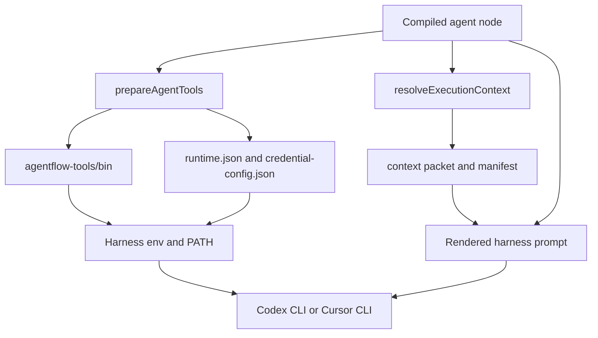
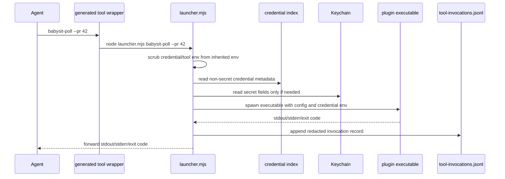
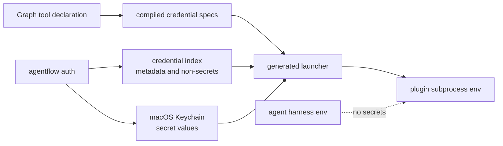

# Runtime Tooling

This page explains how Agentflow injects runtime tools into an agent node, what appears in the harness context window, and how plugin tools resolve config and credentials without exposing secrets to the model.

## What The Harness Receives

Before launching a Codex CLI or Cursor CLI agent node, Agentflow builds one `AgentInvocation` contract. The harness adapter renders that into a prompt and process environment.



The harness prompt includes:

- role and node task
- graph goal, acceptance criteria, and constraints when present
- workspace path, output directory, sandbox, and timeout expectations
- context manifest plus paths to `packet.json` and `provenance.json`
- `af` runtime CLI instructions
- declared artifact contract
- short plugin tool selection hints
- validation and final handoff expectations

The harness environment includes:

- `AGENTFLOW_WORKSPACE`
- `AGENTFLOW_OUTPUT_DIR`
- `AGENTFLOW_CONTEXT_PACKET`
- `AGENTFLOW_CONTEXT_MANIFEST`
- `AGENTFLOW_RUNTIME_METADATA`
- `AGENTFLOW_TOOL_STATE`
- run/node identity values such as `AGENTFLOW_RUN_ID`, `AGENTFLOW_AGENT_ID`, and `AGENTFLOW_NODE_ID`
- a `PATH` with the generated tool directory prepended

It explicitly does not include `AGENTFLOW_CREDENTIAL_*` values or raw `AGENTFLOW_TOOL_<NAME>_<KEY>` config values.

## Harness Config Isolation

Harness-native config is profile authority. Ambient Codex or Cursor user config is not used by default, and node definitions do not carry their own `harness_config`.

Profiles may declare:

```json
{
  "harness_config": {
    "isolation": "isolated",
    "codex": {
      "config": {},
      "mcp_servers": {},
      "plugins": {},
      "notify": []
    },
    "cursor": {
      "config": {},
      "permissions": {
        "allow": [],
        "deny": []
      }
    }
  }
}
```

`isolation` defaults to `isolated`. Launch profile config is inherited only when the effective harness matches; node and supervisor profiles then overlay it. Object maps merge by key, arrays replace, and the more specific profile wins. Validation fails unknown `harness_config` keys and harness-specific config under the wrong effective harness.

In Codex isolated mode, Agentflow creates a temporary `CODEX_HOME`, links auth when available, and passes only declared `codex.config`, `codex.mcp_servers`, `codex.plugins`, and `codex.notify` values. If no MCP servers or plugins are declared, isolated Codex runs have none by default.

In Cursor isolated mode, Agentflow creates a generated `CURSOR_CONFIG_DIR`, writes the Agentflow workspace and sandbox permissions, then merges declared `cursor.config` and `cursor.permissions`. Cursor `inherit_user` cannot combine with declared `cursor.config` or `cursor.permissions` because Agentflow would have no generated config file to merge into.

`isolation: "inherit_user"` is an explicit reproducibility tradeoff. Codex runs keep the user's `CODEX_HOME`; Cursor runs keep the user's `CURSOR_CONFIG_DIR` and ambient CLI config. Agentflow still supplies required workspace, sandbox, output, context, runtime CLI, and plugin-tool environment. Use this only when the local harness-native setup is part of the intended run, and exclude those profiles from prompt-regression release gates.

Verifier, AI-check, and supervisor-evidence invocations always force isolated no-external-tool harness config, even if their profile asks to inherit user config. Those prompts are runtime trust checks, not worker capability nodes.

## Generated Tool Directory

For each agent execution, Agentflow creates:

```text
<execution-dir>/agentflow-tools/
  bin/
    af
    <plugin-callable-name>
  launcher.mjs
  runtime.json
  state.json
  credential-config.json
```

`bin/af` is a generated wrapper around Agentflow's runtime CLI implementation. Plugin callable files in `bin/` are generated shell wrappers that execute `launcher.mjs <tool-name> "$@"`.

The generated `bin/` directory is prepended to `PATH` only for that node attempt. A downstream or helper node gets its own generated directory and metadata.

## Prompt Tool Contract

Plugin tools are described to the agent as short selectable CLIs, not as fully inlined API docs. The prompt includes each callable name, plugin origin, description, credential scope names, and configured default keys. It tells the agent to run:

```bash
<tool> --help
```

before first use when exact arguments, defaults, output shape, exit codes, examples, or safety notes matter.

This keeps the context window small and makes the executable's own `--help` the source of truth. It also lets the same graph work across Codex CLI and Cursor CLI because both harnesses receive the same tool contract and generated `PATH`.

## Plugin Tool Invocation



The generated launcher has two paths:

- Help path: if args include `--help` or `-h`, it runs the tool without resolving credentials, injects only non-secret config defaults, appends an `Agentflow configured defaults` section, and records a redacted invocation.
- Invocation path: it reads non-secret config, resolves declared credential scopes, injects `AGENTFLOW_TOOL_<CALLABLE>_<KEY>` and `AGENTFLOW_CREDENTIAL_<SCOPE>_<FIELD>` only into the plugin subprocess, writes stdout/stderr sidecar logs, and appends a redacted ledger entry.

The agent sees tool stdout/stderr and exit code. It does not see secret values unless the plugin executable itself prints them, which plugin authors must avoid.

## Credential Isolation

Secret values are configured with `agentflow auth` and stored in macOS Keychain. The local credential index stores metadata and non-secret fields. At runtime:

1. The compiled graph records which credential scopes a granted tool requires.
2. `prepareAgentTools` writes `credential-config.json` with credential specs and tool metadata, but not secret values.
3. `buildHarnessSpawnEnv` removes any inherited `AGENTFLOW_CREDENTIAL_*` and `AGENTFLOW_TOOL_*` values before launching the harness.
4. The generated launcher resolves credentials only when a plugin tool subprocess runs.
5. Invocation ledgers redact secret-looking argv values and omit credential env values.



## Runtime CLI `af`

`af` is injected beside plugin tools because it is part of the same per-attempt runtime contract. It reads `$AGENTFLOW_RUNTIME_METADATA`, which points at `runtime.json`.

Common commands:

- `af status`: inspect run, node, workspace, output directory, sandbox, declared artifacts, granted tools summary, active supervisor recovery, and live human observations relevant to the current node.
- `af context show`: print the materialized context manifest and packet path.
- `af artifact write`: publish declared artifacts to their declared destinations.
- `af complete check`: build the runtime completion packet and report whether the current attempt is `ready_for_verification`, `incomplete`, or `blocked`.
- `af log --type progress --summary ... --evidence ...`: record verified progress only after checking the claim.
- `af log --type finding --finding-kind <observation|issue|risk|blocker> --summary ... --evidence ...`: record relevant facts as they come up.
- `af log --type decision --decision ... --rationale ... --contract-implication ... --evidence ...`: record considered decisions with evidence.

`af --help` is intentionally narrow for normal agents. Recovery/debug/orchestration commands such as `af diagnose`, `af learn`, and `af spawn` are explicit supervisor or managed-pattern tools, but they are not part of the ordinary worker completion loop. There is no standalone `af wait`; `af spawn --purpose <investigation|implementation|verification|repair> ... --wait` is the blocking orchestration form when orchestration authority is granted.

The runtime CLI is file-backed. It coordinates through the run root and runtime directory, not through a live in-memory service exposed to the model.

`af complete check` writes the same packet shape that the engine enforces after each attempt. Completion packets include declared artifact state, placeholder/empty/stale artifact findings, validation evidence gaps, active blocking findings, active live human observations, supervisor recovery requirements, managed-pattern summaries, and helper session evidence. Outcome verification only judges semantic correctness after this mechanical packet is ready, or after the packet reports a supported blocked state.

## Tool Invocation Evidence

Generated wrappers write `tool-invocations.jsonl` under the node execution directory. Invocation records include:

- run, graph, agent, execution, node, and compiled ids
- tool callable name and source
- redacted argv
- cwd
- exit code and duration
- stdout/stderr sidecar paths for normal invocations
- redaction note

Those records feed debugging and delivery evidence. They are not the main handoff; durable handoffs still belong in declared artifacts.

## Practical Consequences

- Adding a plugin tool to a graph is operator approval to expose that CLI to eligible nodes.
- The plugin manifest describes selection and auth/config needs; `--help` describes exact CLI usage.
- Config values are graph-provided defaults for the tool subprocess, not agent prompt variables.
- Credentials stay out of the harness context window and environment.
- Tool behavior is auditable through wrapper ledgers and sidecar logs.
